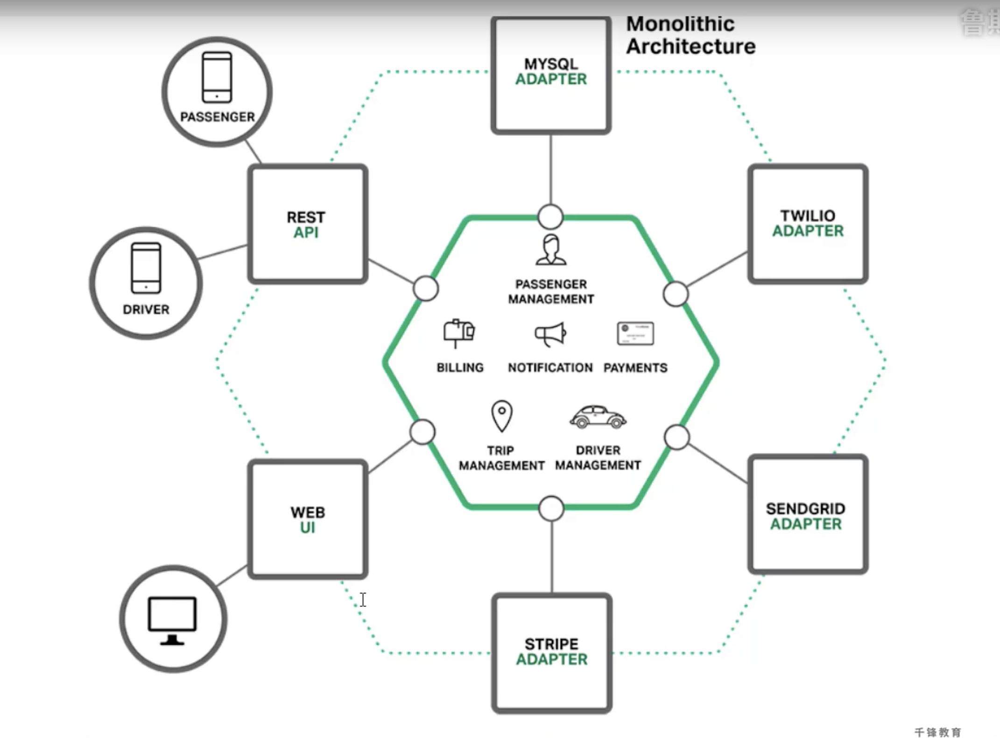
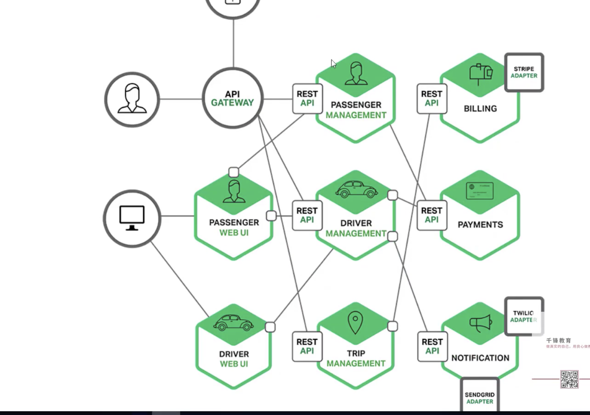
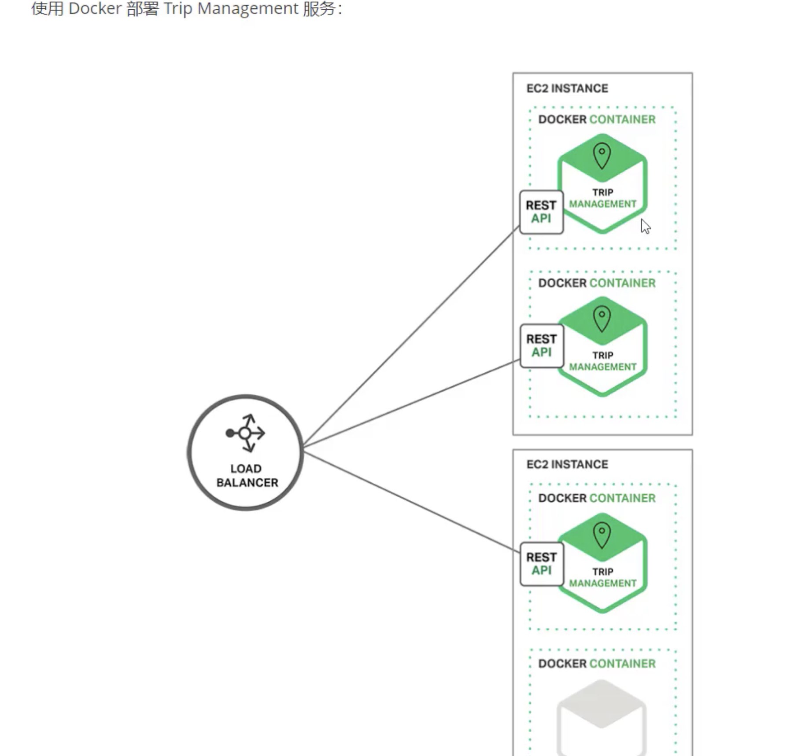
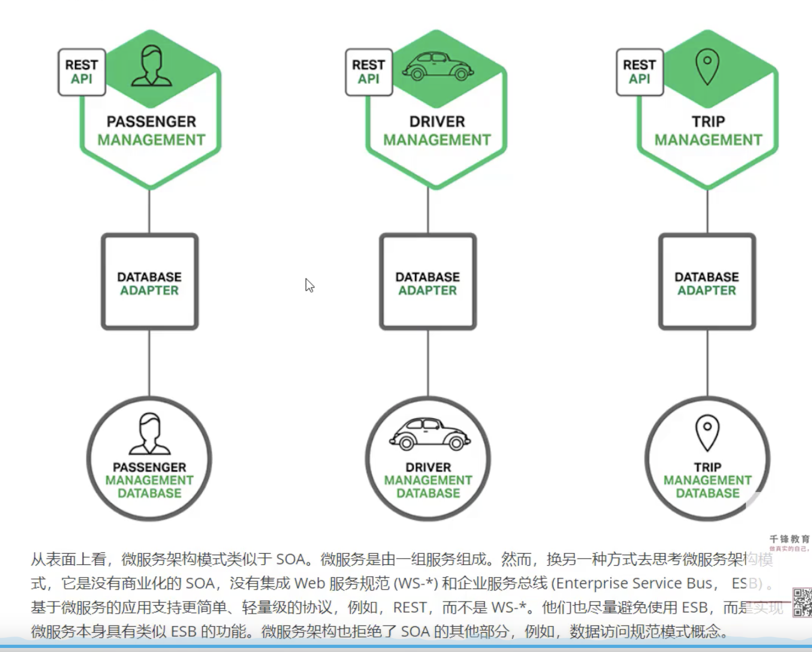

# Day-1 什么是微服务

## 01.构建单体应用模型

### 概述

我们假设，您开始开发一个打车应用，打算与Uber和Hailo竞争。您开始手动或者使用类似Rails、Spring Boot、Play或者Maven等平台来生成一个新项目。

该新应用是一个模块化的六边形架构，如下图（一个简单的打车应用）所示：

该应用的核心是由模块实现的业务逻辑，它定义了服务、领域对象和时间。围绕核心的是与外部世界接口对接的适配器。适配器示例包括数据库访问组件、生产和消费信息的消息组件暴露了API或实现了一个UI的Web组件。

尽管有一个逻辑模块化架构，但应用程序被作为一个单体进行打包和部署。实际格式取决于应用程序的语言和框架。例如，许多Java应用程序被打包成war文件部署在如tomcat或jetty之类的应用服务器上。其他Java应用程序被打包成自包含的可执行jar。类似地，rails和node.js应用程序被打包成有目录层次的结构

以这种风格编写的应用是很常见的。他们很容易开发，因为我们的IDE和其他工具就是专注于构建单体应用。这些应用程序也很容易测试。您可以通过简单地启动并使用Selenium测试包来测试UI以轻松地实现端到端测试。单体应用同样易于部署。只需要拷贝打包好的应用程序到服务器上。您还可以通过运行多个副本和结合负载均衡器来扩展应用。在项目的早期阶段，它可以良好运作。

## 02.走向单体地狱

### 概述

不幸的是，这种简单的方法有很大的局限性。成功的应用有一个趋势，随着时间推移而变得越来越臃肿。您的开发团队在每个冲刺阶段都要实现更多的用户需求，这意味着需要添加许多行代码。几年之后，小而简单的应用将会逐渐成长成一个庞大的单体。为了给出一个极端示例，举出了一个工具，该工具用于从他们的数百万行代码应用中分析出数千个jar之间的依赖。我相信这是大量开发者在多年齐心协力下创造出了这样的野兽。

一旦您的应用程序称为了一个庞大、复杂的单体，您的开发组织可能会陷入一个痛苦的境地，敏捷开发和交付的任何一次尝试都将原地徘徊。一个主要问题是应用程序实在非常复杂。对于任何一个开发人员来说显得过于庞大，这是可以理解的。最终，正确修复Bug和实现新功能变得非常困难而耗时。此外，这种趋势就像是往下掉螺旋。如果基本代码都令人难以理解，那么改变也不回变得正确，您最终得到的将是一个巨大且不可思议的大泥鳅。

应用程序的规模也将减缓发展。应用程序越大，启动时间越长。我调查过开发者们的单体应用的大小和性能，一些报告的启动时间为12分钟。也听说过应用程序启动需要40分钟以上的怪事。如果开发人员经常要重启应用服务器，那么很大一部分时间都是在等待中度过，他们的生产力将受到限制。

另一个大问题是，复杂的单体应用本身就是持续部署的障碍。如今，SaaS应用发展到了可以每天多次将变更推送到生产环境中。这对于复杂的单体来说非常困难，因为您需要重新部署整个应用程序才能更新其中任何一部分。联想到之前提到的漫长启动时间，这也不是什么好事。此外，因变更所产生的影响通常不是很明确，您可能需要做大量的手工测试。因此，持续部署是不可能做到的。

当不同模块存在资源需求冲突时，单体应用可能难以扩展。例如，一个模块可能会执行CPu密集型图像处理逻辑，理想情况是不熟在Amazon EC2 Compute Optimized实例中。另一个模块可能是一个内存数据库，最适合部署到EC2 Memory-optimized示例。然而，由于这些模块被部署在一起，您必须在硬件选择上作出妥协。

 单体应用的另外一个问题是可靠性。因为所有模块都运行在同一进程中。任何模块的一个bug，比如内存泄漏，可能会拖垮整个进程。此外，由于应用程序的所有示例都是相同的，该错误将影响到整个应用到可用性。

最后但同样重要，单体应用使得采用新框架和语言变得非常困难。在项目开始时，您无论选择何种新技术都会感到困扰。

## 03.微服务解决复杂问题

### 概述

`微服务架构是一种架构思想，而真正的开始是采用分布式系统开发`

`Docker 容器化引擎，新一代虚拟化技术`

`微服务架构，需要实现三大指标：高可用、高并发、高性能`

`将类型环境隔离起来～`

许多组织，已经采用现在所谓的微服务架构模式解决了这个问题，而不是构建一个臃肿的单体应用。它的思路是将应用程序分解成一套较小的互连服务。一个服务通常实现了一组不同的特性或功能，例如订单管理、客户管理等。每一个微服务都是一个迷你应用，它自己的六边形架构包括了业务逻辑以及多个适配器。

一些微服务会暴露一个供其他微服务或应用客户端消费的API。其他微服务可能实现了一个web UI。在运行时，每个示例通常是一个云虚拟机(virtual machine,VM)或者一个Docker容器。

例如，前面描述的系统可能分解成如下图所示：

应用程序的每个功能区域现在都由自己的微服务实现。此外，Web应用程序被划分为一组更简单的Web应用程序。例如，以我们的出租车为例，一个是乘客的应用，一个是司机的应用。这使得它更容易为特定的用户、司机、设备或者专门的用例部署不同的场景。每个后端服务部署了一个REST API， 大部分服务消费的API都其他服务提供。例如，Driver Management使用了Notification服务器来通知一个可用司机和一个可选路程。UI服务调用了其他服务来渲染页面。服务也可以使用异步、基于消息的通信。

一些REST API 也暴露给移动端应用以供司机和乘客使用。然而，应用不能直接访问后端服务。相反，他们之间的通信是由一个称为API 网关（API Gateway）的中介负责。API 网关负责 负载均衡、缓存、访问控制、API计量和监控，可以通过使用nginx来实现。

使用Docker部署服务：

两台机器，部署了3个～

  

从表面看,微服务架构模式类似于SOA。微服务是由一组服务组成。然而，换另一种方式去思考微服务架构模式，它是没有商业化的SOA，没有集成WEB 服务规范和企业服务总线。

基于微服务的应用支持跟个简单、轻量级的协议，例如REST,而不是esb。

## 04.微服务的优点

### 概述

第一，它解决了复杂问题。它把可能会变得庞大的单体应用程序分解成一套服务。虽然功能数量不变，但是应用程序已经被分解成可管理的块或者服务。每个服务都有一个明确定义边界的方式，如 **远程过程调用（RPC）驱动** 或者 **消息驱动API**。 微服务架构模式强制一定程度的模块化，实际上，使用单体代码来实现是及其困难的。因此，使用微服务架构模式，个体服务能被更快地开发，并更容易理解与维护。

第二，这种架构使得每个服务都可以由一个团队独立专注开发。开发者自由选择任何符合服务API契约的技术。当然，更多的组织是希望通过技术选型限制来避免完全混乱的状态。可以使用新技术，用当前技术来重写旧服务将变得更加可行。

第三，微服务架构模式可以实现每个微服务独立部署。开发人员根本不需要去协调部署本地变更到服务。这些变更一经测试即可立即部署。比如，UI团队执行A｜ B测试，并快速迭代UI变更。微服务架构模式使得持续部署成为可能。

最后，微服务架构模式使得每个服务能够独立扩展。您可以仅部署满足每个服务的可容量和可用性约束的示例约束。

## 05.微服务的缺点

### 概述

没有简单的方法解决复杂问题的软件工程问题

分布式的系统

分区数据库架构，不会使用分布式事务

测试微服务应用程序也很复杂

一个服务依赖其他服务（服务发现机制）

PaaS（平台技术，阿里云～）

自动化部署微服务部署的另一个方式是开发自己的PaaS。一个普遍的起点是使用集群方案，如kubernetes，与Docker灯容器技术相结合。

## 06.CAP定力与BASE理论

### CAP定理

2000年7月，加州大学伯克利分校的Eric Brewer 教授在ACM PODC 会议上提出CAP猜想。2年后，麻省理工学院的Seth Gilbert 和 Nancy Lynch从理论上证明了CAP。之后，CAP理论正式成为分布式计算领域的公认定理。

CAP理论为：一个分布式系统最多只能同时满足 一致性（Consistency）、可用性(Availability)和分区容错性（Partition tolerance）这三项中两项。

- 一致性（Consistency）:一致性指，即更新操作成功并返回客户端完成后，所有节点在同一时间点数据完全一致。
- 可用性（Aailability）: 可用性指，即服务一直可用，而且是正常响应时间。
- 分区容错性（Partition tolerance）: 上海的挂了，其他地方的机房去 满足 一致性和可用性 