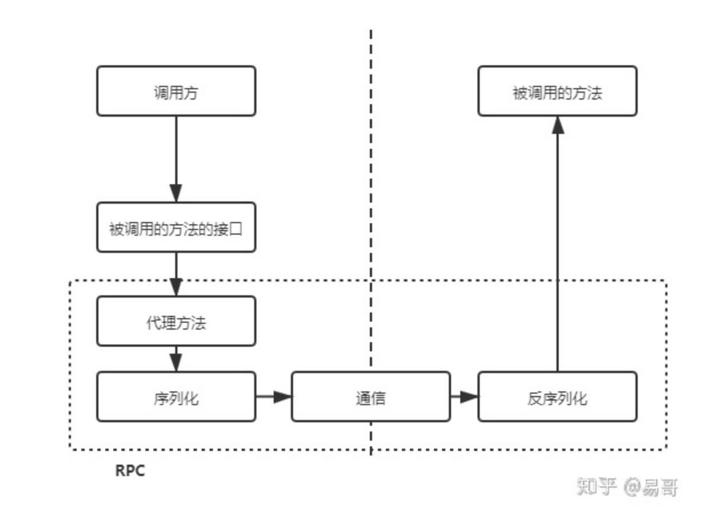

# 既然由HTTP请求，为什么还要用RPC调用？

URL：https://www.zhihu.com/search?type=content&q=%E4%B8%BA%E4%BB%80%E4%B9%88%E6%9C%8D%E5%8A%A1%E4%B9%8B%E9%97%B4%E7%9A%84%E8%B0%83%E7%94%A8%E4%B8%8D%E7%9B%B4%E6%8E%A5%E7%94%A8HTTP

1. HTTP和RPC不是对等的概念。

   RPC是一个完整的远程调用方案，它包括了：接口规范+反序列化规范+通信协议

   HTTP只是一个通信协议，工作在OSI的第7层。

2. 基于HTTP的远程调用方案。

   HTTP+RestFul，其优势很大。其可读性好，且 **可以得到防火墙的支持、跨语言的支持**。

   缺点：

   - 有用信息占比少。
   - 效率低
   - 可读性似乎没有必要，可以引入网关增加可读性
   - HTTP协议调用远程方法比较复杂，需要封装各种参数名和参数值。

3. RPC与HTTP互补。

   应用调用另一个应用的方法的解决方案：

   1. 暴露接口后使用HTTP调用 - 接口定义规范- Restful

   2. 远程过程调用

      1. 动态代理

      2. 序列化与反序列化

      3. 通信

         1. HTTP
         2. TCP
         3. UDP

      4. 异常处理

​        HTTP出现了2次，其中一个是和RPC并列的，都是跨应用调用方法的解决方案；另一个则是被RPC包含的，是RPC通信过程的可选协议之一。

基于HTTP的远程调用方案（包含了接口规范、序列化反序列化等）。这样，才是和RPC同一级别的概念。

RPC通常特指在一个应用中调用另一个应用的接口而实现的远程调用。这样来说，RPC是不包含Restful的。

服务A调用服务B的过程是应用间的内部过程，牺牲可读性提升效率、易用性是可取的。基于本思想：RPC产生。

通常，RPC要求在调用方中放置被调用的方法的接口。 **调用方只要调用了这些接口，就相当于调用了被调用方的实际方法，十分易用。** 于是，调用方可以像调用内部接口一样调用远程的方法，而不用封装参数名和参数值等操作。  

要想实现这个过程，需要怎么做呢？

首先，调用方调用的是接口，必须得为接口构造一个假的实现。显然，要使用动态代理。这样，调用方的调用就被动态代理接收到了。

其次，动态代理接收到调用后，应该想办法调用远程的实际实现。这包括下面几步：

- 识别具体要调用的远程方法的IP、端口
- 将调用方法的入参进行序列化
- 通过通信将请求发送到远程的方法中

这样，远程的服务就接收到了调用方的请求。它应该：

- 反序列化各个调用参数
- 定位到实际要调用的方法，然后输入参数，执行方法
- 按照调用的路径返回调用的结果

一个完整的RPC调用过程如下：

这样，RPC操作就完成了。

调用方调用内部的一个方法，但是被RPC框架变为 远程的一个方法。之间的通信数据可读性不需要好，只需要RPC框架能读懂即可，因此可以提高效率。通常使用UDP或者TCP作为通讯协议，当然也可以使用HTTP。