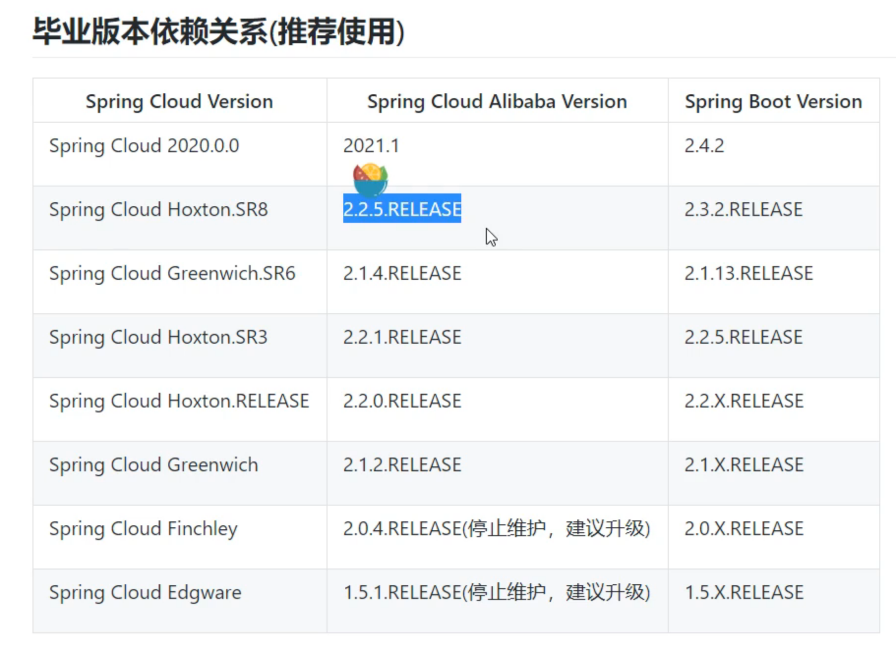

# day-1 项目搭建

## 1. 首先搭建一个分布式的项目

1. 基于SpringBoot的父maven项目
2. 创建2个服务

```java
   @Bean
    public RestTemplate restTemplate(RestTemplateBuilder builder) {
        RestTemplate build = builder.build();
        return build;
    }
维护这个东西很麻烦
String msg = restTemplate.getForObject("http://localhost:8011/stock/reduct", String.class);
```

微服务架构的改造势在必行。

组件版本关系




Spring Could Alibaba 2.25.RELEASE SpringBoot 2.3.2RELEASE 

Spring Cloud Hoxton.SR8


最终所得到的pom文件为：

```xml
<?xml version="1.0" encoding="UTF-8"?>
<project xmlns="http://maven.apache.org/POM/4.0.0" xmlns:xsi="http://www.w3.org/2001/XMLSchema-instance"
         xsi:schemaLocation="http://maven.apache.org/POM/4.0.0 https://maven.apache.org/xsd/maven-4.0.0.xsd">
    <modelVersion>4.0.0</modelVersion>
    <modules>
        <module>stock</module>
        <module>orders</module>
    </modules>
    <!-- parent 以后使用公司内部的maven-->

    <groupId>com.tulingxueyuan.springcloud</groupId>
    <artifactId>springcloudalibaba</artifactId>
    <version>0.0.1-SNAPSHOT</version>
    <name>springcloudalibaba</name>
    <description>Spring Cloud Alibaba</description>
    <!--打包成pom-->
    <packaging>pom</packaging>

    <properties>
        <java.version>1.8</java.version>
        <spring.cloud.alibaba.version>2.2.5.RELEASE</spring.cloud.alibaba.version>
        <spring.boot.version>2.3.2.RELEASE</spring.boot.version>
        <spring.cloud.version>Hoxton.SR8</spring.cloud.version>
    </properties>
    <dependencies>
        <dependency>
            <groupId>org.springframework.boot</groupId>
            <artifactId>spring-boot-starter</artifactId>
        </dependency>

        <dependency>
            <groupId>org.springframework.boot</groupId>
            <artifactId>spring-boot-starter-test</artifactId>
            <scope>test</scope>
        </dependency>
    </dependencies>

    <!--多继承 通过dependency来继承-->
    <dependencyManagement>
        <dependencies>
            <dependency>
                <groupId>com.alibaba.cloud</groupId>
                <artifactId>spring-cloud-alibaba-dependencies</artifactId>
                <version>${spring.cloud.alibaba.version}</version>
                <type>pom</type>
                <scope>import</scope>
            </dependency>

            <dependency>
                <groupId>org.springframework.boot</groupId>
                <artifactId>spring-boot-starter-parent</artifactId>
                <version>${spring.boot.version}</version>
                <type>pom</type>
                <scope>import</scope>
            </dependency>

            <dependency>
                <groupId>org.springframework.cloud</groupId>
                <artifactId>spring-cloud-dependencies</artifactId>
                <version>${spring.cloud.version}</version>
                <type>pom</type>
                <scope>import</scope>
            </dependency>
        </dependencies>
    </dependencyManagement>

    <build>
        <plugins>
            <plugin>
                <groupId>org.springframework.boot</groupId>
                <artifactId>spring-boot-maven-plugin</artifactId>
            </plugin>
        </plugins>
    </build>

</project>

```


