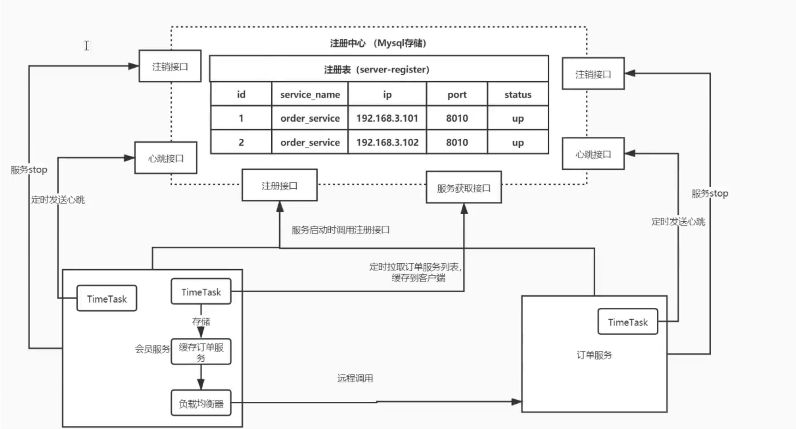
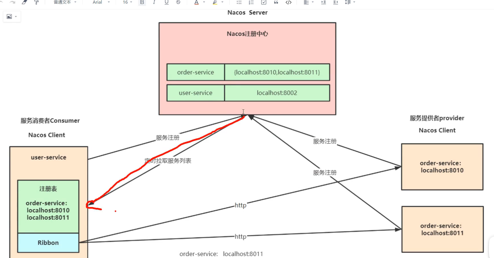
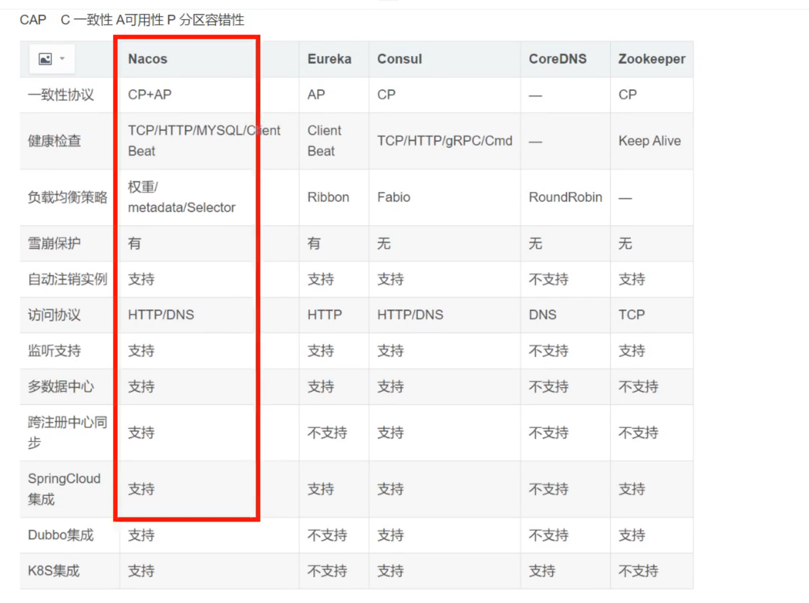

# Nacos

## 1. 什么是Nacos

官方： 一个更易于构建云原生应用的动态 **服务发现(Nacos Discovery)**、**服务配置(Nacos Config)**和服务管理平台

集 注册中心+ 配置中心+ 服务管理 平台

Nacos的关键特性包括： 

- 服务发现和服务健康监测
- 动态配置服务
- 动态DNS服务
- 服务及其元数据管理

## 2. Nacos注册中心

### 2.1 注册中心演变及其设计思想

会员服务 192.168.3.100:8080 通过HTTP远程调用 订单服务192.168.3.101:8010

```java
String url = "http://localhost8010/order/findOrderByUserId/" + id;
ResponseEntity<List> responseEntity = restTemplate.getForEntity(url, List.class);
List<Order> orderList = responseEntity.getBody();
```

存在问题： 订单服务ip:port变更，服务迁移 订单服务集群部署都很麻烦

---

变为了手动维护一份注册表： 注册表中维护了订单服务信息：

```
192.168.3.101:8010
192.168.3.102:8010 
```

从注册表中拉取订单服务列表，选择一个订单服务进行调用。

存在问题： 订单服务水平扩容的问题（如何去做负载均衡，在客户端做一个轮询调用，实现比较麻烦） 某个订单服务不行了

---

引入nginx： 通过nginx维护订单服务列表（upStream)

存在问题： nginx没有对服务进行健康检查的功能，如果某个服务挂掉了.... 虽然可以饮用第三方，但是非常麻烦

成败上千的微服务 nginx配置文件会变得非常复杂，运维人员内心非常崩溃。。。

加进去+改出来，人麻了

---

注册中心（Mysql存储） 

```
注册表(server-register)
id service_name ip port status
1	order_service	192.168.3.101 8010 up
2 order_service 192.168.3.102 8010 up

```

1. 每当服务启动时，就会调用注册接口，执行inset，将信息放到注册中心中存储
2. 服务之间的调用： 比如会员服务要调用订单服务，每次调用订单服务之间，都去注册中心获取订单服务列表，就是执行select
3. 根据第2步获取的订单服务列表选择一个服务进行远程调用

问题： 1. 每次都要去注册中心拉取服务列表，注册中心宕机比较麻烦。2. 拉取的订单服务对应的机器宕机也非常麻烦。

---




### 2.2 服务注册发现，Nacos Dicovery

该项目通过自动配置以及其他Spring 编程模型的习惯用法为Spring Boot 应用程序在服务注册发现方面提供和Nacos的无缝集成。通过一些简单的注解，可以快速来注册一个服务，并使用Nacos组件来作为大规模分布式系统的服务注册中心

**服务注册发现： Nacos Discovery Starter**

Nacos Discovery Starter可以帮助您将服务自动注册到Nacos服务端并且能够动态感知和刷新某个服务实例的服务列表。除此以外，将会将自身的一些元数据信息-例如host，post,健康检查URL，主页等注册到Nacos。

### 2.3 核心功能



**服务注册**： Nacos Client会通过发送REST请求的方式向Nacos Server注册自己的服务，提供自身的元数据，比如ip地址、端口等信息。Nacos Server 接收到注册请求后，就会把这些元数据信息存储在一个双层的内存Map中。

**服务心跳：** 在服务注册后，Nacos Client会维护一个定时心跳来持续通知Nacos Server，说明服务一直处于可用状态，防止被剔除。默认5s一次心跳。

**服务同步： ** Nacos Server 集群之间会互相同步服务实例，用来保证信息的一致性。

**服务发现： ** 服务消费者(Nacos Client)在调用服务提供的服务时，会发送一个REST请求给Nacos Server， 获取上面注册的服务清单，并且缓存在Nacos Client本地，同时会在Nacos Clietn本地开启一个定时任务拉取服务端最新的注册表信息更新到本地缓存

**服务健康检查：** Nacos Server会开启一个定时任务用来检查注册服务实例的健康情况，对于超过15s没有收到客户端心跳的实例会把heathly属性设置为false，如果某个实例超过30s没有收到心跳，直接剔除该实例（被剔除的实例如果回复发送心跳则会重新注册）




启动，配置文件修改问 standalone,单机模式，然后可以在properites文件当中设置mysql

这里我采用的通过docker安装nacos，目前映射在8847端口，没有把数据写到数据库当中去。

服务发现配置：

```

        <dependency>
            <groupId>com.alibaba.cloud</groupId>
            <artifactId>spring-cloud-starter-alibaba-nacos-discovery</artifactId>
        </dependency>
```

```yml
# 应用名称（nacos会将该名称当作服务名称
spring:
  application:
    name: order-service
  cloud:
    nacos:
      server-addr: localhost:8847
      discovery:
        username: nacos
        password: nacos
        namaspace: public
```


负载均衡

```
   // 负载均衡器
    @Bean
    @LoadBalanced
    public RestTemplate restTemplate(RestTemplateBuilder builder) {
        RestTemplate build = builder.build();
        return build;
    }
```


**雪崩保护： ** 

​	**雪崩： 所有服务都不会使用**

​	保护阈值： 设置0-1之间的值，比如0.5

​	spring.cloud.nacos.discovery.ephemeral = false: 永久实例 

​	**当健康实例数/总实例数 < 保护阈值，会把已经不健康的实例拿来使用，防止洪峰流量导致宕机。**

​	nacos使用服务降级来防止雪崩保护，sentinal。


