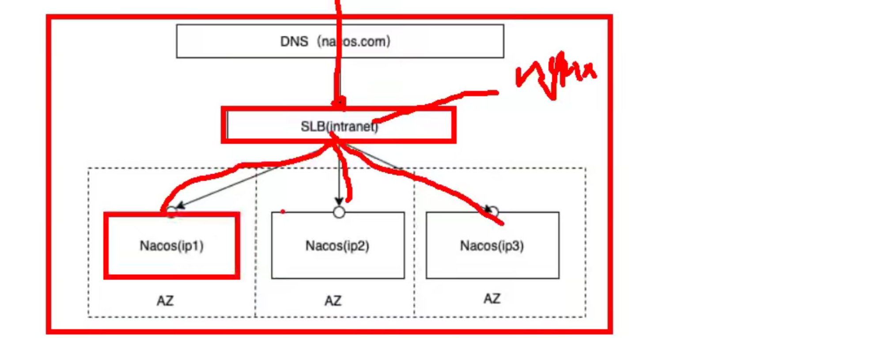
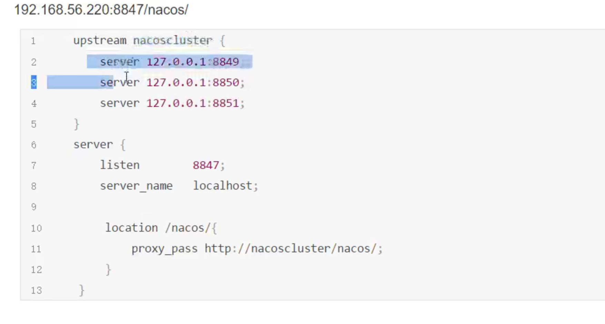

## nacos配置项

```yaml
# 应用名称（nacos会将该名称当作服务名称
spring:
  application:
    name: order-service
  cloud:
    nacos:
      server-addr: localhost:8847
      discovery:
        username: nacos
        password: nacos

#        secret-key: 和阿里云的有关的
#        metadata: 结合元数据做扩展
#        access-key: 和阿里云的有关的
#        namaspace: public  相同的特征的服务进行归类管理
#        group: 默认DEFAULT_GROUP 更细的特征的没·服务进行归类分组管理
#        service:  默认取的是${spring.application.name}
#        ephemeral: false # 永久实例，宕机之后也不会删除实例  默认为true: 表示临时实例
```

## nacos集群模式



这里部署的是个伪集群。

负载均衡采用的是ngix。

1. 下载nacos，然后解压重命名3台，为nacos8849,nacos8850,nacos8851.

2. 以nacos8849为例，进入nacos8849目录

   1. 修改conf/application.properties的配置，使用外置数据源，使用mysql5.7+

      ```
      server.port=8849
      spring.datasource.platform=mysql
      
      db.num=1
      
      db.url.0 = jdbc:mysql//127.0.0.1::3306/nacos?characterEncoding=utf8&connectTimeout=1000&socketTimeout=3000&autoReconnect=true&useSSL=false&serverTimezone=UTC
      db.user.0=root
      db.password.0=root
      ```

   2. 拷贝cluster.conf.example 为 cluster.conf

      ```
      127.0.0.1:8849
      127.0.0.1:8850
      127.0.0.1:8851
      ```

   3. 修改启动文件 startup.sh

      ```
      -Xms512m -Xmx512m -Xmn256m
      ```

   4. 

终于用docker配好了，我太难了。


