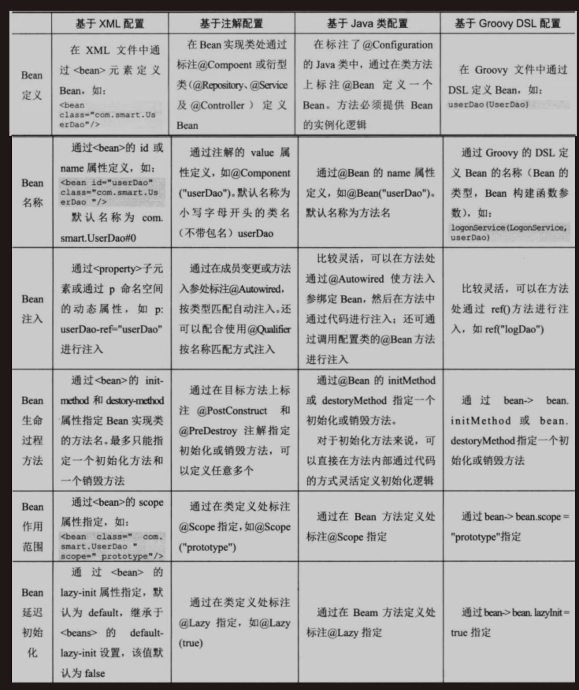
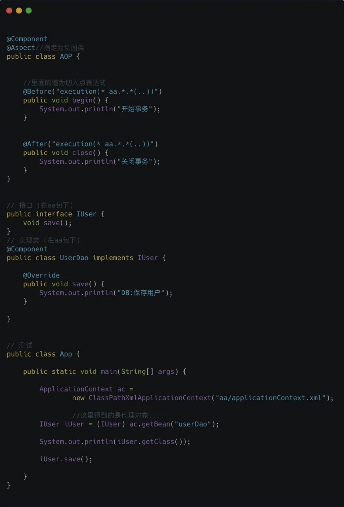

# Spring 

参考： https://mp.weixin.qq.com/s?__biz=MzI4Njg5MDA5NA==&mid=2247487013&idx=1&sn=f0d8c292738eb49bcd09cb2f6458dc69&chksm=ebd74f24dca0c632fa3ef8f205a2dd5c96531f78a68eae805e15b84de0b59774196a188aed14&scene=178&cur_album_id=1344014214528335873#rd

Spring家族的东西很多，先来看看最核心的知识点： **AOP** 和 **IOC**

## 1. 为什么用Spring

大家都在用，我也不清楚，看了面经，有很多依赖注入、控制反转、面向切面编程等，我一直都不理解，称着这个暑假，每天学一个小知识点啦。

Spring IOC 解决了 ：  **对象管理和对象依赖的问题**

Spring AOP 解决了： 非业务代码抽取的问题

## 2. Spring IOC

Spring IOC解决的是 **对象管理和对象依赖的问题**。 原本我们的对象都是new出来的，而我们使用Spring框架，则把对象交给 **IOC容器**来管理。

**IOC容器**： 可以理解为一个 **工厂**， 我们把对象交给这个工厂来管理，包括对象的创建和对象之间的依赖关系等，我们需要用到对象的时候，就从这个工厂里面取出来。

**控制反转**： 本来由我们自己new出来的对象，现在交给了IOC容器。把这个对象的 **控制权** 给了第三方。 **控制反转**更多的是一种思想或者说是 **设计模式**， 把原本由自己掌控的事，交给别人来处理。

**依赖注入**： 更多的指的是 **控制反转** 这个思想的一种 **实现方式**: 对象无需自行创建或管理它们的依赖关系，依赖关系将被 **自动注入**到需要它们的对象当中去。

理论上，我们可以把【IOC容器】也当作是一个 工厂，使用IOC的好处就是：

- **将对象统一管理，便于修改**
- 降低了耦合度

### 2.1 IOC需要学什么？

我们在使用Spring的时候，首先要学习如何把对象交给【IOC容器管理】

Sprig提供了四种方式：

- 注解
- XML
- JavaConfig
- 基于Groovy DSL 配置

总的来说：我们以XML配置+注解来装配Bean比较多，其中 **注解这种方式占大部分**。

把对象放到了【IOC容器】了以后，对象与对象之间是有关系的，我们需要把对象之间的依赖告诉Spring ，让它来解决对象的依赖关系。

【对象之间的关系】不需要弄的很复杂。在日常开发中很多时候就是 **A对象里面有B对象的属性**。

```java
public class A {
	private B b;
}
```

一般来说我们会通过 **构造器** 或者 **属性的set**方法来注入对象的依赖

举个例子： 日常开发，我们很多时候用 @Component 注解标识将对象 方法 【IOC容器】中，用 @Autowired 注解将对象注入

```java
@Component
public class UserService {
	private UserDao userDao;
	
	@Autowired
	public void setUserDao(UserDao userDao) {
		this.userDao = userDao;
	}
}
```

下面的图



## 3. Spring AOP

AOP : Aspect Object Programming

Spring AOP 主要做的事情就是： 把重复的代码抽取，在运行的时候往业务方法上 **动态植入** 切面类代码。

```java
public void add(User user) {
	Session session = null;
	Transaction trans = null;
	try {
		session = HibernatrSessionFactoryUtils.getSession();
		
		trans = session.beginTransaction();
		
		session.save(user);
		
		trans.commit();
		
	} catch (Exception e) {
		if (trans != null) trans.rollback();
	} finally {
			HibernateSessionFactoryUtils.closeSession(session);
	}
}
```

核心代码其实就是一行代码：保存user对象到数据库中

```java
session.save(user);
```

我们的数据库肯定不止user一张表，对数据库的增删改查也肯定不止add()放啊一个。所以，我们对数据库的每次操作，都要写 **开启事物** 和 **关闭事物** 这种代码。

这种代码对我们来说是重复的，于是我们会把这种代码给 **抽取** 出来。

如果我们单纯用OOP的思想去把代码给优化掉，最终效果可能为：

```java
public class User Dao {
	AOP aop;
	public void save() {
		aop.begin();
		sout("保存用户");
		aop.close();
	}
}
```

但是： update()/delete()方法同样也会有aop.beigin()这样重复代码的。

我们想要【消灭】这些重复代码，可以怎么做？ 可以想到采用 **动态代理**， 通过动态代理，我们可以把对象 **增强**， 将业务代码写在要【增强】的逻辑上。

```java
public class ProxyFactory {
	private static Object target;
	
	private static AOP aop;
	
	public static Object getProxyInstance(Object target_, AOp aop_) {
		target = target_;
		aop = aop_;
		
		return Proxy.newProxyInstance(
				target.getClass().getClassLoader(),
				target.getClass().getInterfaces();
				new InvocationHandler() {
					@Override
					public Object invoke(Object proxy, Method method, Object[] args) throws Throwable {
						aop.begin();
						Object returnValue = method.invoke(target, args);
						aop.close();
						return return Value;
					}
				}
		);
	}
}
```

通过增强后的对象去调用个方法，最终屏蔽重复代码

```java
public class App {
	psvm {
		ApplicationContext ac = new ClassPathXmlApplicationContext("aa/applicationContext.xml");
		IUser iUser = (IUser)ac.getBean("proxy");
		iUser.save();
	}
}
```


Spring支持AOP， 让我们可以不用自己手动去写代理对象，达到降【非业务代码】的抽取的效果。



