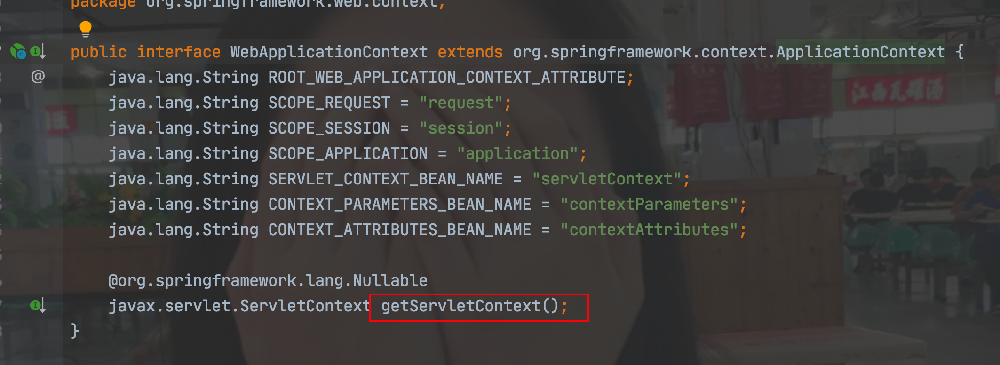
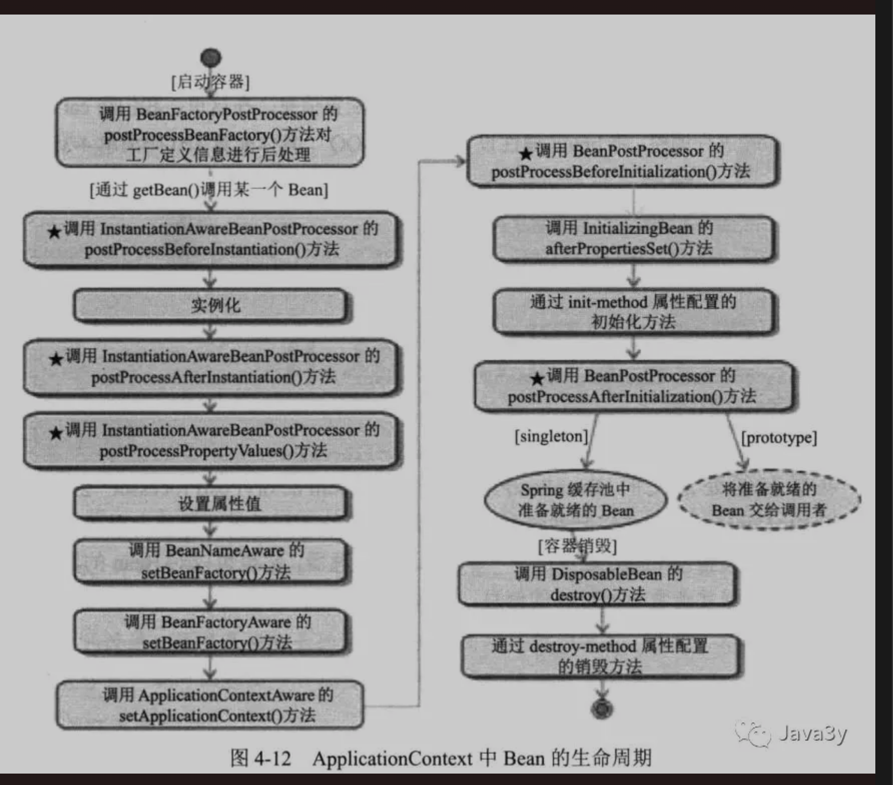
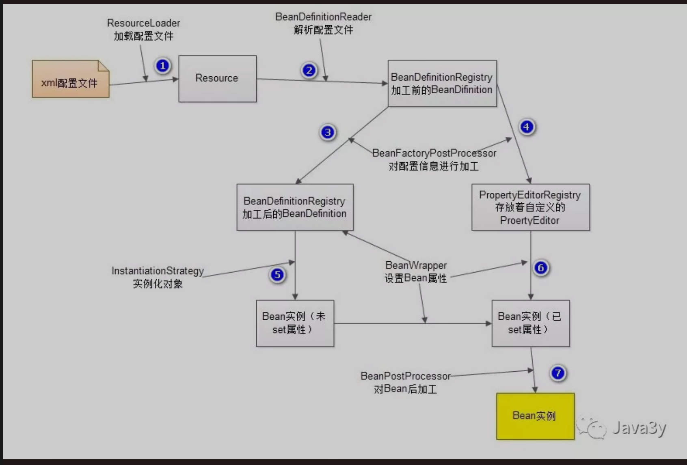

# Spring IOC 

摘抄URL： https://mp.weixin.qq.com/s?__biz=MzI4Njg5MDA5NA==&mid=2247484247&idx=1&sn=e228e29e344559e469ac3ecfa9715217&chksm=ebd74256dca0cb40059f3f627fc9450f916c1e1b39ba741842d91774f5bb7f518063e5acf5a0&scene=178&cur_album_id=1344014214528335873#rd

## 前言

今天在3y这学了单例模式和工厂模式，继续来看IOC。

## Spring IOC 全面认识

### IOC和ID概述

IOC 控制反转，包含了两个方面： 一、控制。二、反转

简单的认为：

- 控制： 当前对象对内部成员的控制
- 反转：这种控制权 **不由当前对象管理了**， 由其他来管理

IOC不够开门见山，于是Martin Fowler提出了DI 依赖注入，来代替IOC，及让调用类对某一接口实现类的依赖关系由第三方容器或者协作类注入，以移除调用类对某一接口实现类的依赖。

通过DI，对象的依赖关系将由系统中负责协调对象的第三方组件在创建对象的时候进行设定，对象无需自行创建或者管理它们的依赖关系，依赖关系将被自动注入到需要它们的对象当中。

- IOC： 思想、设计模式，主要的实现方式有两种：依赖查找， **依赖注入**

- 依赖注入： 一种可取的实现方式

**所谓的IOC容器就是一个大工厂**。

使用IOC的好处：

- 不用自己组装，拿来就用
- 享受了单例的好处，效率高，不浪费空间
- 便于单元测试，方便切换mock组件
- 便于进行AOP操作，对于使用者是透明的
- 统一配置，便于修改。

### IOC的原理

上面已经说了：IOC容器其实就是一个大工厂，用来管理我们所有的对象以及依赖关系。

-  原理就是通过Java的 **反射技术** 来实现的，通过反射我们可以获取类的所有信息（成员变量、类名等）
- 再通过配置文件（xml)或者注解来 **描述** 类与累之间的关系
- 我们可以通过这些配置信息和反射技术来 **构建** 出对应的对象和依赖关系了。

**简单**来看看实际 Spring IOC 容器是怎么实现对象的创建和依赖的：

Bean 配置信息：

- XML <bean>
- Java类  @Configuration
- 注解。@Autowire

Bean实现类： 

- Bean1
- Bean1...

1. 根据Bean配置信息在容器内部创建 **Bean定义注册表**
2. 根据注册表加载、实例化bean、建立Bean与Bean之间的依赖关系
3. 将这些准备就绪的Bean放到 **Map缓存池中**， 等待应用程序调用

Spring容器可简单分为两种：

- BeanFactory
- ApplicationContext
  - 在BeanFactory基础上，面向使用Spring框架的开发者。提供一些列的功能

几乎所有的应用场合都是使用 ApplicationContext!

其中在ApplicationContext子类中又有一个比较重要的: WebApplicationContext。

专门为Web应用准备的。

Web应用与Spring融合：



看看ApplicationContext的生命周期：



ApplicationContext与BeanFactory **不同之处** 在于：

- ApplicationContext会利用Java反射机制自动识别出配置文件中定义的： BeanPostProcessor、InstaniationAwareBeanPostProcesso和BeanFactoryPostProcessor 后志气，并自动将它们注册到应用上下文中。而BeanFatory需要在代码中手工调用addBeanPostProcessor()方法进行注册
- ApplicationContext在 **初始化**应用上下文的时候 **就实例化所有单实例的Bean。**而 BeanFactory在初始化容器的时候并未实例化Bean，直到第一次访问某个Bean时才实例化目标Bean。



**总结：**

- BeanDefinitionReader **读取Resource所指向的配置文件资源**，然后解析配置文件。配置文件中每一个<bean>解析成一个BeanDefinition对象，并保存到 **BeanDefinitionRegistry**中；
- 容器扫描BeanDefinitionRegistry中的BeanDefinition；调用InstantiationStrategy **进行Bean实例化的工厂**； 使用 **BeanWrapper完成Bean属性的设置工作**；
- 单例bean缓存池： Spring在 DefaultSingletonBeanRegistry类中提供了一个用于缓存单实例Bean的 **缓存器**， 它是一个用HashMap实现的缓存器，单实例的Bean 以 **beanName未键保存在这个HashMap**中。

### IOC容器装配bean

#### 装配Bean的方式

Spring4.X 开始IOC容器装配Bean有 4种方式

- XML配置
- 注解
- JavaConfig
- 基于Groovy DSL配置

总的来说：我们使用XML+ 注解来装配Bean很多，其中 **注解这种方式占绝大部份**

#### 依赖注入方式

依赖注入的方式有3种方式：

- 属性注入 通过setter()方式注入
- 构造函数注入
- 工厂方法注入

总的来说使用 **属性注入** 是比较灵活和方便的，这是大多数人的选择

#### 对象之间的关系

<bean>对象之间用三种关系

- 依赖 -> 极少用的 依赖的bean先初始化，当前bean才会初始化
- 继承 可能会用到
- 引用 最常见

#### Bean的作用域

- 单例 Singleton
- 多例prototype
- 与Web应用环境相关的Bean作用与
  - request
  - session

---

如果Bean对象里边的成员对象我们希望是多例的，

需要使用 lookup方法注入。

```
<bean>
	<lookup-method name = "getCar" bean = "car"/>
</bean>
```


#### 处理自动装配的歧义性

一个接口的两个实现类怎么在注入的时候 **优先调用某个实现类？**

- 使用@Primary 注解为 **首选**的注入Bean
- 使用@Qualifier 注解设置 **特定名称的Bean**来限定注入
  - 也可以使用自定义的注解来标识


#### 引用属性文件以及Bean属性

引用配置文件的数据使用的是。**${}**

除了引用配置文件上的数据，还可以引用 Bean的属性：

```
#{sysConfig.maxTabPageNum}
```

## Spring IOC 相关面试题

### 什么是Spring

Spring 是个java企业级应用的开源开发框架。Spring主要用来开发Java应用，但是有些扩展是针对构建J2EE平台的web应用。Spring框架**目标是简化Java企业级应用开发**，并通过POJO为基础的编程模型促进良好的编程习惯。

### 使用Spring框架的好处是什么？

- **轻量**：Spring 是轻量的，基本的版本大约2MB。

- **控制反转**：Spring通过控制反转实现了松散耦合，对象们给出它们的依赖，而不是创建或查找依赖的对象们。

- **面向切面的编程**(AOP)：Spring支持面向切面的编程，并且把应用业务逻辑和系统服务分开。

- **容器**：Spring 包含并管理应用中对象的生命周期和配置。

- **MVC框架**：Spring的WEB框架是个精心设计的框架，是Web框架的一个很好的替代品。

- **事务管理**：Spring 提供一个持续的事务管理接口，可以扩展到上至本地事务下至全局事务（JTA）。

- **异常处理**：Spring 提供方便的API把具体技术相关的异常（比如由JDBC，Hibernate or JDO抛出的）转化为一致的unchecked 异常。

### Spring由哪些模块组成?

- Core
- AOP
- ORM
- DAO
- WEB
- SPRING EE

### BeanFactory 实现举例

Bean工厂是工厂模式的一个实现，提供了控制反转功能，**用来把应用的配置和依赖从正真的应用代码中分离**。

在spring3.2之前最常用的是XmlBeanFactory的，但现在被废弃了，取而代之的是：XmlBeanDefinitionReader和DefaultListableBeanFactory

### 什么是Spring的依赖注入？

依赖注入，是IOC的一个方面，是个通常的概念，它有多种解释。这概念是说你不用创建对象，而只需要描述它如何被创建。你**不在代码里直接组装你的组件和服务，但是要在配置文件里描述哪些组件需要哪些服务**，之后一个容器（IOC容器）负责把他们组装起来。

### 有哪些不同类型的IOC（依赖注入）方式？

- **构造器依赖注入**：构造器依赖注入通过容器触发一个类的构造器来实现的，该类有一系列参数，每个参数代表一个对其他类的依赖。
- **Setter方法注入**：Setter方法注入是容器通过调用无参构造器或无参static工厂 方法实例化bean之后，调用该bean的setter方法，即实现了基于setter的依赖注入。
- 工厂注入：这个是遗留下来的，很少用的了！

## 哪种依赖注入方式你建议使用，构造器注入，还是 Setter方法注入？

最好的解决方案是**用构造器参数实现强制依赖，setter方法实现可选依赖**。

