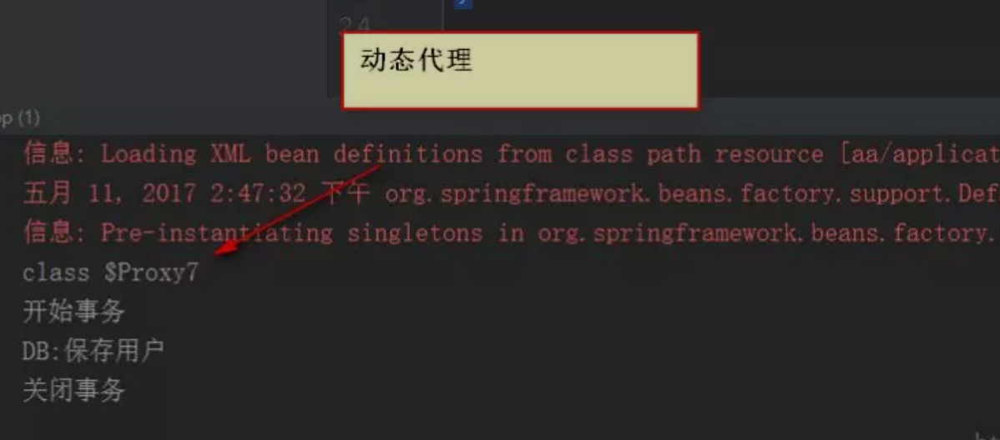
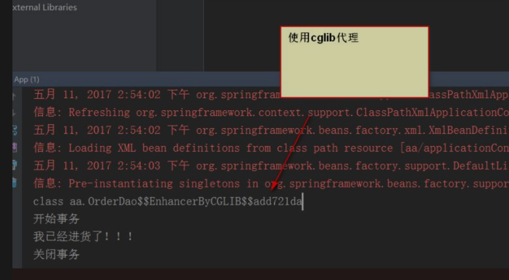

# Spring AOP

摘抄URL：https://mp.weixin.qq.com/s?__biz=MzI4Njg5MDA5NA==&mid=2247483954&idx=1&sn=b34e385ed716edf6f58998ec329f9867&chksm=ebd74333dca0ca257a77c02ab458300ef982adff3cf37eb6d8d2f985f11df5cc07ef17f659d4&scene=178&cur_album_id=1344014214528335873#rd

## 前言

学习AOP模块之前，先要学习一下cglib代理，以及如何手动实现AOP编程

## cglib代理

静态代理的缺陷： 静态代理需要实现目标对象的相同接口，可能会导致代理类会非常的多，不好维护-> 因此出现了动态代理

动态代理也有个约束： 目标对象一定是要有接口的，没有接口就不能实现动态代理-> 因此出现了cglib代理

**cglib代理：** 也称为子代理，从内存中构建出一个子类来扩展目标对象的功能

- cglib是一个强大的高性能代码生成包，它可以在运行期扩展JAVA类与实现JAVA接口。它广泛的被需要AOP框架使用，例如SPRING AOP和DYNAOP，为他们提供方法的interception（拦截）。

### 编写cglib代理

步骤：

1. 引入cglib-jar文件，但是spring的核心包中已经包括了cglib功能，所以直接引入spring-core-3.2.5.jar即可
2. 引入功能包后，就可以在内存中动态构建子类
3. 代理的类不能为final，否则会报错，在【内存中构建子类来做扩展，当然不能为final，有final就不能继承】
4. **目标对象的方法如果为final/static，那么就不会被拦截，即不会执行目标对象额外的业务放啊。**


```java
// 1. 实现MethodInterceptor接口
public class ProxyFactory implements MethodInterceptor {
	
  //2. 维护目标对象
  private Object target;
  
  //3. 给目标对象添加代理对象
  public Object getProxyInstance() {
    	// 1. 工具类
    	Enhancer en = new Enhancer();
    	// 2. 设置父类
    	en.setSuperclass(target.getClass());
    	// 3. 设置回调函数
    	en.setCallback(this);
    	// 4. 创建子类
    	return en.create();
  }
  
  //4. 实现接口
  public Object intercept(Object obj, Method method, Object[] args, MethodProxy proxy) thrwos Throwable {
    sout("开始事物。。。")
      
     Object res = method.invoke(target, args);
    
    sout("结束事物...")
		return res;    
  }
  
}
```

测试：

```java
public class App {

    public static void main(String[] args) {

        UserDao userDao = new UserDao();

        UserDao factory = (UserDao) new ProxyFactory(userDao).getProxyInstance();

        factory.save();
    }
}
```

**使用cglib就是为了弥补动态代理的不足【动态代理的目标对象一定要实现接口】**

## 手动实现AOP编程

AOP 面向切面的编程：

- AOP可以实现“业务代码”与“关注点”分离

下面来看一段业务代码：

```java
public void add(User user) {
	Session session = null;
	Transcation trans = null;
	try {
		session = HibernateSessionFactoryUtils.getSession();
		trans = session.begiunTransaction();
		
    //业务核心代码
		session.save(user);
    
    trans.commit();
		
	} catch(Exception) {
		if (trans != null) {
			trans.rollback();
		}
	} finally {
		HibernateSessionFactoryUtils.closeSession(session);
	}
}
```

- 除了业务核心代码，其他都是重复执行的代码。
- 将业务代码与关注点代码分离，好处？
  - 关注点代码写一次即可；
  - 开发者只需要关注核心业务
  - 运行时期，执行核心业务代码时候动态植入关注点代码：【代理】

### 案例分析：

1. interface

```java
public interface IUser {
	void save();
}
```

2. 在UserDao中有一个save()方法，每次都要开启事物和关闭事物

```java
@Respository
public class UserDao {
  public void save() {
    // 1. 开启事物
    begin();
    // 业务核心
    保存用户
    // 3. 关闭事物
    end();
  }
}
```

3. 现在呢，可能有多个DAO，都需要开启事物和关闭事物

4. 采用代理。

```java
public class AOP {

    public void begin() {
        System.out.println("开始事务");
    }
    public void close() {
        System.out.println("关闭事务");
    }
}
```

```java
public class ProxyFactory {
    //维护目标对象
    private static Object target;

    //维护关键点代码的类
    private static AOP aop;
    public static Object getProxyInstance(Object target_, AOP aop_) {

        //目标对象和关键点代码的类都是通过外界传递进来
        target = target_;
        aop = aop_;

        return Proxy.newProxyInstance(
                target.getClass().getClassLoader(),
                target.getClass().getInterfaces(),
                new InvocationHandler() {
                    @Override
                    public Object invoke(Object proxy, Method method, Object[] args) throws Throwable {

                        aop.begin();
                        Object returnValue = method.invoke(target, args);
                        aop.close();

                        return returnValue;
                    }
                }
        );
    }
}
```


#### 工厂静态方法

1. 把AOP加入到IOC容器中

```java
//把该对象加入到容器中
@Component
public class AOP {

    public void begin() {
        System.out.println("开始事务");
    }
    public void close() {
        System.out.println("关闭事务");
    }
}
```

2. 把UserDao放入到容器中

```java
@Component
public class UserDao {

    public void save() {

        System.out.println("DB:保存用户");

    }

}
```

3. 在配置文件中开启注解扫描，使用工厂静态方法创建代理对象

```java
<?xml version="1.0" encoding="UTF-8"?>
<beans xmlns="http://www.springframework.org/schema/beans"
       xmlns:xsi="http://www.w3.org/2001/XMLSchema-instance"
       xmlns:p="http://www.springframework.org/schema/p"
       xmlns:context="http://www.springframework.org/schema/context"
       xsi:schemaLocation="
        http://www.springframework.org/schema/beans
        http://www.springframework.org/schema/beans/spring-beans.xsd
        http://www.springframework.org/schema/context
        http://www.springframework.org/schema/context/spring-context.xsd">


    <bean id="proxy" class="aa.ProxyFactory" factory-method="getProxyInstance">
        <constructor-arg index="0" ref="userDao"/>
        <constructor-arg index="1" ref="AOP"/>
    </bean>

    <context:component-scan base-package="aa"/>


</beans>
```

4. 测试代码

```java
public class App {

    public static void main(String[] args) {

        ApplicationContext ac =
                new ClassPathXmlApplicationContext("aa/applicationContext.xml");


        IUser iUser = (IUser) ac.getBean("proxy");

        iUser.save();


    }
}
```

#### 工厂非静态方法

1. 动态工厂类

```java
package aa;

import java.lang.reflect.InvocationHandler;
import java.lang.reflect.Method;
import java.lang.reflect.Proxy;

/**
 * Created by ozc on 2017/5/11.
 */

public class ProxyFactory {

    public Object getProxyInstance(final Object target_, final AOP aop_) {

        //目标对象和关键点代码的类都是通过外界传递进来

        return Proxy.newProxyInstance(
                target_.getClass().getClassLoader(),
                target_.getClass().getInterfaces(),
                new InvocationHandler() {
                    @Override
                    public Object invoke(Object proxy, Method method, Object[] args) throws Throwable {

                        aop_.begin();
                        Object returnValue = method.invoke(target_, args);
                        aop_.close();

                        return returnValue;
                    }
                }
        );
    }
}
```

2. 创建工厂，再创建代理类对象

```kava
<?xml version="1.0" encoding="UTF-8"?>
<beans xmlns="http://www.springframework.org/schema/beans"
       xmlns:xsi="http://www.w3.org/2001/XMLSchema-instance"
       xmlns:p="http://www.springframework.org/schema/p"
       xmlns:context="http://www.springframework.org/schema/context"
       xsi:schemaLocation="
        http://www.springframework.org/schema/beans
        http://www.springframework.org/schema/beans/spring-beans.xsd
        http://www.springframework.org/schema/context
        http://www.springframework.org/schema/context/spring-context.xsd">


    <!--创建工厂-->
    <bean id="factory" class="aa.ProxyFactory"/>


    <!--通过工厂创建代理-->
    <bean id="IUser" class="aa.IUser" factory-bean="factory" factory-method="getProxyInstance">
        <constructor-arg index="0" ref="userDao"/>
        <constructor-arg index="1" ref="AOP"/>
    </bean>


    <context:component-scan base-package="aa"/>


</beans>
```


## AOP的概述

AOP： aspect object programming 面向切面编程

- 功能： 让关注点代码与业务代码分离
- 面向切面编程： 对很多功能都有的重复的代码抽取，再在运行的时候往业务方法上动态植入“切面类代码”。

关注点： 

- **重复代码叫做关注点**

- 切面：

  - 关注点形成的类，就叫做切面

  ```java
  public class AOP {
  
      public void begin() {
          System.out.println("开始事务");
      }
      public void close() {
          System.out.println("关闭事务");
      }
  }
  ```

- 切入点：

  - 执行目标对象方法，动态植入
  - 可以通过 **切入点表达式，指定拦截哪些类的哪些方法；给指定的类在运行的时候植入切面类代码**

- 切入点表达式：

  - 指定哪些类的哪些方法被拦截


## 使用Spring AOP开发步骤

1. 引入AOP相关jar文件 (aspectj aop优秀组件)

```
1. spring-aop-3.2.5 
2. aopalliance.jar
3. aspectjweaver.jar
4. aspectjrt.jar 
```

tips: 用到spring2.5版本的jar文件，用jdk1.7可能出现问题

- 需要升级aspectj组件，即使用aspectj-1.8.2版本中提供jar

2. bean.xml中引入aop名称空间

```xml
xmlns:context="http://www.springframework.org/schema/context"

http://www.springframework.org/schema/context

http://www.springframework.org/schema/context/spring-context.xsd
```

3. 注解方式实现AOP编程

我们之前手动实现的AOP编程都是需要自己来编写代理工厂的，**有了SPRING，就不需要自己写代理工厂了，SPRING内部会帮我们创建代理工厂。**

- 也就是说，不用我们自己写代理对象了。

因此，**我们只需要关心切面类，切入点，编写切入表达式指定拦截什么方法就可以了。**

4. 在配置文件中开启AOP注解方式

```xml
<?xml version="1.0" encoding="UTF-8"?>
<beans xmlns="http://www.springframework.org/schema/beans"
       xmlns:xsi="http://www.w3.org/2001/XMLSchema-instance"
       xmlns:p="http://www.springframework.org/schema/p"
       xmlns:context="http://www.springframework.org/schema/context"
       xmlns:aop="http://www.springframework.org/schema/aop"
       xsi:schemaLocation="http://www.springframework.org/schema/beans
        http://www.springframework.org/schema/beans/spring-beans.xsd
        http://www.springframework.org/schema/context
        http://www.springframework.org/schema/context/spring-context.xsd http://www.springframework.org/schema/aop http://www.springframework.org/schema/aop/spring-aop.xsd">


    <context:component-scan base-package="aa"/>

    <!-- 开启aop注解方式 -->
    <aop:aspectj-autoproxy></aop:aspectj-autoproxy>

</beans>
```

5. **代码1,目标对象有接口**

- 切面类

  ```java
  @Component
  @Aspect//指定为切面类
  public class AOP {
  
  
      //里面的值为切入点表达式
      @Before("execution(* aa.*.*(..))")
      public void begin() {
          System.out.println("开始事务");
      }
  
  
      @After("execution(* aa.*.*(..))")
      public void close() {
          System.out.println("关闭事务");
      }
  }
  ```

- interface

  ```java
  public interface IUser {
      void save();
  }
  ```

- impl

  ```java
  @Component
  public class UserDao implements IUser {
  
      @Override
      public void save() {
          System.out.println("DB:保存用户");
      }
  
  }
  ```

- 测试代码

  ```java
  public class App {
  
      public static void main(String[] args) {
  
          ApplicationContext ac =
                  new ClassPathXmlApplicationContext("aa/applicationContext.xml");
  
          //这里得到的是代理对象....
          IUser iUser = (IUser) ac.getBean("userDao");
  
          System.out.println(iUser.getClass());
  
          iUser.save();
  
      }
  }
  ```

  

6.  代码2，目标对象没有接口

- 目标对象

  ```java
  @Component
  public class OrderDao {
  
      public void save() {
  
          System.out.println("我已经进货了！！！");
  
      }
  }
  ```

- 测试代码：

  ```java
  public class App {
  
      public static void main(String[] args) {
  
          ApplicationContext ac =
                  new ClassPathXmlApplicationContext("aa/applicationContext.xml");
  
          OrderDao orderDao = (OrderDao) ac.getBean("orderDao");
  
          System.out.println(orderDao.getClass());
  
          orderDao.save();
  
      }
  }
  ```



