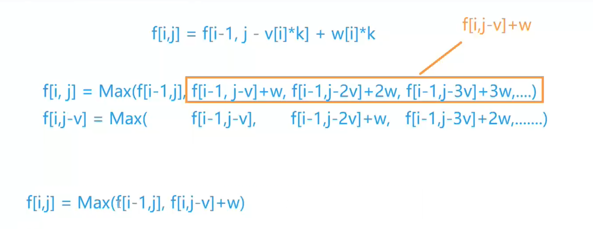

- 动态规划
  - 状态表示 ： f[i] [j] 
    - 集合：所有只考虑前i个物品，且总体积不大于j的所有选法
    - 属性：Max, 
  - 状态计算 ： 集合的划分 
    - f[i, j] 分为： 第i个物品选择了0，1，2，3..., k-1, k个
      - 0: f[i - 1, j]
      - 第二个物品选择了k个： 曲线救国
        - 1. 去掉k个物品i
          2. 求Max，f[i - 1, j - k * v[i]]
          3. 再加回来k个物品i
        - f[i-1, j - k * v[i]] + k * w[i]



# 3. 完全背包问题

URL：https://www.acwing.com/problem/content/3/

有 NN 种物品和一个容量是 VV 的背包，每种物品都有无限件可用。

第 ii 种物品的体积是 vivi，价值是 wiwi。

求解将哪些物品装入背包，可使这些物品的总体积不超过背包容量，且总价值最大。
输出最大价值。

#### 输入格式

第一行两个整数，N，VN，V，用空格隔开，分别表示物品种数和背包容积。

接下来有 NN 行，每行两个整数 vi,wivi,wi，用空格隔开，分别表示第 ii 种物品的体积和价值。

#### 输出格式

输出一个整数，表示最大价值。

#### 数据范围

0<N,V≤10000<N,V≤1000
0<vi,wi≤10000<vi,wi≤1000

#### 输入样例

```
4 5
1 2
2 4
3 4
4 5
```

#### 输出样例：

```
10
```


优化前

```java
import java.util.*;

class Main {
    static final int N = 1010;
    static int n, m;
    static int[] v = new int[N];
    static int[] w = new int[N];
    static int[][] f = new int[N][N];
    public static void main(String[] args) {
        Scanner sc = new Scanner(System.in);
        n = sc.nextInt();
        m = sc.nextInt();
        for (int i = 1; i <= n; i++) {
            v[i] = sc.nextInt();
            w[i] = sc.nextInt();
        }
        
        for (int i = 1; i <= n; i++)
            for (int j = 0; j <= m; j++) 
                for (int k = 0; k * v[i] <= j; k++) 
                    f[i][j] = Math.max(f[i][j], f[i - 1][j - k * v[i]] + k * w[i]);
                    
        System.out.println(f[n][m]);
    }
}
```

优化 时间

```java
import java.util.*;

class Main {
    static final int N = 1010;
    static int n, m;
    static int[] v = new int[N];
    static int[] w = new int[N];
    static int[][] f = new int[N][N];
    public static void main(String[] args) {
        Scanner sc = new Scanner(System.in);
        n = sc.nextInt();
        m = sc.nextInt();
        for (int i = 1; i <= n; i++) {
            v[i] = sc.nextInt();
            w[i] = sc.nextInt();
        }
        
        for (int i = 1; i <= n; i++)
            for (int j = 0; j <= m; j++) {
                f[i][j] = f[i - 1][j];
                if (j >= v[i]) f[i][j] = Math.max(f[i][j], f[i][j - v[i]] + w[i]);
            }
                    
        System.out.println(f[n][m]);
    }
}
```


优化 空间

```java
import java.util.*;

class Main {
    static final int N = 1010;
    static int n, m;
    static int[] v = new int[N];
    static int[] w = new int[N];
    static int[] f = new int[N];
    public static void main(String[] args) {
        Scanner sc = new Scanner(System.in);
        n = sc.nextInt();
        m = sc.nextInt();
        for (int i = 1; i <= n; i++) {
            v[i] = sc.nextInt();
            w[i] = sc.nextInt();
        }
        
        for (int i = 1; i <= n; i++)
            for (int j = v[i]; j <= m; j++) {
                f[j] = Math.max(f[j], f[j - v[i]] + w[i]);
            }
                    
        System.out.println(f[m]);
    }
}
```

