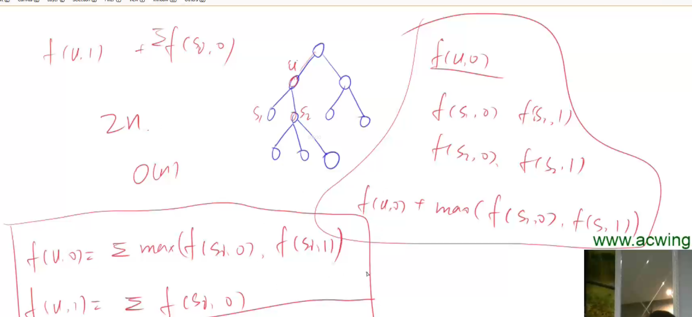

# 树形DP

需要适应一下树形DP的跨度。



---

数的存储方式可以使用图的存储方式

**code:**

学习

```python
from collections import defaultdict
import sys
if __name__ == '__main__':

    # avoid RuntimeError: maximum recursion depth 
    limit = 10000
    sys.setrecursionlimit(limit)

    n = int(sys.stdin.readline().strip())
    happy = [0]
    for _ in range(n):
        happy.append(int(sys.stdin.readline().strip()))
    tree = defaultdict(list)
    parent = dict()
    for _ in range(n-1):
        c, p = map(int, sys.stdin.readline().strip().split())
        tree[p].append(c)
        parent[c] = p

    if parent:
        root = list(parent.keys())[0]
        while root in parent:
            root = parent[root]

        f = [[0, 0] for _ in range(n+1)]
        def dfs(u):
            f[u][1] = happy[u]
            if u not in tree:
                return
            for j in tree[u]:
                dfs(j)
                f[u][0] += max(f[j][0], f[j][1])
                f[u][1] += f[j][0]
        dfs(root)

        print(max(f[root][0], f[root][1]))
    else:
        print(happy[-1])


    
```

