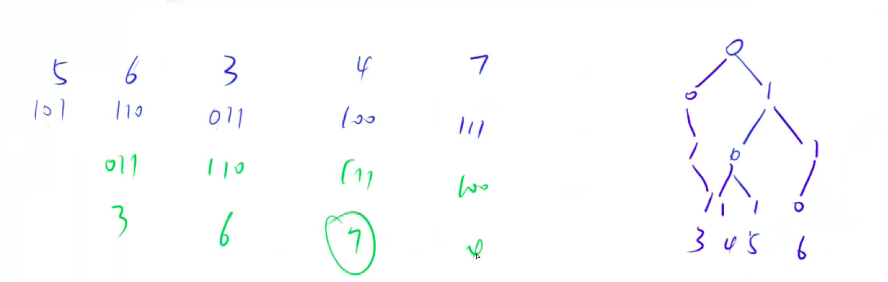

# 143. 最大异或对

URL： https://www.acwing.com/problem/content/145/

在给定的 NN 个整数 A1，A2……AN 中选出两个进行 xor（异或）运算，得到的结果最大是多少？

#### 输入格式

第一行输入一个整数 N。

第二行输入 N 个整数 A1～AN。

#### 输出格式

输出一个整数表示答案。

#### 数据范围

1≤N≤105
0≤Ai<231

#### 输入样例：

```
3
1 2 3
```

#### 输出样例：

```
3
```


```java
import java.util.*;
import java.io.*;

class Main {
    // N为输入的整数的个数  M为建立的Trie节点的最大个数
    static int N = 100010, M = 3100010;
    
    static int[][] son = new int[M][2];
    static int[] a = new int[N];
    static int idx = 0;
    
    public static void insert(int x) {
        int p = 0;
        for (int i = 30; i >= 0; i-- ) {
             int j = (x >> i) & 1;
             if (son[p][j] == 0) son[p][j] = ++idx;
             p = son[p][j];
        }
    }
    
    public static int query(int x) {
        int p = 0;
        int res = 0;
        for (int i = 30; i>= 0; i--) {
            int j = (x >> i) & 1;
            if (son[p][j ^ 1] > 0) {
                p = son[p][j ^ 1];
                res += (1 << i);
            } else {
                p = son[p][j];
            }
        }
        return res;
    }
    
    
    public static void main(String[] args) throws Exception{
        BufferedReader in = new BufferedReader(new InputStreamReader(System.in));
        BufferedWriter out = new BufferedWriter(new OutputStreamWriter(System.out));
        int n = Integer.parseInt(in.readLine());
        int res = 0;
        String[] tmp = in.readLine().split(" ");
        for (int i = 0; i < n; i++) {
            a[i] =  Integer.parseInt(tmp[i]);
            insert(a[i]);
        }
        
        for (int i = 0; i < n; i++) res = Math.max(res, query(a[i]));
        out.write(res+"");
        out.flush();
    }
}
```

