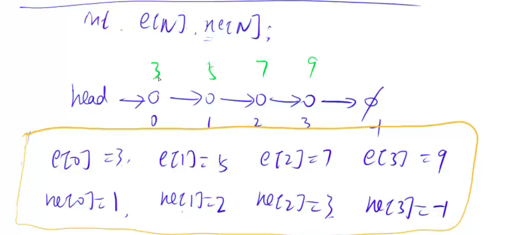

# 单链表

1. 单链表： 邻接表：存储图和树
2. 双链表：优化某些问题




# 826. 单链表

URL：https://www.acwing.com/problem/content/828/

实现一个单链表，链表初始为空，支持三种操作：

1. 向链表头插入一个数；
2. 删除第 kk 个插入的数后面的数；
3. 在第 kk 个插入的数后插入一个数。

现在要对该链表进行 MM 次操作，进行完所有操作后，从头到尾输出整个链表。

**注意**:题目中第 kk 个插入的数并不是指当前链表的第 kk 个数。例如操作过程中一共插入了 nn 个数，则按照插入的时间顺序，这 nn 个数依次为：第 11 个插入的数，第 22 个插入的数，…第 nn 个插入的数。

#### 输入格式

第一行包含整数 MM，表示操作次数。

接下来 MM 行，每行包含一个操作命令，操作命令可能为以下几种：

1. `H x`，表示向链表头插入一个数 xx。
2. `D k`，表示删除第 kk 个插入的数后面的数（当 kk 为 00 时，表示删除头结点）。
3. `I k x`，表示在第 kk 个插入的数后面插入一个数 xx（此操作中 kk 均大于 00）。

#### 输出格式

共一行，将整个链表从头到尾输出。

#### 数据范围

1≤M≤1000001≤M≤100000
所有操作保证合法。

#### 输入样例：

```
10
H 9
I 1 1
D 1
D 0
H 6
I 3 6
I 4 5
I 4 5
I 3 4
D 6
```

#### 输出样例：

```
6 4 6 5
```


```java
import java.util.*;
import java.io.*;

class Main {
    
    static int N = 100010;
    
    // head ： 头指针，指向第一个节点
    // e : 存储链表中节点值的数组
    // ne : 存储链表中节点的next节点位置的数组
    // idx : 表示当前new使用的节点
    static int head;
    static int[] e = new int[N];
    static int[] ne = new int[N];
    static int idx;
    
    static void init() {
        head = -1;
        idx = 0;
    }
    
    // 在头节点插入值x
    static void insert_to_head(int x) {
        e[idx] = x;
        ne[idx] = head;
        head = idx;
        idx++;
    }
    
    // 在坐标为k的地方后插入值x
    static void insert(int k, int x) {
        e[idx] = x;
        ne[idx] = ne[k];
        ne[k] = idx;
        idx++;
    }
    
    // 删除位置为k的下一个节点的元素
    static void remove(int k) {
        ne[k] = ne[ne[k]];
    }
    
    public static void main(String[] args) throws Exception {
        BufferedReader in = new BufferedReader(new InputStreamReader(System.in));
        BufferedWriter out = new BufferedWriter(new OutputStreamWriter(System.out));
        init();
        int M = Integer.parseInt(in.readLine());
        while (M-- > 0) {
            String[] tmp = in.readLine().split(" ");
            if ("H".equals(tmp[0])) {
                int x = Integer.parseInt(tmp[1]);
                insert_to_head(x);
            } else if ("D".equals(tmp[0])) {
                int k = Integer.parseInt(tmp[1]);
                if (k == 0) head = ne[head];
                else remove(k - 1);
            } else if ("I".equals(tmp[0])) {
                int k = Integer.parseInt(tmp[1]);
                int x = Integer.parseInt(tmp[2]);
                insert(k - 1, x);
            }
        }
        for (int i = head; i != - 1; i = ne[i]) {
            out.write(e[i]+" ");
        }
        out.write("\n");
        out.flush();
    }
}
```


```java
import java.util.*;
import java.io.*;


class Main {
    
    static int N = 100010;
    static int[] e = new int[N];
    static int[] ne = new int[N];
    static int idx = 0;
    static int head = -1;
    
    static void add_to_head(int x) {
        e[idx] = x;
        ne[idx] = head;
        head = idx;
        idx++;
    }
    
    static void add(int k, int x) {
        e[idx] = x;
        ne[idx] = ne[k];
        ne[k] = idx;
        idx++;
    }
    
    static void remove(int k)  {
        ne[k] = ne[ne[k]];
    }
    
    public static void main(String[] agrs) throws Exception {
        BufferedReader in = new BufferedReader(new InputStreamReader(System.in));
        BufferedWriter out = new BufferedWriter(new OutputStreamWriter(System.out));
        
        int M = Integer.parseInt(in.readLine());
        String[] tmp = null;
        while (M-- > 0) {
            tmp = in.readLine().split(" ");
            switch (tmp[0]) {
                case "H" : {
                    int x = Integer.parseInt(tmp[1]);
                    add_to_head(x);
                    break;
                }
                case "D" : {
                    int k = Integer.parseInt(tmp[1]);
                    if (k == 0) head = ne[head];
                    else remove(k - 1);
                    break;
                }
                case "I" : {
                    int k = Integer.parseInt(tmp[1]);
                    int x = Integer.parseInt(tmp[2]);
                    add(k - 1, x);
                    break;
                }
            }
        }
        
        for (int i = head; i != -1; i = ne[i]) out.write(e[i] + " ");
        out.write("\n");
        
        out.flush();
    }
}
```

