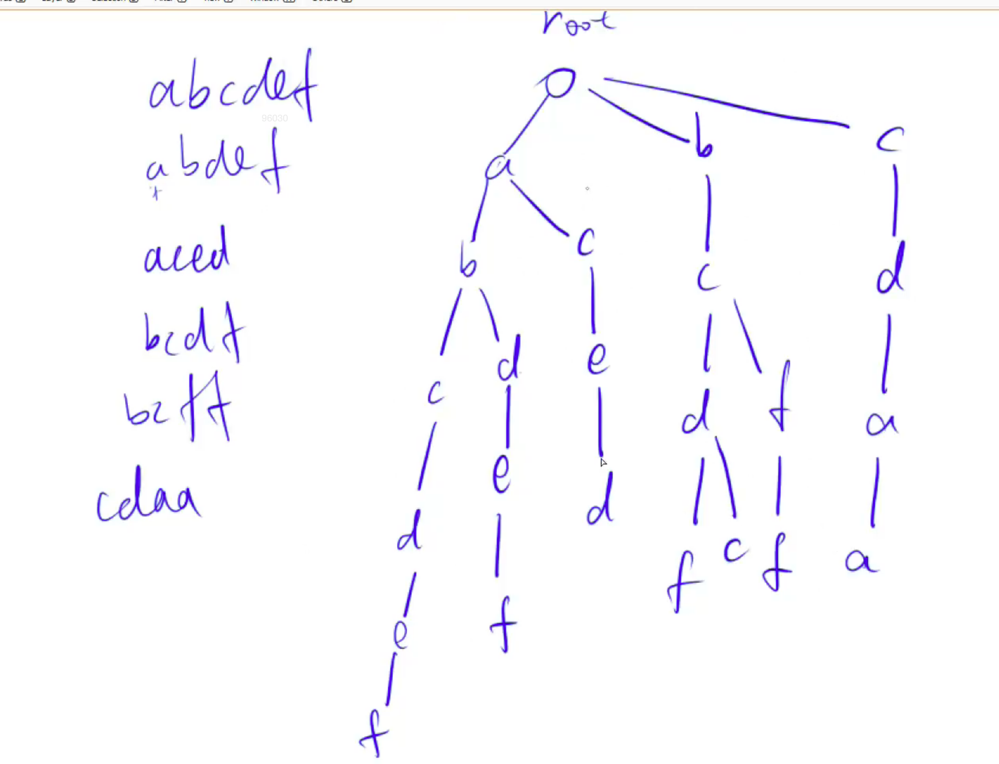
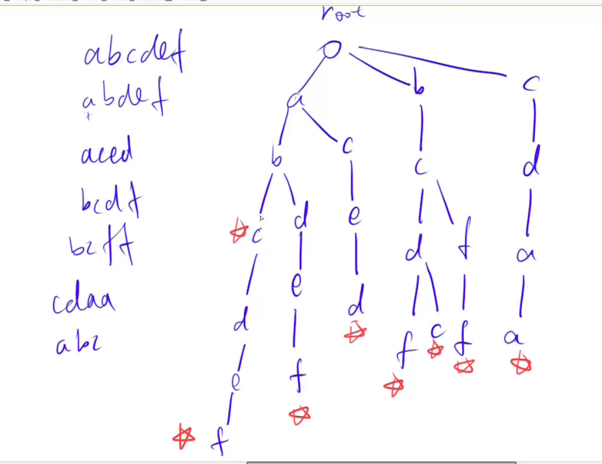

# **Trie树：快速存储和查找字符串集合的数据结构**



并且以某个单词结尾的单词，需要打个标记。




# 835.Trie字符串统计

URL：https://www.acwing.com/problem/content/837/

维护一个字符串集合，支持两种操作：

1. `I x` 向集合中插入一个字符串 x；
2. `Q x` 询问一个字符串在集合中出现了多少次。

共有 N 个操作，输入的字符串总长度不超过 105，字符串仅包含小写英文字母。

#### 输入格式

第一行包含整数 N，表示操作数。

接下来 N 行，每行包含一个操作指令，指令为 `I x` 或 `Q x` 中的一种。

#### 输出格式

对于每个询问指令 `Q x`，都要输出一个整数作为结果，表示 xx 在集合中出现的次数。

每个结果占一行。

#### 数据范围

1≤N≤2∗104

#### 输入样例：

```
5
I abc
Q abc
Q ab
I ab
Q ab
```

#### 输出样例：

```
1
0
1
```


```java
import java.util.*;
import java.io.*;


class Main {
    static int N = 100010;
    static int[][] trie = new int[N][26];
    static int[] cnt = new int[N];
    static int idx = 0;
    
    public static void insert(String str) {
        char[] s = str.toCharArray();
        int n = s.length;
        int x = 0;
        for (int i = 0; i < n; i++) {
            int j = s[i] - 'a';
            if (trie[x][j] == 0) trie[x][j] = ++idx;
            x = trie[x][j];
        }
        cnt[x] ++;
    }
    
    public static int query(String str) {
        char[] s = str.toCharArray();
        int n  = s.length;
        int x = 0;
        for (int i = 0; i < n; i++) {
            int j = s[i] - 'a';
            if (trie[x][j] == 0) return 0 ;
            x = trie[x][j];
        }
        return cnt[x];
    }
    
    public static void main(String[] args) throws Exception {
        BufferedReader in = new BufferedReader(new InputStreamReader(System.in));
        BufferedWriter out = new BufferedWriter(new OutputStreamWriter(System.out));

        int n = Integer.parseInt(in.readLine());
        
        while (n-- > 0) {
            String[] tmp = in.readLine().split(" ");
            if (tmp[0].equals("I")) insert(tmp[1]);
            else {
                out.write(query(tmp[1])+"\n");
            }
         
        }
        out.flush();
    }
}
```

