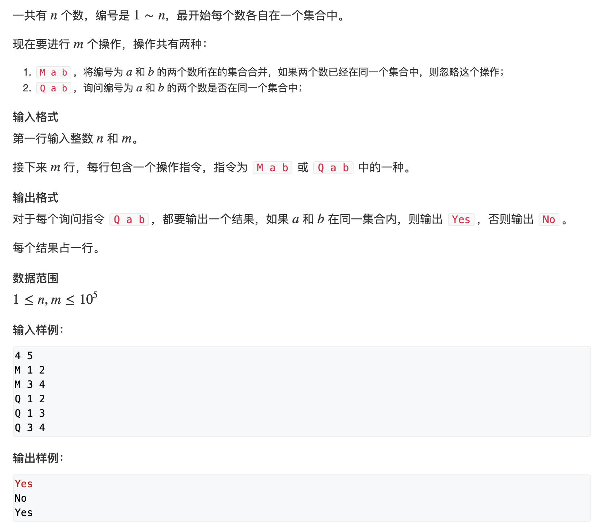

# **并查集**

1. 将两个集合合并
2. 询问两个元素是否在一个集合当中

基本原理： 每个集合用一棵树来表示。树根的编号就是整个集合的编号。每个节点存储它的父节点，p[x]表示x的父节点。

问题1: 如何判断树根： if (p[x] == x) 

问题2: 如何求x的集合编号： whlie (p[x] != x) x = p[x]；(**优化：将路径上的所有节点的父节点都指向父亲（路径压缩）)**

问题3: 如何合并两个集合： px是x的集合编号，py是y的集合编号。p[x] = y


# 836. 合并集合

URL：https://www.acwing.com/problem/content/838/




```java
import java.util.*;
import java.io.*;

class Main {

    static int[] p = new int[100010];

    public static int find(int x) {
        if (x != p[x]) p[x] = find(p[x]);
        return p[x];
    }

    public static void main(String[] args) throws Exception {
        BufferedReader in = new BufferedReader(new InputStreamReader(System.in));
        BufferedWriter out = new BufferedWriter(new OutputStreamWriter(System.out));

        String[] tmp = in.readLine().split(" ");
        int n = Integer.parseInt(tmp[0]);
        int m = Integer.parseInt(tmp[1]);
        for (int i = 1; i <= n; i++) p[i] = i;

        while (m-- > 0) {
            tmp = in.readLine().split(" ");
            int a = Integer.parseInt(tmp[1]);
            int b = Integer.parseInt(tmp[2]);
            if (tmp[0].equals("M")) p[find(a)] = find(p[b]);
            else {
                if (find(a) == find(b)) out.write("Yes");
                else out.write("No");
                out.write("\n");
            }
        }
        out.flush();
    }
}

作者：CrazyShanShan
链接：https://www.acwing.com/activity/content/code/content/1272321/
来源：AcWing
著作权归作者所有。商业转载请联系作者获得授权，非商业转载请注明出处。
```

