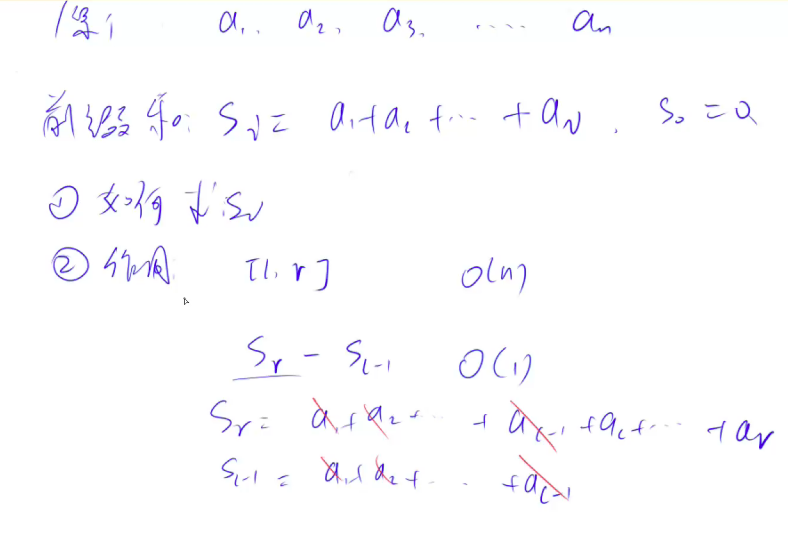

# 前缀数组



# 795. 前缀和

URL：https://www.acwing.com/problem/content/797/

输入一个长度为 n 的整数序列。

接下来再输入 m 个询问，每个询问输入一对 l,r。

对于每个询问，输出原序列中从第 ll 个数到第 rr 个数的和。

#### 输入格式

第一行包含两个整数 n 和 m。

第二行包含 n 个整数，表示整数数列。

接下来 m 行，每行包含两个整数 l 和 r，表示一个询问的区间范围。

#### 输出格式

共 m 行，每行输出一个询问的结果。

#### 数据范围

1≤l≤r≤n,
1≤n,m≤100000
−1000≤数列中元素的值≤1000

#### 输入样例：

```
5 3
2 1 3 6 4
1 2
1 3
2 4
```

#### 输出样例：

```
3
6
10
```


```java
import java.util.*;

class Main {
    public static void main(String[] args) {
        Scanner sc = new Scanner(System.in);

        int n = sc.nextInt();
        int m = sc.nextInt();

        int[] a = new int[n + 1];
        int[] s = new int[n + 10];
        for (int i = 1; i <= n; i++) a[i] = sc.nextInt();
        for (int i = 1; i <= n; i++) s[i] = s[i - 1] + a[i];        

        while (m-- > 0) {
            int l = sc.nextInt(), r = sc.nextInt();
            System.out.println(s[r] - s[l - 1]);
        }
    }
}
```

