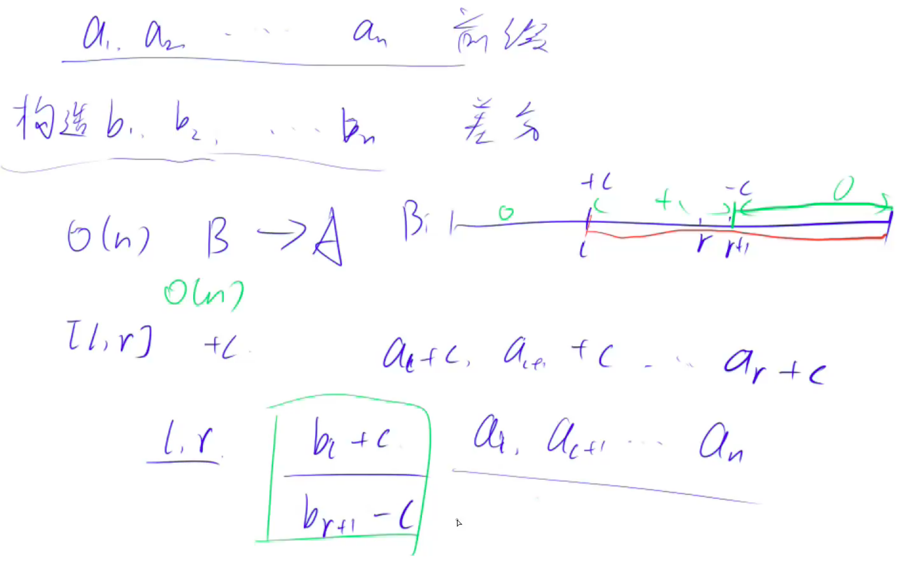

# **差分： 前缀和的逆运算**

已知：a1, a2, ..., an a称为b的前缀和

构造b1, b2, ... , bn :  b称为a的差分

使得ai = b1+ b2 + ... + bi





b1 = b1 

b2 = a2 - a1

b3 = a3 - a2

...,

bn = an - an-1


# 797. 差分

URL：https://www.acwing.com/problem/content/799/

输入一个长度为 nn 的整数序列。

接下来输入 mm 个操作，每个操作包含三个整数 l,r,cl,r,c，表示将序列中 [l,r][l,r] 之间的每个数加上 cc。

请你输出进行完所有操作后的序列。

#### 输入格式

第一行包含两个整数 nn 和 mm。

第二行包含 nn 个整数，表示整数序列。

接下来 mm 行，每行包含三个整数 l，r，cl，r，c，表示一个操作。

#### 输出格式

共一行，包含 nn 个整数，表示最终序列。

#### 数据范围

1≤n,m≤100000,
1≤l≤r≤n,
−1000≤c≤1000 ,
−1000≤整数序列中元素的值≤1000−1000≤整数序列中元素的值≤1000

#### 输入样例：

```
6 3
1 2 2 1 2 1
1 3 1
3 5 1
1 6 1
```

#### 输出样例：

```
3 4 5 3 4 2
```


空间稍微开大一点，b[r + 1] -= c，如果长度不够的话，可能会产生溢出。

```java
import java.util.*;

class Main {

    public static void insert(int[] b, int l, int r, int c) {
        b[l] += c;
        b[r + 1] -= c;
    }

    public static void main(String[] args) {
        Scanner sc = new Scanner(System.in);
        int n = sc.nextInt();
        int m = sc.nextInt();
        int[] a = new int[n + 10];
        int[] b = new int[n + 10];
        for (int i = 1; i <= n; i++) a[i] = sc.nextInt();

        for (int i = 1; i <= n; i++) insert(b, i, i, a[i]);

        while (m-- > 0) {
            int l = sc.nextInt();
            int r = sc.nextInt();
            int c = sc.nextInt();
            insert(b, l, r, c);
        }

        for (int i = 1; i <= n; i++) b[i] += b[i - 1];

        for (int i = 1; i <= n; i++) {
            System.out.print(b[i]+" ");
        }
    }
}

作者：CrazyShanShan
链接：https://www.acwing.com/activity/content/code/content/1262327/
来源：AcWing
著作权归作者所有。商业转载请联系作者获得授权，非商业转载请注明出处。
```

