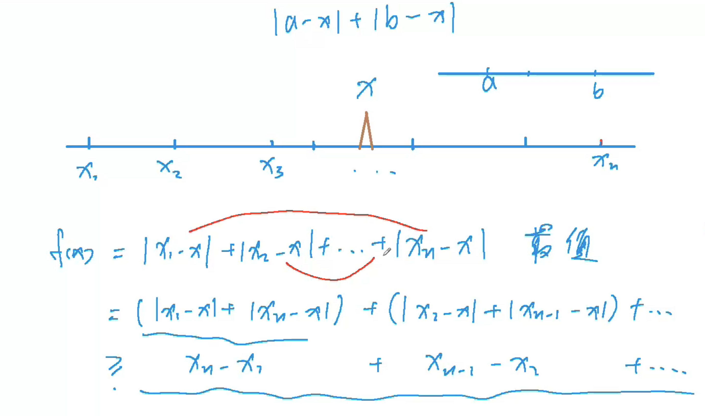

# 绝对值不等式



# 104. 货仓选址

URL：https://www.acwing.com/video/2285/

在一条数轴上有 NN 家商店，它们的坐标分别为 A1∼ANA1∼AN。

现在需要在数轴上建立一家货仓，每天清晨，从货仓到每家商店都要运送一车商品。

为了提高效率，求把货仓建在何处，可以使得货仓到每家商店的距离之和最小。

#### 输入格式

第一行输入整数 NN。

第二行 NN 个整数 A1∼ANA1∼AN。

#### 输出格式

输出一个整数，表示距离之和的最小值。

#### 数据范围

1≤N≤1000001≤N≤100000,
0≤Ai≤400000≤Ai≤40000

#### 输入样例：

```
4
6 2 9 1
```

#### 输出样例：

```
12
```


