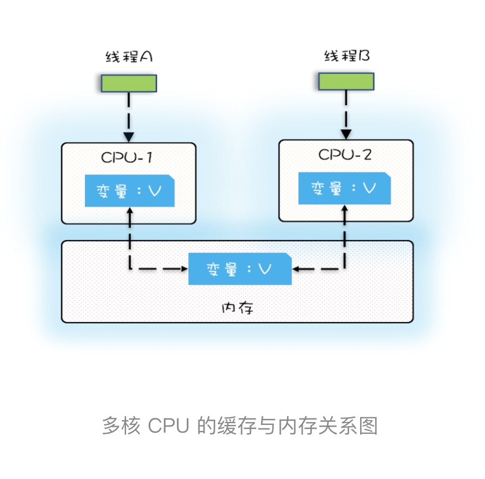

# 01｜ 可见性、原子性和有序性问题：并发编程Bug的源头

## 并发程序背后的故事

这些年，我们的CPU、内存、I/O都在不断迭代，但是其矛盾没有解决：三者的速度差异。

形象的比喻：CPU速度为天上一天，内存速度是地上一年（假如CPU执行一条普通指令需要一天，那么CPU读写内存得等待一年的时间）。内存和I/O的速度差异更多，内存天上一天，I/O设备是地上十年。

程序里大部分语句都需要访问内存，有些还需要访问I/O，根据木桶理论，程序整体的性能取决于最慢的操作——读写I/O为设备，也就是说单方面提高CPU性能是无效的。

为了合理利用CPU的高性能，平衡着三者的速度差异，计算机体系结构、操作系统、编译程序都做出了贡献，主要体现为：

1. CPU增加了缓存，以均衡与内存的速度差异；
2. 操作系统增加了进程、线程，以分时服用CPU，进而均衡CPU与I/O设备的速度差异；
3. 编译程序优化指令执行次序，是的缓存能够得到更加合理地利用。


## 源头之一：缓存导致的可见性问题

在单核时代，所有的线程都是在一颗CPU上执行，CPU缓存与内存的数据一致性容易解决。因为所有线程都是操作同一个CPU的缓存，一个线程对缓存写，对另外一个线程来说一定是可见的。例如在下面的图中，线程A和线程B都是操作同一个CPU里面的缓存，所以线程A更新了变量V的值，那么线程B之后再访问变量V，得到的一定是V的最新值（线程A写过的值）。


一个线程对共享变量的修改，另外一个线程能够立刻看到，我们称为可见性。

多核时代，每颗CPU都有自己的缓存，这时CPU缓存与内存的数据一致性就没那么容易解决了，当多个线程在不同的CPU上执行时，这些线程操作的是不同的CPU缓存。比如下图中，线程A操作的是CPU-1上的缓存，而线程B操作的是CPU-2上的缓存，很明显，这个时候线程A对变量V的操作对于线程B而言就不具备可见性了。这个就属于硬件程序员给软件程序员挖的“坑”。



下面我们再用一段代码来验证一下多核场景下的可见性问题。下面的代码，每执行一次add10K()方法，都会循环1000次count+1操作。在calC（）方法中我们创建两个线程，每·个线程调用一次add10K()方法，我们来想一想执行calc()方法得到的结果应该是多少呢？

```java

public class Test {
  private long count = 0;
  private void add10K() {
    int idx = 0;
    while(idx++ < 10000) {
      count += 1;
    }
  }
  public static long calc() {
    final Test test = new Test();
    // 创建两个线程，执行add()操作
    Thread th1 = new Thread(()->{
      test.add10K();
    });
    Thread th2 = new Thread(()->{
      test.add10K();
    });
    // 启动两个线程
    th1.start();
    th2.start();
    // 等待两个线程执行结束
    th1.join();
    th2.join();
    return count;
  }
}
```

直觉告诉我们应该是20000，因为在单线程里调用两次add10K()方法，count的值就是20000，但实际上calc()的执行结果是个10000到20000之间的随机数。为什么呢？

我们假设线程A和线程B同时开始执行，那么第一次都会将count=0读到各自的cpu缓存里，执行完count+=1之后，各自cpu缓存里的值都是1，同时写入内存后，我们会发现内存中是1，而不是我们期望的2。之后由于各自的CPU缓存里都有了count的值，两个线程都是基于CPU缓存里的count来计算，所以导致最终count的值都是小于20000的，这就是缓存的可见性问题。

## 源头之二：线程切换带来的原子性问题

由于IO太慢，早期的操作系统就发明了多进程，即使在单核的CPU上我们也可以一边听歌，一边写Bug，这个就是多进程的功劳。

操作系统允许某个进程执行一小段时间，例如过了50毫秒，过了50毫秒操作系统就会重新选择一个进程来执行，这个50毫秒成为时间片。

在一个时间片内，如果一个进程进行一个IO操作，例如读文件，这个时候该进程可以把自己标记为“休眠状态”并让出CPU使用权，待文件读进内存，操作系统就会把是这个休眠的进程唤醒，唤醒后的进程就有机会重新获得CPU的使用权了。

这里的进程在等待IO时之所以会释放CPU使用权，是为了让CPU在这段等待时间里可以做别的事情，这样一来CPU的使用率就上来了；此外，如果这时有另外一个进程也读文件，读文件读操作就会排队，磁盘驱动在完成一个进程的读操作后，发现有排队任务，就会立即启动下一个读操作，这样IO的使用率也上来了。

Unix是因为解决该问题而闻名天下的。

早期的操作系统基于进程来调度CPU，不同进程间是不共享内存空间的，所以进程要做任务切换就要切换内存映射地址，而一个进程创建的所有线程，都是共享一个内存空间的，所以线程做任务切换成本就很低了/现在的操作系统都是基于更轻量的线程来调度，现在我们提到的“任务切换”都是指“线程切换”。

Java并发程序都是基于多线程的，自然也会涉及到任务切换，也许你想不到，任务切换也会产生Bug。任务切换到时机大多数是在时间片结束的时候，我们现在都使用高级语言编程，高级语言里一条语句往往需要多条CPU指令完成，例如上面代码count += 1，至少需要三条CPU指令。

- 指令1: 把变量count 从内存加载到 cpu的寄存器
- 指令2: 寄存器到计算单元执行+1操作
- 指令3:将结果写入内存

操作系统做任务切换，可以发生在任何一条CPU指令执行换，CPU指令，而不是高级语言里的一条语句。对于上面三条语句来说，我们假设count = 0，如果线程A在指令1执行完后做线程切换，线程A和线程B按照下图的序列执行，那么我们会发现两个线程都执行了count += 1的操作，但是得到的结果不是我们期望的2，而是1.


 我们潜意识里觉得count += 1这个操作是一个不可分割的整体，线程的切换可以发生在count += 1之前，也可以发生在count += 1之后，但是就是不会发生在中间。（错）

我们把一个或多个操作在CPU执行的过程中不被中断的特性成为原子性。CPU能保证的原子操作是CPU指令级别的，而不是高级语言的操作福，这是违背直觉的地方。


## 源头之三：编译优化带来的有序问题

在Java领域一个经典的案例就是利用双重检查创建单例对象，例如下面的代码：在获取示例getInstance()的放啊中，我们首先判断instance是否为空，如果为空，则锁定Singleton.class并再次检查instance是否为空，如果还为空则创建Singleton的一个实力。

```java

public class Singleton {
  static Singleton instance;
  static Singleton getInstance(){
    if (instance == null) {
      synchronized(Singleton.class) {
        if (instance == null)
          instance = new Singleton();
        }
    }
    return instance;
  }
}
```

假设两个线程A、B同时调用getInstance()方法，他们会同时发现instance == null，于是同时对Singleton.class加锁，此时JVM保证只有一个线程能够加锁成功，另外一个线程则会处于等待状态；线程A会创建一个Singleton实例，之后释放锁，锁释放后，线程B被唤醒，线程B再次尝试加锁，加锁成功，加锁成功后，线程B检查instance == null  时会发现，已经创建过Singleton实例了，所以线程B不会再创建一个Singleton实例。

这一切看上去没有问题，但是并不完美，问题出在了new 操作上，我们以为的new操作应该是：

1. 分配一块内存M；
2. 在内存M上初始化Singleton对象；
3. 然后M的地址赋值给instance变量。

但是实际优化后的执行路径为：

1. 分配一块内存M；
2. 将M的地址赋值给instance变量；
3. 最后在内存M上初始化Singleton对象。

优化后导致的问题：我们假设线程A先执行getInstance()方法，当执行完指令2时恰好发生了线程切换，切换到了线程B上；如果此时线程B也执行getInstance()方法，那么线程B在执行第一个判断时回发现instance != null， 所以直接返回instance,而此时的instance是没有初始化过的，如果我们这个时候访问instance的成员遍历那个就可以出发空指针异常。


## 总结：

看了上面3个源头，还是感觉很无厘头。

但是我们需要去深入理解可见性、原子性、有序性在并发场景下的原理。


## 参考：

极客时间版权所有：https://time.geekbang.org/column/intro/100023901

