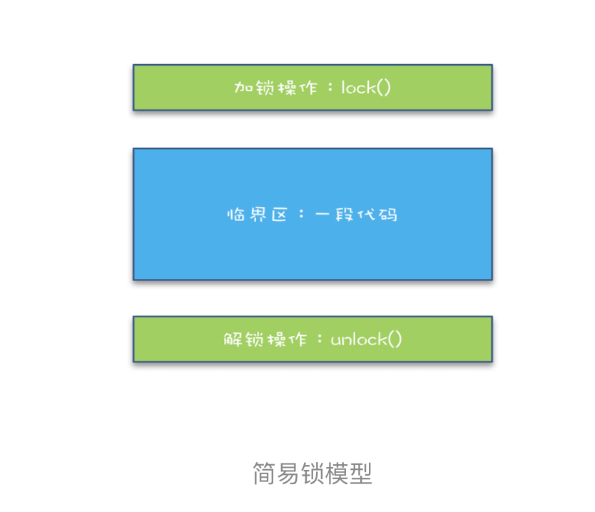
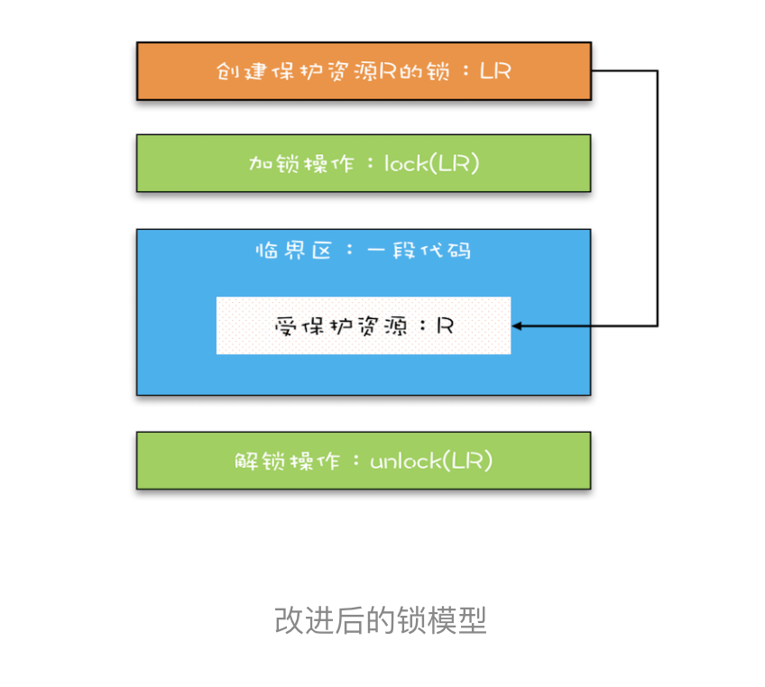

# 03| 互斥锁（上）：解决原子性问题

在第一篇文章中我们提到，一个或者多个操作在CPU执行的过程中不被中断的特性，称为“原子性”。理解这个特性有助于你分析并发编程Bug出现的原因，例如利用它可以分析出long型变量在32位机器上读写可能出现的诡异Bug，明明已经把变量成功写入内存，重新读出来却不是自己写入的。

## 那原子性问题到底该如何解决呢？

你已经知道，原子性问题的源头是线程切换，如果能够禁用线程切换那不就能解决这个问题了吗？而操作系统做线程切换是依赖cpu中断的，所以禁止cpu发生中断就能够禁止线程切换。

在早期单核cpu时代，这个方案的确是可行的，而且也有很多应用案例，但是并不适合多核场景。这里我们以32位cpu执行long型变量的写操作为例来说明这个问题，long型变量是64位，在32位CPU上执行写操作回被拆分成两次操作（写高32位和写低32位，如下图所示）。


在单核cpu场景下，同一时刻只有一个线程执行，禁止cpu中断，意味着操作系统不会重新调度线程，也就是禁止了线程切换，获得cpu使用权的线程就可以不间断地执行，所以两次写操作一定是：要么都执行，要么都没有被执行，具有原子性。

但是在多核场景下，同一时刻，有可能有两个线程同时在执行，一个线程执行在cpu-1上，一个线程执行在cpu-2上，此时禁止cpu中断，只能保证cpu上的线程连续执行，并不能保证同一时刻只有一个线程执行，如果这两个线程同时写long型变量高32位的话，那就可能出现开头提及的Bug了。

**同一时刻只有一个线程运行** 这个条件非常重要，我们称之为互斥。如果我们能够保证对共享变量的修改是互斥的，那么，无论是单核CPU还是多核cpu，就都能保证原子性了。


## 简易锁模型

当谈到互斥，相信聪明的你一定能想到杀手级解决方案：锁。同时大脑中出现以下模型：



我们把一段需要互斥执行的代码称为 **临界区**。 线程在进入临界区之前，首先尝试加锁lock()，如果成功，则进入临界区，此时我们称之歌线程持有锁；否则就等待，直到持有锁的线程解锁；持有锁的线程执行完临界区的代码后，执行解锁unlock()。

这个过程非常像办公司高峰期抢占坑位，每个人都是进坑锁门（加锁），出坑开门（解锁），如厕这个事就是临界区。很长时间里，作者都是这样理解的。这样理解本身没有问题，但是却很容易让人忽略两个非常重要的点：

- 1. 我们锁的是什么？
- 2. 我们保护的又是什么？

## 改进后的锁模型

我们知道在现实世界里，锁和锁要保护的资源是有对应关系的，比如你用你家的锁保护你家的东西，我用我家的锁保护我家的东西。在并发编程世界里，锁和资源也应该有这个关系，但是这个关系在我们上面的模型中是没有体现的，所以我们需要完善一下我们的模型。



首先，我们要把临界区要保护的资源标注出来，如图临界区里增加了一个元素：受保护的资源R；其次，我们要保护资源R就得为它创建一把锁LR；最后针对这把锁LR，我们还需在进出临界区时添加上加锁操作和解锁操作。另外，在锁LR和受保护资源之间，特地用一条线做了关联，这个关联非常重要。很多并发Bug的出现都是因为把它忽略了，然后就出现了类似锁自家们来保护他家资产的事情，这样的Bug不好诊断，因为潜意识里我们认为一斤个正确加锁了。


## Java 语言提供的锁奇数： synchronized

锁是一种通用的技术方案，Java语言提供的synchronized关键字，就是锁的一种实现。

synchronized关键字可以用来修饰方法，也可以用来修饰代码，它的使用示例基本上都是下面这个样子：

```java
class X {
	// 修饰非静态方法
	synchronized void foo() {
		// 临界区
	}
	// 修饰晶态方法 
	synchronized static void bar() {
		// 临界区
	}
	// 修饰代码块
	Object obj = new Object();
	void baz() {
		synchronized(obj) {
			//临界区
		}
	}
	
}
```

看完之后可能会觉得很奇怪，这和我们上面提到的模型有点对不上号，加锁lock()和解锁unlock()在哪里呢？其实这两个操作都是有的，只是这两个操作是被Java默默加上的，Java编译器会在synchronized修饰的方法或代码块前后自动加上锁lock()和解锁unlock()，这样做的好处是加锁lock()和解锁unlock()一定是成对出现的，毕竟忘记解决unlock()可是个致命的Bug(意味着其他线程只能死等下去了)。

那synchronized里的加锁lock()和解锁unlock()锁定的对象在哪里呢？上面的代码我们看到只有修饰代码块的时候，锁定了一个obj对象，那修饰方法的时候锁定的是什么呢？

这个也是Java的一条隐式规则：

> 当修饰静态方法的时候，锁定的是当前类的Class对象，上上面的例子中就是Class X；
>
> 当修饰非静态方法的时候，锁定的是当前实例对象this。

对于上面的例子，synchronized修饰静态方法相当于：

```java
class X {
// 修饰静态方法
	synchronized(X.class) static void bar() {
	//	临界区
	}
}
```

修饰非静态方法，相当于：

```java
class X {
	// 修饰非静态方法
	synchronized(this) void foo() {
	//	临界区
	}
}
```


## 用synchronized 解决 coun += 1问题

相信你一定记得我们前面文章中提到过的count += 1存在的并发问题，现在我们可以尝试用synchronized来小试牛刀一把，代码如下所示。SafaCalc这个类有两个方法：一个是get()方法，用来获得value的值；另一个是addOne()方法，用来给value加1，并且addOne()方法我们用synchronized修饰。那么我们使用的这两个方法有没有并发问题呢？

```java

class SafeCalc {
  long value = 0L;
  long get() {
    return value;
  }
  synchronized void addOne() {
    value += 1;
  }
}
```

我们来看看那addOne()方法，首先可以肯定，被synchronized修饰后，无论是单核Cpu还是多核Cpu，只有一个线程能够执行addOne()方法，所以一定能保证原子操作，那是否有可见性问题呢？回答这个问题，需要重温 **管程中锁的规则**。

> 管程中锁的规则：对一个锁的解锁 Happens-Before于后序对这个锁的加锁。

管程，就是我们这里的synchronized（至于为什么叫管程，我们后面介绍），我们知道synchronized修饰的临界区是互斥的，也就是说同一时刻只有一个线程执行临界区的代码；而所谓“对一个锁解锁Happens-Before后续对这个锁的加锁“，指的是前一个线程的解锁操作对后一个线程的加锁操作可见，综合Happens-Before的传递性原则，我们就能得出前一个线程在临界区修改的共享变量（该操作在解锁前），对后续进入临界区（该操作在加锁之后）的线程是可见的。

按照这个规则，如果多个线程同时执行addOne()方法，可见性是可以保证的，也就是说如果有100个线程执行addOne()方法，最终结果一定是value的值增加了1000。看到这个结果，我们长出一口气，问题解决了。

但也许，你一不小心就忽视了get()方法。执行addOne()方法后，value的值对get()方法是可见的吗？这个可见性是没法保证的。管程中锁的规则，是只保证后续对这个锁的加锁的可见性，而get()方法并没有加锁操作，所以可见性没法保证。那如何解决呢？很简单，就是get()方法也synchronized一下，完整的代码如下所示：

```java
class SafeCalc {
 long value = 0L;
 synchronized long get() {
   return value;
 }
 synchronized void addOne() {
   value += 1;
 }
}
```

上面的代码转换为我们提到的锁的模型，就是下面图示这个样子。get()方法和addOne()方法都需要访问value这个受保护的资源，这个资源用this这把锁来保护。线程要进入临界区get()和addOne()，必须先获得this这把锁，这样get()和addOne()也是互斥的。


这个模型更像是现实世界里面球赛门票的管理，一个座位只允许一个人使用，这个座位就是“受保护资源”，球场的入口就是Java类里的方法，而门票就是用来保护资源的”锁“，Java里的检票工作是由synchronized解决的。


## 锁和受保护资源的关系

我们前面提到，受保护资源和锁的之间的关联关系非常重要，他们的关系是怎么样的呢？一个合理的关系是：**受保护资源和锁之间的关联关系是N：1的关系**。还拿前面球赛门票的管理来类比，就是一个座位，我们只能用一张票来保护，如果多发了重复的票，那就要大家了。现实世界里，我们可以用多把锁来保护同一个资源，但在并发领域是不行的，并发领域的锁和现实世界的锁是不能完全匹配的。不过倒是可以用同一把锁来保护多个资源，这个对应到现实世界就是所谓的包场。

上面的那个例子稍作改动，把value改成静态变量，把addOne()方法改成静态方法，此时get()和addOne()方法是否存在并发问题呢？

```java
Class SafeCalc {
	static long value = 0L;
	synchronized long get() {return value;}
	synchronized staic void addone() {
		value += 1;
	}
	
}
```

如果你仔细观察，就会发现改动后的代码使用两个锁保护一个资源。这个受保护的资源就是静态变量value，两个锁分别是this和SafeCalc.class。我们可以用下面这幅图来形象描述这个关系。由于临界区get()和addOne()是用两个锁保护的，因此这两个临界区没有互斥关系，临界区addOne()对value的修改对临界区get()也没有可见保证，这就导致并发问题了。


## 总结

互斥锁，在并发领域的知名度极高，只要有了并发问题，大家首先容易想到的就是加锁，因为大家都知道，加锁能够保证执行临界区代码的互斥性。这样理解虽然正确，但是却不能够知道你真正用好互斥锁。临界区的代码是操作受保护资源的路径，类似于球场的入口，入口一定要检票，也就是要加锁，但不是随便一把锁都有效。所以必须深入分析锁定的对象和受保护资源的关系，综合考虑受保护资源的访问路径，多方面考量才能用好互斥锁。


synchronized是Java在语言层面提供的互斥原语，其实Java里面还有很多其他类型的锁，但作为互斥锁，原理都是相同的：锁，一定要有一个要锁定的对象，至于这个锁定的对象要保护的资源以及在哪里加锁/解锁，就属于设计层面的事情了。


## 参考：

极客时间版权所有：https://time.geekbang.org/column/intro/100023901

