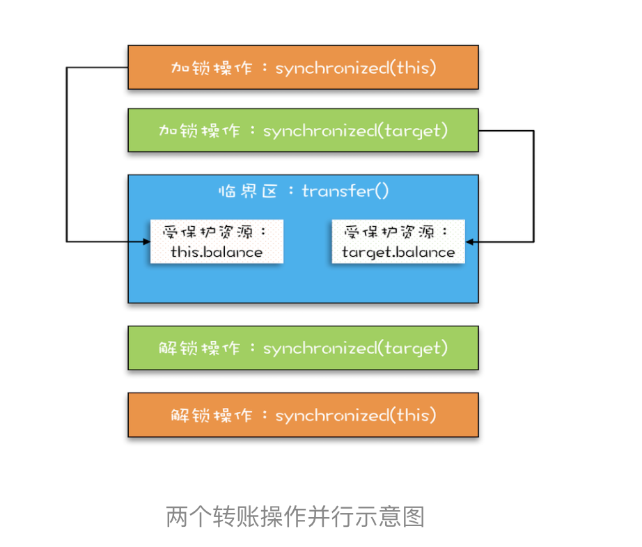
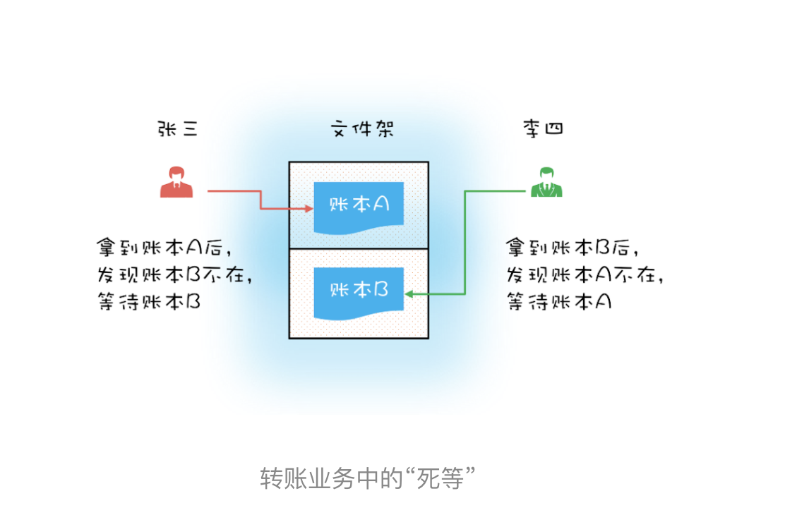
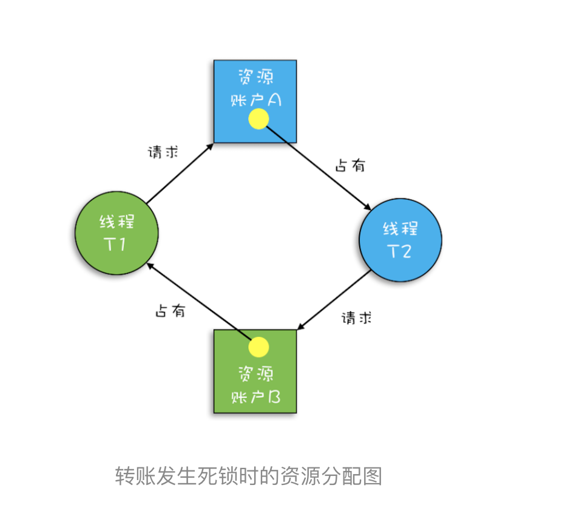

# 05 | 一不小心就死锁了，怎么办？


在上一篇文章中，我们用Account.class作为互斥锁，来解决银行业务里面的转账问题，虽然这个方案不存在并发问题，但是所有账户的转账操作都是串行的，例如账户A转账户B，账户C转账户D这两个转账操作在现在世界里是可以并行的，但是在这个方案里却被串行化了，这样的话，性能太差。

试想互联网支付盛行的当下，8亿网民每人每天一笔交易，每天就是8亿笔交易；每笔交易都对应着一次转账操作，8亿笔交易就是8亿次转账操作，也就是说平均到每秒就是近1万次转账操作，若所有的转账操作都串行，性能完全不能接受。

下那面提升一下。

## 向现实世界要答案

现实世界里，账户转账操作是支持并发的，而且绝对是真正的并行，银行所有的窗口都可以转账操作。只要我们能仿照现实世界做转账操作，串行的问题就解决了。

我们试想在古代，没有信息化，账户的存在形式就是一个账本，而且每个账户都有一个账本，这些账本都统一放在文件架上。银行柜员在给我们做转账时，要去文件夹上把转出账本和转入账本都拿到手，然后做转账。这个柜员在拿账本的时候可以能遇到以下三种情况：

1. 文件驾上恰好有转出账本和转入账本，那就同时拿走；
2. 如果文件驾上只有转出账本和转入账本之一，那这个柜员就先把文件驾上有的账本拿到手，同时等着其他柜员把营外一个账本送回来；
3. 转出账本和转入账本都没有，那么这个柜员就等着两个账本都呗送回来。

上面这个过程在编程世界里怎么实现呢？其实用两把锁就实现了，转出账本一把，转入账本另一把。在transfer()方法内部，我们首先尝试锁定转出账户this(先把转出账本拿到手)，然后尝试锁定转入账户target（再把转入账本拿到手），只有当两者都成功时，才执行转账操作。这个逻辑可以化为下图这个样子。



而至于详细的代码，如下所示。经过这样的优化后，账户A转账户B和账户C转账户D这两个转账操作就可以并行了。

```java
class Account {
  private int balance;
  // 转账
  void transfer(Account target, int amt){
    // 锁定转出账户
    synchronized(this) {              
      // 锁定转入账户
      synchronized(target) {           
        if (this.balance > amt) {
          this.balance -= amt;
          target.balance += amt;
        }
      }
    }
  } 
}
```


## 没有免费的午餐

上面的实现看上去很完美，并且也算是将锁用得出神入化了。相对于Account.class作为互斥锁，锁定的范围太大，而我们锁定两个账户范围就小多了，这样的锁，上一章我们介绍过，叫做 **细粒度锁**。 **使用细粒度锁可以提高并行度，是性能优化的一个重要手段**。

这个时候你可能已经开始警觉了，使用细粒度锁着么简单，有这样的好事，是不是也要付出点什么代价呀？编写并发程序就需要这样时时刻刻保持谨慎。

**的确，使用细粒度锁是有代价的，这个代价就是可能会导致死锁**。

在介绍死锁之前，我们先看看现实世界里一种特殊场景。如果有客户找柜员张三做个转账业务：账户A转给B 100元，此时另外一个客户找柜员李四也做个转账业务：账户B 转 账户A 100元，于是张山和李四同时都去文件驾上拿账本，这个时候可能凑巧张三拿到了账本A，李四拿到了账本B。张三拿到账本A后就等着账本B，而李四拿到账本B后就等着账本A，他们要等多久呢？他们会永远等待下去...因为张山不会把账本A送回去，李四也不会把账本B送回去。

现实世界里的死等，就是编程领域的死锁了。**死锁**的一个比较专业的定义是： **一组互相竞争资源的线程因互相等待，导致‘永久’阻塞**的现象。

上面转账的代码是怎么发生死锁的呢？

我们假设线程T1 执行账户A 转账户B 的操作，账户A.transfer(账户B)；同时线程T2执行账户B转账户A的操作，账户B.transfer(账户A)。当T1和T2同时执行完1⃣️初的代码，T1获得了账户A的锁（对于T1，this是账户A），而T2获得了账户B的锁（对于T2，this是账户B）。之后t1和t2在执行2⃣️处的代码了时，t1试图获取账户B的锁，发现账户B已经被锁定（被T2锁定），所以T1开始等待；T2则是图获取账户A的锁时，发现账户A已经被锁定（被T1锁定），所以T2也开始等待。于是T1和T2会无期限地等待下去，也就是我们所说的死锁了。

> 和操作系统里面学的死锁的感觉差不多，不过这里是更详细的代码～ 之前是资源被占了，现在是锁被拿了

```java

class Account {
  private int balance;
  // 转账
  void transfer(Account target, int amt){
    // 锁定转出账户
    synchronized(this){     ①
      // 锁定转入账户
      synchronized(target){ ②
        if (this.balance > amt) {
          this.balance -= amt;
          target.balance += amt;
        }
      }
    }
  } 
}
```

关于这种现象，我们还可以借助资源分配图来可视化锁的占用情况（资源分配图是个有向图，它可以描述资源和线程的状态）。其中，资源用方形节点表示，线程则用圆形节点表示；资源中的点执行线程的边表示：线程已经获得该资源，线程指向资源的边表示：线程请求资源，但尚未得到。转账发生死锁时的资源分配图如下图所示，一个“各占据汕头死等”的尴尬局面。



## 如何预防死锁

并发程序一旦死锁，一般没有特别好的方法，很多时候只能重启应用。因此，解决死锁问题的最好办法还是规避死锁。

那如何避免死锁呢？要避免死锁就需要分析死锁发生的条件，有个叫Coffman的牛人早就总结过了，只有以下四个条件都发生时才会出现死锁：

1. 互斥：共享资源X和Y只能被一个线程占用。
2. 占有且等待：线程T1已经取得共享资源X，在等待共享资源Y的时候，不释放共享资源X。
3. 不可抢占：其他线程不能强行抢占T1占有的资源。
4. 循环等待：线程t1等待线程t2,t2等待t1占有的资源，就是循环等待。

反过来分析，**也就是说只要我们破坏其中一个，就可以成功避免死锁的发生**。

其中，互斥这个条件我们没有办法破坏，因为我们用锁为的就是互斥。不过其他三个条件都有办法破坏，那么如何去做呢？

1. 对于“占用且等待”这个条件，我们可以一次性申请所有的资源，这样就不存在等待了。
2. 对于“不可抢占”这个条件，占用部分资源的线程进一步申请其他资源时，如果申请不到，可以主动释放它的资源，这样不可抢占这个条件就破坏掉了。
3. 对于“循环等待”这个条件，可以按序申请资源来预防。所谓按序申请，是指资源是有线性顺序的，申请的时候可以先申请资源序号小的，再申请资源序号大的，这样线性化后自然就不存在循环了。


代码实现：

**1.破坏占用且等待条件**

我不是很喜欢这个方法

对应到编程领域，“同时申请”这个操作是一个临界区，我们也需要一个角色（Java 里面的类）来管理这个临界区，我们就把这个角色定为 Allocator。它有两个重要功能，分别是：同时申请资源 apply() 和同时释放资源 free()。账户 Account 类里面持有一个 Allocator 的单例（必须是单例，只能由一个人来分配资源）。当账户 Account 在执行转账操作的时候，首先向 Allocator 同时申请转出账户和转入账户这两个资源，成功后再锁定这两个资源；当转账操作执行完，释放锁之后，我们需通知 Allocator 同时释放转出账户和转入账户这两个资源。具体的代码实现如下。

```java

class Allocator {
  private List<Object> als =
    new ArrayList<>();
  // 一次性申请所有资源
  synchronized boolean apply(
    Object from, Object to){
    if(als.contains(from) ||
         als.contains(to)){
      return false;  
    } else {
      als.add(from);
      als.add(to);  
    }
    return true;
  }
  // 归还资源
  synchronized void free(
    Object from, Object to){
    als.remove(from);
    als.remove(to);
  }
}

class Account {
  // actr应该为单例
  private Allocator actr;
  private int balance;
  // 转账
  void transfer(Account target, int amt){
    // 一次性申请转出账户和转入账户，直到成功
    while(!actr.apply(this, target))
      ；
    try{
      // 锁定转出账户
      synchronized(this){              
        // 锁定转入账户
        synchronized(target){           
          if (this.balance > amt){
            this.balance -= amt;
            target.balance += amt;
          }
        }
      }
    } finally {
      actr.free(this, target)
    }
  } 
}
```

**2.破坏不可抢占条件**

破坏不可抢占条件看上去很简单，核心是要能够主动释放它占用的资源，这一点synchronized是做不到的。原因是synchronized申请资源的时候，如果申请不到，线程直接进入阻塞状态了，而线程进入阻塞状态，啥都干不了，也释放不了线程已经占用的资源。

你可能会之一，“java 作为排行榜第一的语言，这都解决不了？”你的怀疑没错，不过在SDK层面还是解决了的，java.util.concurent这个包下面提供的Lock是可以轻松解决这个问题的。关于这个话题，咱们后面会详细讲。


**3. 破坏循环等待条件**

破坏这个条件，需要对资源进行排序，然后按序申请资源。这个实现非常简单，我们假设每个账户都有不同的属性id，这个id可以作为排序字段，申请的时候，我们可以按照从小到大的顺序来申请。比如下面代码中，1-6处的代码对转出账户和转入账户排序，然后按照序号从小到大锁定账户。这样就不存在“循环”等待了。

```java

class Account {
  private int id;
  private int balance;
  // 转账
  void transfer(Account target, int amt){
    Account left = this        ①
    Account right = target;    ②
    if (this.id > target.id) { ③
      left = target;           ④
      right = this;            ⑤
    }                          ⑥
    // 锁定序号小的账户
    synchronized(left){
      // 锁定序号大的账户
      synchronized(right){ 
        if (this.balance > amt){
          this.balance -= amt;
          target.balance += amt;
        }
      }
    }
  } 
}
```


## 总结

利用现实世界的模型来构思解决方案。

利用细粒度锁来锁定多个之资源时，要注意死锁的问题。

预防死锁主要是破坏三个条件中的一个，有了这个思路后，实现就比较简单了。

我们选择具体方案的时候，需要评估一下操作成本，从中选择一个成本最低的方案。


## 参考：

极客时间版权所有：https://time.geekbang.org/column/intro/100023901

