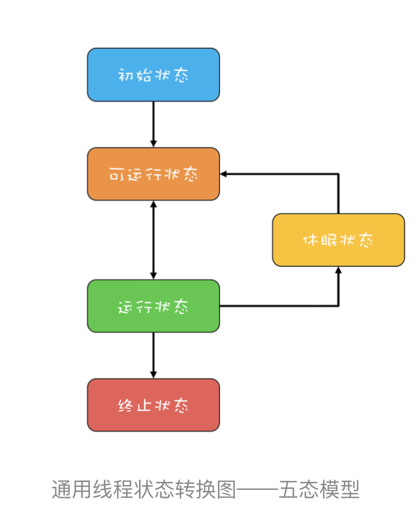
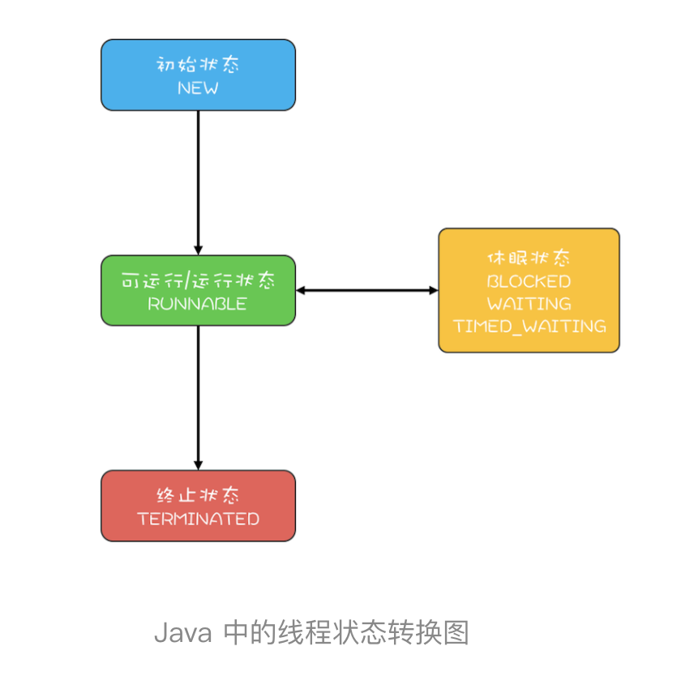

# 09 | Java线程（上）：Java线程的生命周期

> 感觉和os中差不多

在Java领域，实现并发程序的主要手段就是多线程。线程是操作系统里的一个概念，虽然各种不同的开发语言如Java、c#等都对其进行了封装，但是万变不离操作系统。Java语言里的闲扯个本质上就是操作系统的线程，它们是一一对应的。

在操作系统层面，线程也有“生老病死”，专业的说法叫做生命周期。对于有生命周期的事物，要学好它，思路非常简单，只要能搞懂生命周期中的各个节点的状态转换机制就可以了。

虽然不同的开发语言对于操作系统进行了不同的封装，但是对于线程的生命周期这部分，基本上是雷同的。所以，我们可以先来了解一下通用的线程生命周期模型，这部分的内容也适用于很多其他编程语言；然后再详细有针对的学习一下Java中线程的生命周期。


## 通用的线程生命周期

通用的线程生命周期基本上可以用下图这个“五态模型”来描述。这五态分别是： **初始状态、可运行状态、允许状态、休眠状态、终止状态**。



这“五态模型”的详细情况如下所示：

1. 初始状态：指的是线程已经被创建，但是还不允许分配CPU执行。这个状态属于编程语言特有的，不过这里所谓的被创建，仅仅是在编程语言层面被创建，而在操作系统层面，真正的线程还没有创建。
2. 可运行状态，指的是线程可以分配cpu执行。在这种状态下，真正的操作系统线程已经被成功创建了，所以可以分配cpu执行。
3. 当有空闲的cpu时，操作系统就会将其分配给一个处于可运行状态的线程，被分配到cpu的线程的状态就转换成了运行状态。
4. 运行状态的线程如果调用一个阻塞的api或者某个等待时间，那么线程的状态就会转换到休眠状态，同时释放cpu使用权，休眠状态的线程永远没有机会获得cpu使用权。当等待的时间出现了，线程就会从休眠状态转换到可运行状态。
5. 线程执行完或者出现异常就会进入终止状态，终止状态的线程不回切换到其他任何状态，进入终止状态也就意味着线程的生命周期结束了。

这五种状态在不同的编程语言里有简化合并，比如java语言里把可运行状态和运行状态合并了，这两个状态在操作系统调度层面有用，而jvm层面不关心这两个状态，因为jvm把线程调度交给操作系统处理了。

除了简化合并，这五种状态也有可能被细化，比如，java语言就细化了休眠状态。


## java中线程的生命周期

介绍完通用的线程生命周期模型，下面来介绍java语言里的线程生命周期是什么样的。

java语言中线程共有六种状态，分别是：

1. New （初始化状态）
2. Runnable(可运行/运行状态)
3. Blocked(阻塞状态)
4. Waiting(无限时等待)
5. Timed_waiting(有限时等待)
6. Terminated(终止状态)

所以Java线程的生命周期可以简化为下图：



转换过程如下：


**1.RUNNABLE与BLOCKED的状态转换**

只有一种场景回触发这种转换，就是线程等待synchronized的隐式锁。synchronized修饰的方法、代码块同一时刻只允许一个线程执行，其他线程只能等待，这种情况下，等待的线程就会从RUNNABLE转换到BLOCKED状态。而当等待的线程获得synchronized隐式锁时，就又会从BLOCKED转换到RUNNABLE状态。

疑问：线程调用阻塞式API时，是否会转换到BLOCKED状态呢？在操作系统层面，线程时会转换到休眠状态的，但是在JVM层面，Java线程的状态不会发生变化，也就时说Java线程的状态会依然保持RUNNABLE状态。JVM层面并不关心操作系统调度相关的状态，因为在JVM看来，等待CPU使用权与等待I/O没有区别，都是在等待某个资源，所以都归入了RUNNABLE状态。

而我们平时所谓的Java在调用阻塞式API时，线程会阻塞，指的是操作系统线程的状态，而不是Java线程的状态。

**2.RUNNABLE与#WAITING的状态转换**

总体来说，有三种场景会触发这种转换。

第一种场景，获得synchronized隐式锁的线程，调用无参数的Object.wait()方法。其中，wait()方法我们在上一篇讲管程的时候已经深入介绍过了，这里就不再赘述。

第二种场景，调用无参数的Thread.join()方法。其中的join()是一种线程同步方法，例如有一个对象thread A ,当调用A.join()的时候，执行后这条语句的线程会等待thread A 执行完，而等待中的这个线程，其状态会从RUNNABLE转换到WAITING。当线程thread A执行完，原来等待它的线程又会从WAITING状态转换到 RUNNABLE。

第三种场景，调用LockSupport.park()方法。其中的LockSupport对象，很陌生，其实Java并发包中的锁，都是基于它实现的。调用LockSupport.park()方法，当前线程会阻塞，线程的状态会从RUNNABLE转换到WAITING。调用LockSupport.unpark(Thread thread)可唤醒目标线程，目标的状态又会从WAITING转换到RUNNABLE。

**3. RUNNABLE 与 TIMED_WAITING的转台转换**

有五种场景会触发这种转换：

1. 调用带超时参数的Thread.sleep(long mills)方法；
2. 获得synchronized隐式锁的线程，调用带超时参数的Object.waiting(long timeout)方法；
3. 调用带超时参数的Thread.join(long mills)方法；
4. 调用带超时参数的LockSupport.parkNanos(Object blocker, long deadline)方法；
5. 调用带超时参数的LockSupport.partUntil(long deadline)方法；

这里发现：TIMED_WAITING和WAITING状态的区别，仅仅是触发条件多了超时参数。

**4. 从NEW到RUNNABLE状态**

Java刚创建出来的Thread对象就是NEW状态，而创建Thread对象主要有两种方法。

**一种是继承Thread对象，重写run()方法。**示例代码如下：

```java

// 自定义线程对象
class MyThread extends Thread {
  public void run() {
    // 线程需要执行的代码
    ......
  }
}
// 创建线程对象
MyThread myThread = new MyThread();
```

**另一种是实现Runnable接口，重写run()方法，并将该是嫌累作为创建Thread对象的参数**。示例代码如下：

```java

// 实现Runnable接口
class Runner implements Runnable {
  @Override
  public void run() {
    // 线程需要执行的代码
    ......
  }
}
// 创建线程对象
Thread thread = new Thread(new Runner());
```

NEW 状态的线程，不会被操作系统调度，因此不会执行。Java线程要执行，就必须转换到Runnable状态。从NEW状态转换到RUNNABLE状态很简单，只要调用点成对象的start()方法就可以了，示例代码如下：

```java

MyThread myThread = new MyThread();
// 从NEW状态转换到RUNNABLE状态
myThread.start()；
```

**5. 从RUNNABLE到TERMINATED状态**

线程执行完run()方法后，会自动转换到TERMINATED状态，当然如果执行run()方法的时候异常抛出，也会导致线程终止。有时候我们需要强制中断run()方法的执行，例如run()方法访问一个很慢的网络，我们等不下去了，想终止怎么办呢？Java的Thread类里面倒是有个stop()方法，不过已经标记为@Deprecated，所以不建议使用了。正确的姿势是调用interrupt()方法。

**那stop()和interrupt()方法的主要区别是什么呢？**

stop()方法会真的杀死线程，不给线程喘息的机会，如果线程持有ReentrantLock锁，被stop()的线程并不回自动调用ReentreanLock的unlock（）去释放锁，那其他线程就再也没有机会获得ReetrantLock锁，这很危险。因此该方法被弃用了。

而interrupt()方法就温柔的多了，interrupt()方法仅仅是通知线程，线程有机会执行一些后续的操作，同时也可以无视这个通知。被interrupt的线程，是怎么收到通知的呢？一种是异常，另一种是主动监测。

当线程A处于WAITING、TIMED——WAITING状态时，如果其他线程调用线程A的interrupt()方法，会使线程A返回到RUNNABLE状态，同时线程A到代码会触发interruptedException异常。上面我们提到转换到WAITING、TIMED_WAITING状态的出发，都是调用了wait()、joint()、sleep()这样的方法，看这些方法的签名，发现都会throws interruptedException这个异常。这个异常的触发条件就是：其他线程调用了该线程的interrupt()方法。

当线程A处于RUNNABLE状态时，并且阻塞在java.nio.channels.InterruptibleChannel上时，如果其他线程调用线程A的interrupt()方法，线程A会触发java.nio.channels.ClosedByInterruptException这个异常；而阻塞在java.nio.channels.Selector上时，如果其他线程调用线程A的interrupt()方法，线程A的java.nio.channels.Selector会立即返沪。

上面这两种情况属于被中断的线程通过异常的方式获得了通知。还有一种是主动检测，如果线程处于RUNNABLE状态，并且没有阻塞在某个I/O操作上，例如中断计算圆周率的线程A，就时候就得依赖线程A主动检测中断状态了。如果其他线程调用线程A的interrupt()方法，那么线程A可以通过isInterrupted()方法，检测是不是自己被中断了。


## 总结

理解Java线程的各种状态以及生命周期对于诊断多线程Bug非常有帮助，多线程程序很难调试，出了Bug基本都是靠日志，靠线程dump来跟踪问题，分析线程dump的一个基本功就是分析线程状态，大部分的死锁、饥饿、活锁问题都需要跟踪分析线程的状态。同时，本文介绍的线程生命周期具备很强的通用性，对于学习其他语言的多线程编程也有很大的帮助。

你可以通过jstack命令或者Java VisualVM这个可视化工具将jvm所有的线程信息导出，完整的线程栈信息不仅包括线程的当前状态、调用栈，而且还包括了锁的信息。


## 参考：

极客时间版权所有：https://time.geekbang.org/column/intro/100023901