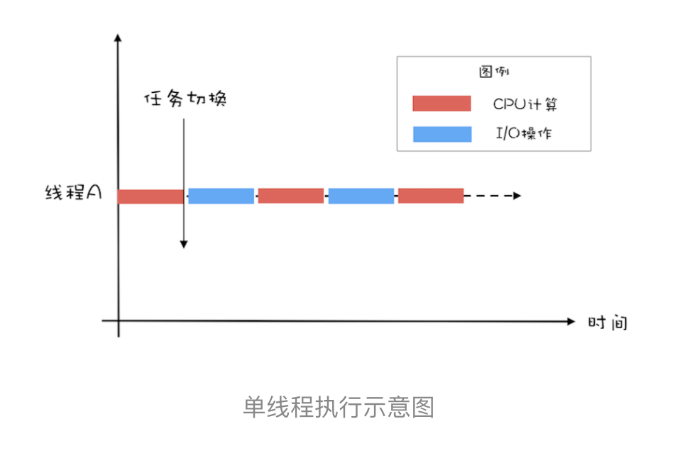
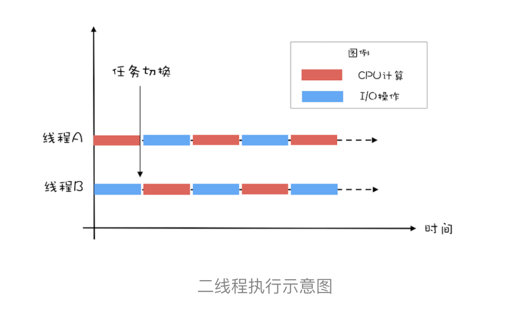
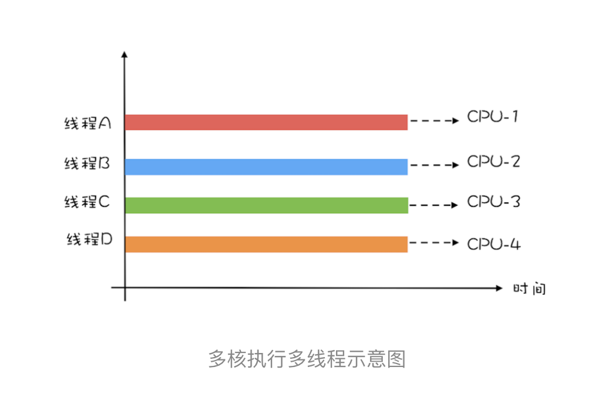
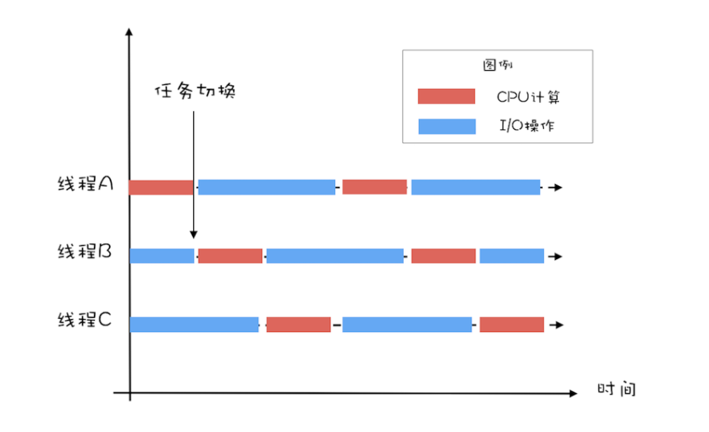

# 10 | Java线程（中）：创建多少线程才是合适的？

在java领域，实现并发程序的主要手段就是多线程，使用多线程还是比较简单的，但是使用多少个线程却是个困难的问题。工作中，经常有人问，“各种线程池的线程数量调整成多少是合适的？”或者Tomcat的线程数、jdbc连接池的连接数是多少等等。 那我们应该如何设置合适的线程数呢？

要解决这个问题，首先要分析以下两个问题：

1. 为什么要使用多线程？
2. 多线程的应用场景有哪些？

## 为什么要使用多线程？

使用多线程，本质就是提升程序性能。不过此刻谈到的性能，可能在脑海中还是比较笼统的，基本就是快、快、快，这种无法度量的感性认识很不科学，所以在提升性能之前，首要问题是：如何度量性能。

度量性能的指标有很多，但是有两个指标是最核心的，它们就是延迟和吞吐量。

**延迟：发出请求到收到响应这个过程的时间；延迟越短，意味执行越快，性能越好。**

**吞吐量：指的是在单位时间内能处理·请求的数量；吞吐量越大，意味着程序能处理的请求越多，性能越好。**

这两个指标内部有一定的联系（同等条件下，延迟越短，吞吐量越大），但是它们属于不同的维度，并不能互相转换。

我们所谓的提升性能，从度量的角度，主要是 **眼底延迟，提高吞吐量**。这也是我们使用多线程的主要目的。那么如何降低延迟，提高吞吐量呢？这个就要从多线程的应用场景说起。

## 多线程的应用场景

要想“降低延迟，提高吞吐量”，对应的方法呢，基本有两个方向，一个方向是 **优化算法**，另一个方向是 **将硬件的性能发挥到极致**。 前者属于算法范围，后者则是和并发编程息息相关了。那计算机主要有哪些硬件呢？主要是两类：一个是I/O，一个是CPU。简言之， **在并发编程领域，提升性能本质上就是体检硬件的利用率，再具体来说，就是提升I/O的利用率和CPU的利用率**。

估计这个时候你会有个疑问，操作系统不是已经解决了硬件的利用率问题了吗？的确是这样，例如操作系统已经解决了磁盘和网卡的利用率问题，利用中断机制还能避免CPU轮询I/O状态，也提升了CPU的利用率。但是操作系统解决硬件利用率低问题的对象往往是单一的硬件设备，而我们的并发程序，往往需要cpu和i/o设备相互配合工作，也就是说，我们需要解决cpu和i/o综合利用率低问题，操作系统虽然没有办法完美解决，但是却给我们提供了方案，那就是：多线程。

下面我们用一个简单的示例来说明：如何利用多线程来提升cpu和i/o设备的利用率？假设程序按照cpu计算和i/o操作交叉执行的方式运行，而且cpu计算和i/o操作的耗时是1:1。

如下图所示，如果只有一个线程，执行cpu计算的时候，i/o设备空间，执行i/o操作的时候，cpu空闲，所以cpu的利用率和i/o设备的利用率都是50%。

如果有两个线程，如下图所示，当线程 A 执行 CPU 计算的时候，线程 B 执行 I/O 操作；当线程 A 执行 I/O 操作的时候，线程 B 执行 CPU 计算，这样 CPU 的利用率和 I/O 设备的利用率就都达到了 100%。

我们将 CPU 的利用率和 I/O 设备的利用率都提升到了 100%，会对性能产生了哪些影响呢？通过上面的图示，很容易看出：单位时间处理的请求数量翻了一番，也就是说吞吐量提高了 1 倍。此时可以逆向思维一下，如果 CPU 和 I/O 设备的利用率都很低，那么可以尝试通过增加线程来提高吞吐量。

在单核时代，多线程主要就是用来平衡 CPU 和 I/O 设备的。如果程序只有 CPU 计算，而没有 I/O 操作的话，多线程不但不会提升性能，还会使性能变得更差，原因是增加了线程切换的成本。但是在多核时代，这种纯计算型的程序也可以利用多线程来提升性能。为什么呢？因为利用多核可以降低响应时间。

为便于你理解，这里我举个简单的例子说明一下：计算 1+2+… … +100 亿的值，如果在 4 核的 CPU 上利用 4 个线程执行，线程 A 计算[1，25 亿)，线程 B 计算[25 亿，50 亿)，线程 C 计算[50，75 亿)，线程 D 计算[75 亿，100 亿]，之后汇总，那么理论上应该比一个线程计算[1，100 亿]快将近 4 倍，响应时间能够降到 25%。一个线程，对于 4 核的 CPU，CPU 的利用率只有 25%，而 4 个线程，则能够将 CPU 的利用率提高到 100%。

## 创建多少线程合适？

创建多少线程合适，要看多线程具体的应用场景。我们的程序一般都是 CPU 计算和 I/O 操作交叉执行的，由于 I/O 设备的速度相对于 CPU 来说都很慢，所以大部分情况下，I/O 操作执行的时间相对于 CPU 计算来说都非常长，这种场景我们一般都称为 I/O 密集型计算；和 I/O 密集型计算相对的就是 CPU 密集型计算了，CPU 密集型计算大部分场景下都是纯 CPU 计算。I/O 密集型程序和 CPU 密集型程序，计算最佳线程数的方法是不同的。

下面我们对这两个场景分别说明。

- 对于 CPU 密集型计算，多线程本质上是提升多核 CPU 的利用率，所以对于一个 4 核的 CPU，每个核一个线程，理论上创建 4 个线程就可以了，再多创建线程也只是增加线程切换的成本。所以，对于 CPU 密集型的计算场景，理论上“线程的数量 =CPU 核数”就是最合适的。不过在工程上，线程的数量一般会设置为“CPU 核数 +1”，这样的话，当线程因为偶尔的内存页失效或其他原因导致阻塞时，这个额外的线程可以顶上，从而保证 CPU 的利用率。

- 对于 I/O 密集型的计算场景，比如前面我们的例子中，如果 CPU 计算和 I/O 操作的耗时是 1:1，那么 2 个线程是最合适的。如果 CPU 计算和 I/O 操作的耗时是 1:2，那多少个线程合适呢？是 3 个线程，如下图所示：CPU 在 A、B、C 三个线程之间切换，对于线程 A，当 CPU 从 B、C 切换回来时，线程 A 正好执行完 I/O 操作。这样 CPU 和 I/O 设备的利用率都达到了 100%。

通过上面这个例子，我们会发现，对于 I/O 密集型计算场景，最佳的线程数是与程序中 CPU 计算和 I/O 操作的耗时比相关的，我们可以总结出这样一个公式：

> 最佳线程数 =1 +（I/O 耗时 / CPU 耗时）

我们令 R=I/O 耗时 / CPU 耗时，综合上图，可以这样理解：当线程 A 执行 IO 操作时，另外 R 个线程正好执行完各自的 CPU 计算。这样 CPU 的利用率就达到了 100%。

不过上面这个公式是针对单核 CPU 的，至于多核 CPU，也很简单，只需要等比扩大就可以了，计算公式如下：

>  最佳线程数 =CPU 核数 * [ 1 +（I/O 耗时 / CPU 耗时）]

## 总结

很多人都知道线程数不是越多越好，但是设置多少是合适的，却又拿不定主意。其实只要把握住一条原则就可以了，这条原则就是将硬件的性能发挥到极致。上面我们针对 CPU 密集型和 I/O 密集型计算场景都给出了理论上的最佳公式，这些公式背后的目标其实就是将硬件的性能发挥到极致。对于 I/O 密集型计算场景，I/O 耗时和 CPU 耗时的比值是一个关键参数，不幸的是这个参数是未知的，而且是动态变化的，所以工程上，我们要估算这个参数，然后做各种不同场景下的压测来验证我们的估计。不过工程上，原则还是将硬件的性能发挥到极致，所以压测时，我们需要重点关注 CPU、I/O 设备的利用率和性能指标（响应时间、吞吐量）之间的关系。

更多的精力其实应该放在算法的优化上，线程池的配置，按照经验配置一个，随时关注线程池大小对程序的影响即可，具体做法：可以为你的程序配置一个全局的线程池，需要异步执行的任务，扔到这个全局线程池处理，线程池大小按照经验设置，每隔一段时间打印一下线程池的利用率，做到心里有数。

看到过太多的代码，遇到要执行一个异步任务就创建一个线程池，导致整个程序的线程池大到爆，完全没必要。而且大多数时候，提高吞吐量可以通过使用缓存、优化业务逻辑、提前计算好等方式来处理，真没有必要太过于关注线程池大小怎么配置，如果小了就改大一点，大了改小一点就好，从老师本文的篇幅也可以看出来。

经验值不靠谱的另外一个原因，大多数情况下，一台服务器跑了很多程序，每个程序都有自己的线程池，那CPU如何分配？还是根据实际情况来确定比较好。

## 参考：

极客时间版权所有：https://time.geekbang.org/column/intro/100023901

