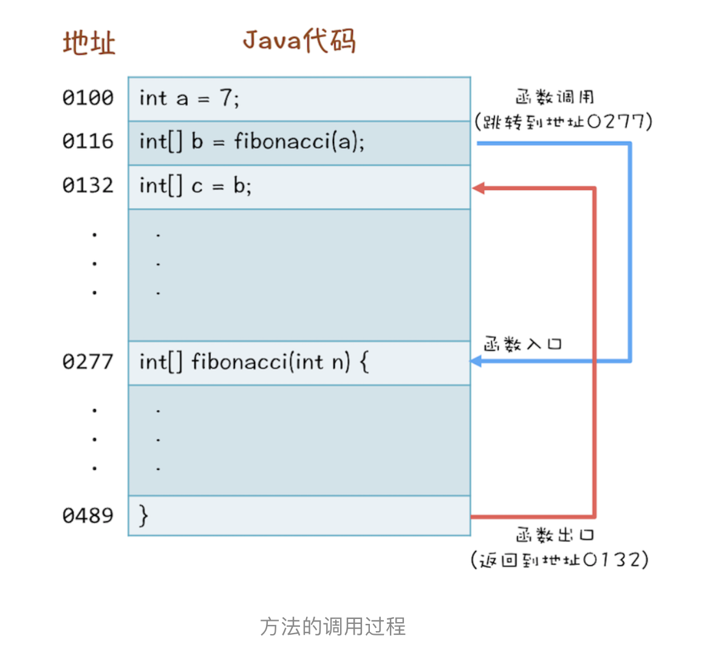
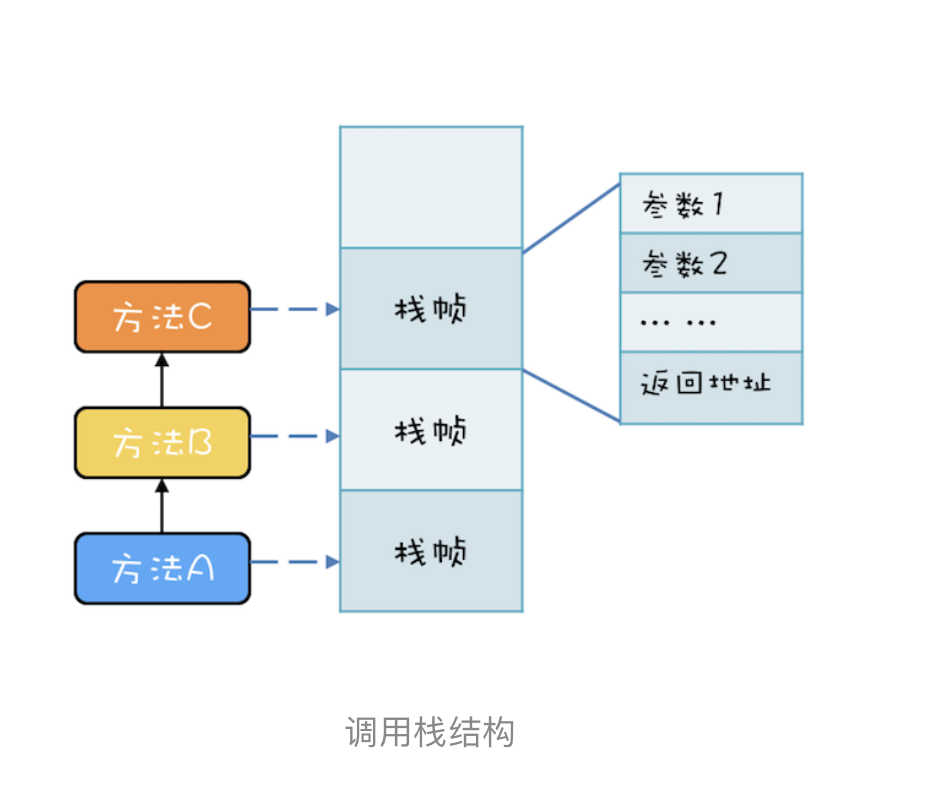
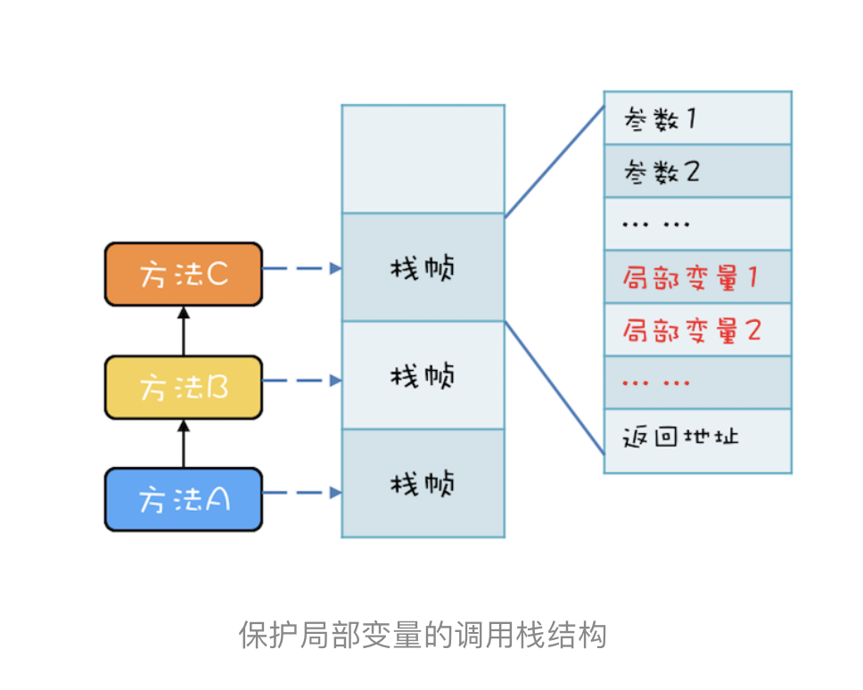
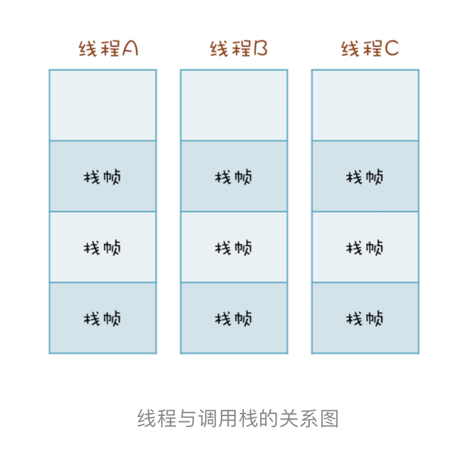

# 11 | Java线程（下）：为什么局部变量是线程安全的？

我们一遍一遍重复再重复地讲到，多个线程同时访问共享变量的时候，会导致并发问题。那在Java语言里，是不是所有变量都是共享变量的？工作中，作者发现了不少同学会给方法里面的比局部变量设置同步，显然这些同学没有把共享变量搞清楚。那Java方法里面的局部变量是否存在并发问题呢？下面结合具体例子来剖析这个问题。

比如，下面代码里面的fibonacci()这个方法，会根据传入的参数n，返回1到n的斐波那契数列，斐波那契数列类似这样：1、1、2、3、5、8、13、21、34..... 第1项和第2项是1，从第3项开始，每一项都等于前两项之和。在这个方法里面，有个局部变量：数组r用来保存数列的结果，每次计算完一项，都会更新数组r对应位置中的值。你可以思考这样一个问题，当多线程调用fibonacci()这个方法的时候，数组r是否存在数据竞争（Data Race)呢？

```java
int[] fibonacci(int n) {
  int[] r = new int[n]
	r[0] = r[1] = 1;
	for (int i = 2;i < n; i++) {
		r[i] = r[i-2] + r[i-1];
	}
  return r;
}
```

你自己可以在大佬里模拟一下多个信啊好吃呢个调用fibonacci()方法的情景，假设多个线程执行到1处，多个线程都要对数组r的第1项和第2项赋值，这里看上去感觉是存在数据竞争的，不过感觉欺骗了你。

其实很多人也是知道局部变量不存在数据竞争的，但是原因就说不清楚了。

那它背后的原因到底是怎样的呢？要弄清楚这个，只需要一点点编译原理的只是。你知道在cpu层面，是没有方法概念的，cpu眼里，只有一条条的指令。编译程序，负责把高级语言里的方法转换成一条条的指令。所以你可以站在编译器实现者的角度来思考“怎么完成方法到指令的转换。

## 方法是如何被执行的

高级语言里的普通语句，例如上面的r[i] = r[i-2] + r[i-1]；翻译成cpu的指令相对简单，可方法的调用就比较复杂了。例如下面者三行代码：第1行，声明一个int变量a；第2行，调用方法fibonacci(a)；第3行，将b赋值给c。

```java
int a = 7;
int[] b = fibonacci(a);
int[] c= b;
```

当你调用fibonacci(a)的时候,cpu要想找到房啊fibonacci()的地址，然后跳转到这个地址去执行代码，最后cpu执行完方法fibonacci()之后，要能够返回。首先找到调用方法的下一条语句的地址：也就是int[] c = b，再跳转到这个地址去执行。可以参考下图加深一下理解。



到这里，方法调用的过程想必你已经清楚了，但是还有一个很重要的问题，“cpu去哪里找到调用方法的参数和返回地址？”如果你熟悉cpu的工作原理，你应该会立刻想到：通过cpu的**堆栈寄存器**。cpu支持一种栈结构，因为这个栈和方法调用相关，因此经常被称为**调用栈**。

例如，有三个方法A、B、C，他们的调用关系是A->B->C（A调用B，B调用C），在运行时，会构建出下面这样的调用栈。每个方法在调用栈里都有自己的独立空间，称为**栈帧**，每个栈帧里都有对应方法需要的参数和返回地址。当调用方法时，会创建新的栈帧，并压入调用栈，当方法返回时，对应的栈帧就会被自动弹出。也就是说，**栈帧和方法是同生共死的**。



利用栈结构来支持方法调用这个方案非常普遍，以至于cpu里内置了栈寄存器。虽然各家编程语言定义的方法千奇百怪，但是方法的内部执行原理是一致的：都是**靠栈结构解决**的。Java语言虽然是靠虚拟机解释执行的，但是方法的调用也是利用栈结构解决的。

## 局部变量存哪里？

我们已经知道了方法间的调用在cpu眼里是怎么执行的，但还有一个关键问题：方法内的局部变量存哪里？

局部变量的作用域是方法内部，也就是说当方法执行完，局部变量就没用了，局部变量应该和方法同生共死。此时你应该会想到调用栈的栈真，调用栈的栈帧就是和方法同生共死的，所以局部放到调用栈里是非常合理的。事实上，的却是这样，**局部变量就是放到调用栈里**。于是调用栈的结构就变成了下图这样。



这个结论大家都知道，因为在学java语言的时候，基本所有的教材都会告诉你new出来的对象是在堆里，局部变量是在栈里，只不过很多人并不清楚堆和栈道区别，以及为什么要区分堆和栈。现在已经清楚了，一个变量如果想跨越方法的边界，就必须创建在堆里。

## 调用栈与线程

两个线程可以同时用不同的参数调用相同的方法，那调用栈和线程之间是什么关系呢？答案是：**每个线程都有自己独立的调用栈**。因为如果不是这样，那两个线程就互相干扰了。如下图所示。线程A、B、C每个线程都有自己独立的调用栈。



现在，回首去看篇首的问题：Java方法里面的局部变量是否存在并发问题？现在应该很清楚了，没有问题，因为每个线程都有自己的调用栈，局部变量保存在线程各自的调用栈里面，不会共享，所以自然没有并发问题。并再次重申：没有共享，就没有伤害。

## 线程封闭

方法里的局部变量，因为不会和其他线程共享，所以没有并发问题，这个思路很好，已经成为解决并发问题的一个重要技术，同时有一个比较官方的名字： **线程封闭**，比较官方的解释是： **仅在单线程内访问数据**。由于不存在共享，所以即便不同步也不会有并发问题，不会影响性能。

采用线程封闭技术的案例非常多，例如从数据库连接池里获取的连接Connection，在JDBC规范里没有要求这个Connection必须是线程安全的。数据库连接池通过线程封闭技术，保证一个Connection一旦被一个线程获取之后，在这个线程关闭Connection之前的这段时间里，不会再分配给其他线程，从而保证了Connection不回有并发问题。

## 总结

调用栈是一个通用的计算机概念，所有的变成语言都会涉及到，Java调用栈相关的知识。

