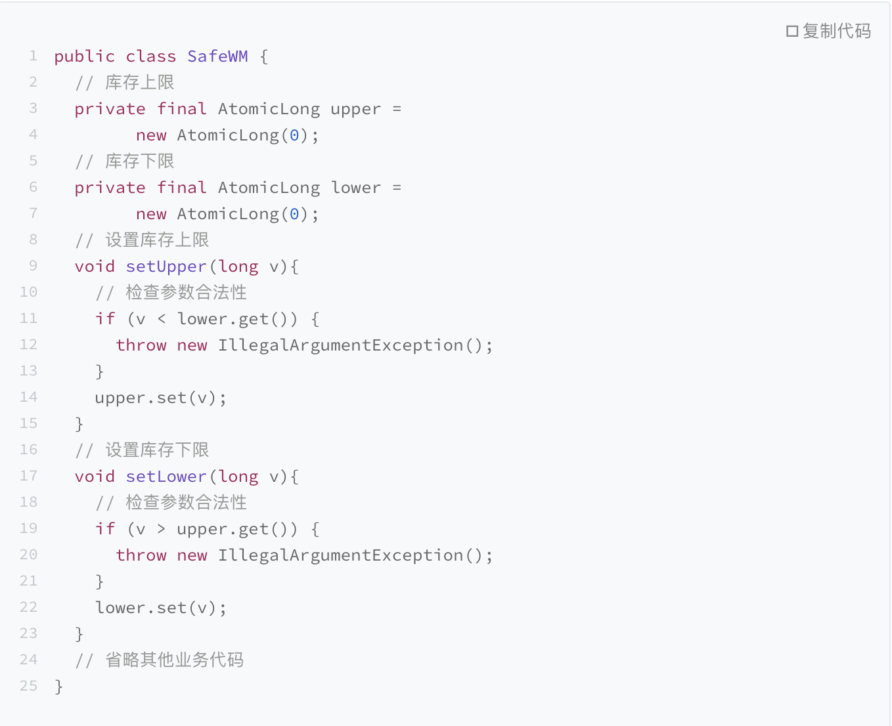

# 12 | 如何用面向对象思想写好并发程序？

虽然我还没有碰到相关的概念，但是这里的还是抄一下吧。

在工作中，作者发现很多同学设计之初是按照单线程的思路来写程序的，而忽略了本应该重视的并发问题；等上线之后，发现了诡异的Bug，然后找到了问题所在，却发现没有解决问题的思路。

面向对象思想与并发编程没关系，它们分属两个不同的领域，但是在Java语言里，这两个领域被无情地融合在一起了，但是融合的效果还可以：**在Java语言里，面向对象思想能够让并发编程变得简单**。

那如何用面向对象思想写好并发程序呢？ 可以从以下三个方面下手：

- 封装共享变量
- 识别共享变量之间的约束条件
- 制定并发访问策略


## 一、封装共享变量

并发程序，关注的核心问题：解决多线程同时访问共享变量的问题。在之前的一个问题中，类比过球场门票的管理，现实世界里门票管理的一个核心问题是：所有观众只能通过规定的入口进入，否则检票就形同虚设。在编程世界这个问题也很重要，编程领域里面对于共享变量的访问路径就类似球场的入口，必须严格控制。有面向对象的思想，对共享变量的访问路径可以轻松把控。

面向对象思想里面有一个很重要的特性是**封装**，封装的通俗解释就是 **将属性和实现细节封装在对象内部**，外界对象只能通过目标对象提供的**公共方法来间接访问**这些内部属性，这和门票管理模型匹配度相当高，球场里的座位就是对象属性，球场入口就是对象的公共方法。我们把共享变量作为对象的属性，那对于共享变量的访问路径就是对象的公共方法，所有入口都要安排检票程序就相当于之前提到的并发访问策略。

利用面向对象思想写并发程序的思路，其实很简单： **将共享遍历作为对象属性封装在内部，对所有公共方法制定并发访问策略**。就拿很多统计程序都要用到的计数器来说，下面的计数器程序共享变量只有一个，就是value，我们把它作为Counter类的属性，并且将两个公共方法get()和addOne()声明为同步方法，这样Counter类就成为一个线程安全的累了。

```java
public class Counter {
	private long value;
	synchronized long get() {
		return value;
	}
	synchronized long addOne(){
		return ++value;
	}
}
```

当然，实际工作中，很多的场景都不回像计数器这么简单，经常要面临的情况往往是有很多的共享变量，例如，信用卡账户有卡号、姓名、身份证、信用额度、已出账单、未出账单等很多共享变量。这么多共享变量，如果每一个都考虑它的并发安全问题，那我们就类似了。但其实仔细观察，会发现，很多共享变量的值是不会变的，例如信用卡账户的卡号、姓名、身份证。 **对于这些不会发生变化的共享变量，建议你用final关键字来修饰**。这样既能避免并发问题，也能很明确涉及意图。

## 二、识别共享变量间的约束条件

识别共享变量间的约束条件非常重要。因为 **这些约束条件，决定了并发访问策略**。例如：库存管理里面有个合理库存的概念，库存量不能太高，也不能太低，它有一个上限和一个下限。关于这些约束条件，我们可以用下面的程序来模拟一下。在类SafeWM中，声明了两个成员变量upper和lower，分别代表库存上限和库存下限，这两个变量用了AtomicLong 这个原子类，原子类是线程安全的，所以这两个成员变量的set方法就不需要同步了。

```java
public class SafeWM {
	private final AtomicLong upper = new AtomicLong(0);
	private final AtomicLong lower = new AtomicLong(0);
	void setUpper(long v) {
		upper.set(v);
	}
	void setLower(long v) {
		lower.set(v);
	}
}
```

虽说上面的代码是没有问题的，但是忽略了一个约束条件，就是 **库存下限要小于库存上限**，这个约束条件能够直接加到上面的set方法上嘛？ 我们先直接加一下看看效果。在setUpper()和setLower()中增加了参数校验，这看上去没有问题，但其实存在并发问题，问题在于存在竞态条件。 tips: 看到代码里出现if 语句的时候，就应该意识到可能存在竞态条件。

我们假设库存的下限和上限分别是（2，10），线程A调用setUpper(5)，线程B调用setLower(7)将下线设置为7，如果A和B同时执行，两个线程都能够通过参数校验（下限和上限都没有被线程A和B设置）。其结果不符合 库存下限要小于库存上限 这个约束条件的。



在没有识别出**库存下限要小于库存上限**这个约束条件之前，我们制定的并发访问策略是利用原子类，但是这个策略，完全不能保证**库存下限要小于库存上限**这个约束条件。所以说，在设计阶段，我们**一定要识别出所有共享变量之间的约束条件，如果约束条件识别不足，很可能导致制定的并发访问策略南辕北辙**。


## 三、制定并发访问策略

制定并发访问策略，是一个非常复杂的事情。应该说整个专栏都是在尝试搞定它。不过从方案上来看，无外乎就是以下“三件事”。

- 避免共享：避免共享的技术主要是利于线程本地存储以及为每个任务分配独立的线程。

- 不变模式：这个在 Java 领域应用的很少，但在其他领域却有着广泛的应用，例如 Actor 模式、CSP 模式以及函数式编程的基础都是不变模式。

- 管程及其他同步工具：Java 领域万能的解决方案是管程，但是对于很多特定场景，使用 Java 并发包提供的读写锁、并发容器等同步工具会更好。

接下来在咱们专栏的第二模块我会仔细讲解 Java 并发工具类以及他们的应用场景，在第三模块我还会讲解并发编程的设计模式，这些都是和制定并发访问策略有关的。

除了这些方案之外，还有一些宏观的原则需要你了解。这些宏观原则，有助于你写出“健壮”的并发程序。这些原则主要有以下三条。

优先使用成熟的工具类：Java SDK 并发包里提供了丰富的工具类，基本上能满足你日常的需要，建议你熟悉它们，用好它们，而不是自己再“发明轮子”，毕竟并发工具类不是随随便便就能发明成功的。

迫不得已时才使用低级的同步原语：低级的同步原语主要指的是 synchronized、Lock、Semaphore 等，这些虽然感觉简单，但实际上并没那么简单，一定要小心使用。

避免过早优化：安全第一，并发程序首先要保证安全，出现性能瓶颈后再优化。在设计期和开发期，很多人经常会情不自禁地预估性能的瓶颈，并对此实施优化，但残酷的现实却是：性能瓶颈不是你想预估就能预估的。

## 总结

利用面向对象思想编写并发程序，一个关键点就是利用面向对象里的封装特性，由于篇幅原因，这里我只做了简单介绍，详细的你可以借助相关资料定向学习。而对共享变量进行封装，要避免“逸出”，所谓“逸出”简单讲就是共享变量逃逸到对象的外面，比如在《02 | Java 内存模型：看 Java 如何解决可见性和有序性问题》那一篇我们已经讲过构造函数里的 this“逸出”。这些都是必须要避免的。

这是我们专栏并发理论基础的最后一部分内容，这一部分内容主要是让你对并发编程有一个全面的认识，让你了解并发编程里的各种概念，以及它们之间的关系，当然终极目标是让你知道遇到并发问题该怎么思考。这部分的内容还是有点烧脑的，但专栏后面几个模块的内容都是具体的实践部分，相对来说就容易多了。我们一起坚持吧！


然后作者推荐了一本书《Java 并发编程实战》，可以拿来深入地学习。

我这里只是想了解一下，这个方面的内容，还有好多好多知识点去学，这本书以后有时间再去看吧～


## 参考：

极客时间版权所有：https://time.geekbang.org/column/intro/100023901

