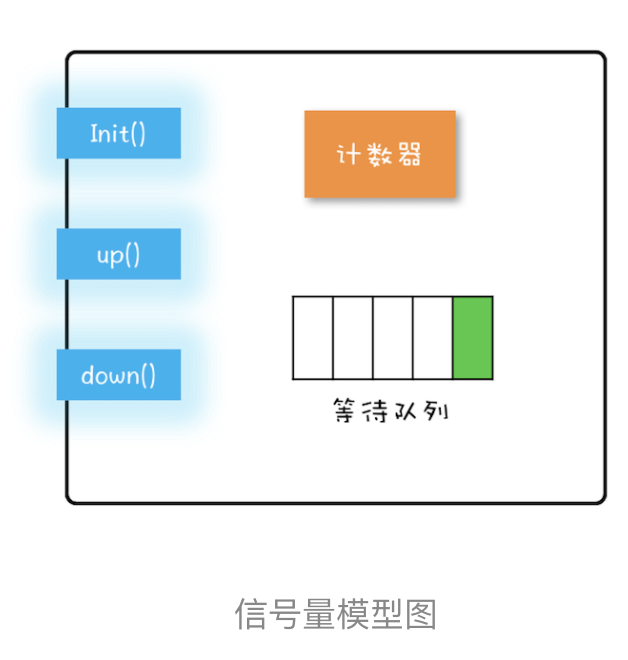

# 16 |Semamphore:如何快速实现一个限流器？

介绍一下信号量模型，之后介绍如何使用信号量，最后再用信号量来实现了一个限流器。

## 信号量模型

信号量模型还是很简单的，可以简单概括为：**一个计数器，一个等待队列，三个方法。**在信号量模型里，计数器和等待队列是对外透明的，所以只能通过信号量模型提供的三个方法来访问他们，这三个方法分别是：int()、down()和up()。



这三个方法详细的语义具体如下所示。

- init()：设置计数器的初始值。
- down()：计数器的值减1；如果此时计数器的值小于0，则当前线程将被阻塞，否则当前线程可以继续执行。
- up()：计数器的值加1；如果此时计数器的值小于或者等于0，则唤醒等待队列中的一个线程，并将其从等待队列中移除。

这里提到的init()、down()和up()三个方法都是原子性的，并且这个原子性是由信号量模型的实现方保证的。在Java SDK里面，信号量模型是由java.util.concurent.Semaphore实现的，Semaphore这个类能够保证这三个方法啊都是原子操作。

这里再插一句，down()、up()这两个操作历史上最早倍称为P操作和V操作，所以信号量模型也被称为PV原语。另外，还有些人喜欢用semWait()和semSignal()来称呼它们，虽然叫法不同，但是语义都是相同的。在Java SDK并发包里，down()和up()对应的则是acquire()和release()。


## 如何使用信号量

通过上文，你应该会发现信号量的模型还是很简单的，那具体该如何使用呢？

红绿灯规则：车辆在通过路口前先检查是否是绿灯，只有绿灯才能通行。

其实，信号量的使用也是类似的。这里我们还是用累加器的例子来说明信号量的使用吧。在累加器的例子里面，count+=1操作是个临界区，只允许一个线程执行，也就是说要保证互斥。那这种情况用信号量怎么控制呢？

其实很简单，就像我们使用互斥锁一样，只需要在进入临界区之前执行义下down()操作，退出临界区之前执行一下up()操作就可以了。

```java

static int count;
//初始化信号量
static final Semaphore s 
    = new Semaphore(1);
//用信号量保证互斥    
static void addOne() {
  s.acquire();
  try {
    count+=1;
  } finally {
    s.release();
  }
}
```

分析：假设两个线程T1和T2同时访问addOne()方法，当它们同时调用acquire()的时候，由于acquire()是一个原子操作，所以只能有一个线程（假设T1）把信号量里的计数器减为0，另外一个线程（T2）则是将计数器减为-1.对于线程T1，计数器的值是0，大于等于0，所以线程T1会继续执行；对于线程T2，信号量里面的计数器的值是-1，因此线程T2将会被阻塞。所以此时只有线程T1会进入临界区执行count+=1。

当线程T1执行release()操作，也就是up()操作，信号量里计数器的值是-1，加1之后的值是0，小于等于0，按照信号量模型里对up()操作的描述，此时等待队列中的T2将会被唤醒。于是T2在T1执行完临界区代码之后才获取了进入临界区执行的机会，从而保证了互斥性。


## 快速实现一个限流器

上面的例子，我们用信号量实现了一个最简单的互斥锁。问题：为什么Java sdk里面提供了lock，为啥还要提供一个Semaphore？其实实现一个互斥锁，仅仅是Semphore的部分功能，Semaphore还有一个功能是Lock不容易实现的，那就是：Sempaphore可以允许多个线程访问一个临界区。

现实中的需求？比较常见的需求是我们工作中遇到的各种池化资源，例如连接池、对象池、线程池等等。可能你最熟悉的是数据库连接池，在同义时刻，一定是允许多个线程同时使用连接池的，当然，每个连接在被释放前，是不允许其他线程使用的。

对象池，指的是一次性创建出N个对象，之后所有的线程重复利用这N个对象，当然对象在被释放前，也是不允许其他线程使用的。对象池，可以用List保存实例对象。这个很简单。但关键是限流器的设计，这里的限流，指的是不允许多于N个线程同时进入临界区。那如何快速实现一个这样的限流器？ 信号量。

信号量的计数器，在上面的例子中，我们设置成了1，这个1表示只允许一个线程进入临界区，但是如果我们把计数器的值设置成对象池里对象的个数N，就能完美解决对象池的限流问题了。

下面是演示代码：

```java

class ObjPool<T, R> {
  final List<T> pool;
  // 用信号量实现限流器
  final Semaphore sem;
  // 构造函数
  ObjPool(int size, T t){
    pool = new Vector<T>(){};
    for(int i=0; i<size; i++){
      pool.add(t);
    }
    sem = new Semaphore(size);
  }
  // 利用对象池的对象，调用func
  R exec(Function<T,R> func) {
    T t = null;
    sem.acquire();
    try {
      t = pool.remove(0);
      return func.apply(t);
    } finally {
      pool.add(t);
      sem.release();
    }
  }
}
// 创建对象池
ObjPool<Long, String> pool = 
  new ObjPool<Long, String>(10, 2);
// 通过对象池获取t，之后执行  
pool.exec(t -> {
    System.out.println(t);
    return t.toString();
});
```

我们用一个List来保存对象实例，用Sempaphore实现限流器。关键的代码是ObjPool里面的exec()方法，这个方法里面实现了限流的功能。在这个方法里面，我们首先调用acquire()方法（与之匹配的是finally里面调用release()方法），假设对象池的大小是10，信号量的计数器初始化为10，那么前10个线程调用acquire()方法，都能继续执行，相当于通过了信号灯，而其他线程则会阻塞在acquire()方法上。对于通过信号灯的线程，我们为每个线程分配了一个对象t（分配工作通过pool.remove(0)实现的），分配完之后会执行一个回掉函数func，而函数的参数正是前面分配的对象t;执行完回调函数之后，它们会释放对象（释放对象的工作是通过pool.add(t)实现的），同时调用release()方法来更新信号量的计数器。如果此时信号量里计数器的值小于等于0，那么说明有线程在等待，此时会自动唤醒等待的线程。


## 总结

信号量在Java语言里面名气并不算大，但是在其他语言里却是很有知名度的。Java在并发编程领域走的很快，重点支持的还是管程模型。管程模型理论上解决了信号量模型一些不足，主要体现在易用性和工程化方面，例如用信号量解决我们曾经提到过的阻塞队列问题，就比管程模型麻烦的多。

## 参考：

极客时间版权所有：https://time.geekbang.org/column/intro/100023901

