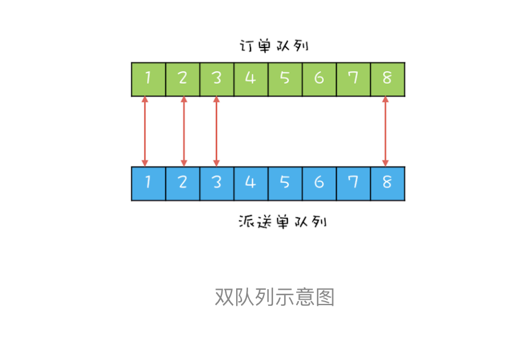

# 19| CountDownLatch 和CyclicBarrier:如何让多线程步调一致？

对账系统对业务，用户通过在线商城下单，会生成电子订单，保存在订单库；之后物流会生成派送订单给用户发货，派送单保存在派送单库。为了防止漏派送或者重复派送，对账系统每天还会校验是否存在异常订单。

对账系统对处理逻辑很简单，可以参考下面的对账系统流程图。目前对账系统对处理逻辑是首先查询订单，然后查询派送订单，之后对比订单和派送单，将差异写入差异库。


对账系统对代码抽象之后，也很简单，核心代码如下，就是在一个单线程里面循环查询订单、派送单，然后执行对账，最后将写入差异库。

```java

while(存在未对账订单){
  // 查询未对账订单
  pos = getPOrders();
  // 查询派送单
  dos = getDOrders();
  // 执行对账操作
  diff = check(pos, dos);
  // 差异写入差异库
  save(diff);
} 
```

## 利用并行优化对账系统

首先要找到这个对账系统的瓶颈所在。

目前的对账系统，由于订单量和派送单量巨大，所以查询未对账订单getPOrders()和查询派送单getDOrders()相对缓慢，那没有办法快速优化一下呢？目前对账系统是单线程执行的，图形化后是下图这个样子。对于串行化的系统，优化性能首先想到的是能否 **利用多线程并行处理。**


所以，这里你应该能够看出来这个对账系统的瓶颈：查询未对账订单getPOrders()和查询派送单getDOrders()是否可以并行处理呢？显然是可以的，因为这两个操作并没有先后顺序的依赖。这两个最耗时的操作并行之后，执行过程如下图所示。对比一下单线程的执行示意图，你会发现同等时间里，并行执行的吞吐量近乎单线程的2倍，优化效果是明显的。


思路有了，下面我们再来看看如何用代码实现。在下面的代码中，我们创建了两个线程T1和T2，并行执行查询未对账订单getOrders()和查询派送订单getDOrders()这两个操作。在主线程中执行对账操作check()和差异写入save()这两个操作。不过需要注意的是：主线程需要等待T1和T2执行完才能执行check()和save()这连两个操作，为此我们通过调用T1.join()和T2.join()来实现等待，当T1和T2线程退出时，调用T1.join()和T2.join()的主线程就会从阻塞态呗唤醒，从而执行之后的check()和save()。

```java
while (存在未对账订单) {
	// 查询未对账订单
	Thread T1 = new Thread(()->{
		pos = getPOrders();
	});
	T1.start();
	Thread T2 = new Thread(() -> {
		dos = getDOrders();
	});
	T2.start();
	T1.join();
	T2.join();
	diff = check (pos,dos);
	save(diff);
}
```

## 用CountDownLatch

经过上面的重重优化之后，就可以交付了。但是还是可以继续优化。

while循环里面每次都会创建新的线程，而创建线程是个费时的操作。所以最好是创建出来的线程能够循环利用，估计这时你已经想到线程池了，是的，线程池就能解决这个问题。

而下面的代码就是用线程池优化后的：我们首先创建了一个固定大小为2的线程池，之后在while循环里重复利用。一切看上去都很顺利，但是有个问题好像误解了，那就是主线程如何知道getPOrders()和getDOrders()这两个操作什么时候执行完。前面主线程通过调用线程T1和线程T2的join()方法来等待线程T1和线程T2退出，但是在线程池的方案里，线程根本就不会退出，所以join()方法失效了。

```java

// 创建2个线程的线程池
Executor executor = 
  Executors.newFixedThreadPool(2);
while(存在未对账订单){
  // 查询未对账订单
  executor.execute(()-> {
    pos = getPOrders();
  });
  // 查询派送单
  executor.execute(()-> {
    dos = getDOrders();
  });
  
  /* ？？如何实现等待？？*/
  
  // 执行对账操作
  diff = check(pos, dos);
  // 差异写入差异库
  save(diff);
}   
```

那如何解决这个问题呢？可以开动脑经想出很多办法，最直接的办法是弄一个计数器，初始值设置成2，当执行完pos = getPOrders()；这个操作之后将计数器减1，执行完dos = getDOrders()；之后也将计数器减1，在主线程里，等待计数器等于0；当计数器等于0时，说明这两个查询操作执行完了。等待计数器等于0其实就是一个条件变量，用管程实现起来也很简单。

不过不建议在实际项目中去实现上面的方案，因为Java并发包里已经提供了实现类似功能的工具类：**CountDownLatch**, 我们直接使用就可以了。

下面的代码示例中，在while循环里面，我们首先创建了一个COuntDownLatch，计数器的初始值等于2，之后在pos = getPOrders()和doc = getDOrders()；两条语句的后面来对计数器执行减1操作，这个对计数器减1的操作是通过调用latch.countDown()；来实现的。在主线程中，我们通过调用latch.await()来实现对计数器等于0的等待。

```java

// 创建2个线程的线程池
Executor executor = 
  Executors.newFixedThreadPool(2);
while(存在未对账订单){
  // 计数器初始化为2
  CountDownLatch latch = 
    new CountDownLatch(2);
  // 查询未对账订单
  executor.execute(()-> {
    pos = getPOrders();
    latch.countDown();
  });
  // 查询派送单
  executor.execute(()-> {
    dos = getDOrders();
    latch.countDown();
  });
  
  // 等待两个查询操作结束
  latch.await();
  
  // 执行对账操作
  diff = check(pos, dos);
  // 差异写入差异库
  save(diff);
}
```

## 进一步优化性能

经过上面的重重优化之后，就可以交付了。不过在交付之前还需要再次看看有没有优化的余地，还是有的。

前面我们将getOrders和getOrders()这两个查询操作并行了，但这两个查询操作和对账操作check()、save()之间还是串行的。很显然，这两个查询操作和对账操作也是可以并行的，也就是说，在执行对账操作的时候，可以同时去执行下一轮的查询操作，操作可以形象的表述为下面这个示意图。


那接下来我们再来思考一下如何实现这步优化，两次查询操作能够和对账操作并行，对账操作还依赖查询操作的结果，这明显是生产者-消费者的意思，两次查询操作是生产者，对账操作是消费这。既然是生产者-消费者模型，那就需要又个队列，来保存生产者生产的数据，而消费者则从这个队列消费数据。

不过针对对账这个项目，作者设计了两个队列，并且两个队列的元素之间还有对应关系。具体如下图所示，订单查询操作将订单查询结果插入订单队列，派送单查询操作将派送单插入派送单队列，这两个队列的元素之间是有一一对应的关系的。两个队列的好处是，对账操作可以每次从订单队列出一个元素，从派送单队列出一个元素，然后对这两个元素执行对账操作，这样数据一定不会乱掉。



下面再来看看如何用双队列来实现完全对并行。一个最直接的想法是：一个线程T1执行订单的查询工作，一个线程T2执行派送单的查询工作，当线程T1和T2都各自生产完1条数据的时候，通知线程T3执行对账操作。隐藏的条件：线程T1和线程T2工作要步调一致。

## 用CyclicBarrier 实现线程同步

下面我们就来实现上面提到的方案。这个方案的难点有两个：一个是线程T1和T2要做到步调一致，另一个是要能够通知到线程T3.

依然可以利用一个计数器来解决这两个难点，计数器初始化为2，线程T1和T2生产完一条数据都将计数器减1，如果计数器大于0则线程T1和线程T2等待。如果计数器等于0，则通知线程T3，并唤醒等待的T1或者T2，与此同时，将计数器重制为2，这样线程T1和T2生产下一条数据的时候就可以继续使用这个计数器了。

同样，还是建议不要在实际项目中这么做，因为Java并发包哦里也已经提供了相关的工具类： **CyclicBarrier**。在下面的代码中，我们首先创建了一个计数器初始值为2的CyclicBarrier，你需要注意的是创建CyclicBarrier的时候，我们还传入了一个回调函数，当计数器减到0的时候，会调用这个回掉函数。


线程T1负责查询订单，当查出一条时，调用barrier.await()来将计数器减1，同时等待计数器变成0；

线程T2负责查询派送单，当查处一条时，调用barrier.await()来将计数器减1，同时等待计数器编程0；

当T1和T2都调用barrier.await()的时候，计数器会减到0，此时T1和T2就可以执行下一条语句了，同时会调用barrier的回调函数来执行对账操作。

非常值得一题的是，CyclicBarrier的计数器有自动重制的功能，当减到0点时候，会自动重制你设置的初始值。

```java
Vector<P> pos;
Vector<D> dos;
Executor executor = 
Executor.newFixedThreadPool(1);
final CyclicBarrier barrier = 
new CyclicBarrier(2, () -> {
	executor.execute(() -> check());
});
void check(){ 
P p = pos.remove(0);
D d = dos.remove(0); 
// 执行对账操作 
diff = check(p, d); 
// 差异写入差异库 save(diff);
}
void checkAll(){ 
// 循环查询订单库 
Thread T1 = new Thread(()->{ 
while(存在未对账订单){ 
// 查询订单库 
pos.add(getPOrders()); 
// 等待 
barrier.await(); 
} }); 
T1.start(); 
// 循环查询运单库
Thread T2 = new Thread(()->{ 
while(存在未对账订单){ 
// 查询运单库
dos.add(getDOrders()); 
// 等待 barrier.await(); } }); 
T2.start();}

```

## 总结

CountDownLatch和CyclicBarrier是Java并发包提供的两个非常易用的线程同步工具，这两个工具类用法的区别在这里还是要强调一下：

- CountDownLatch主要用来解决一个线程等待多个线程的场景
- CyclicBarrier是一组线程之间互相等待

也可以利用Future特性用来实现线程之间的等待，这个后面也会详细介绍。

## 参考：

极客时间版权所有：https://time.geekbang.org/column/intro/100023901

