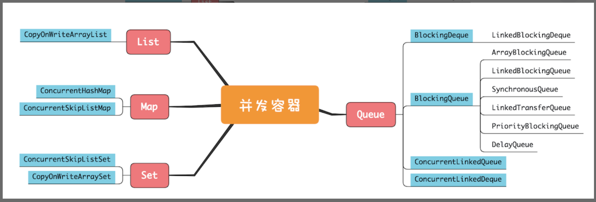
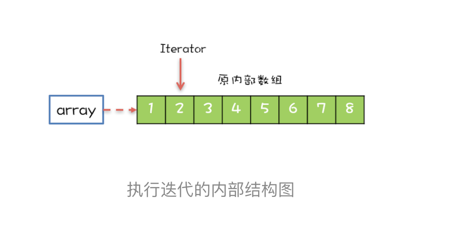
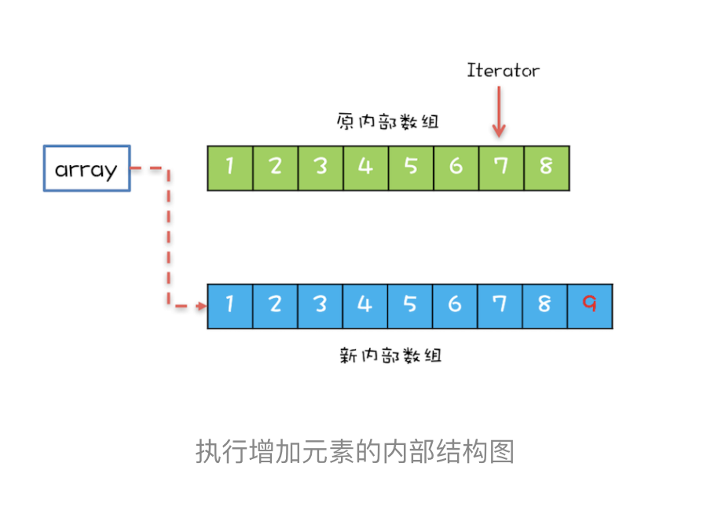
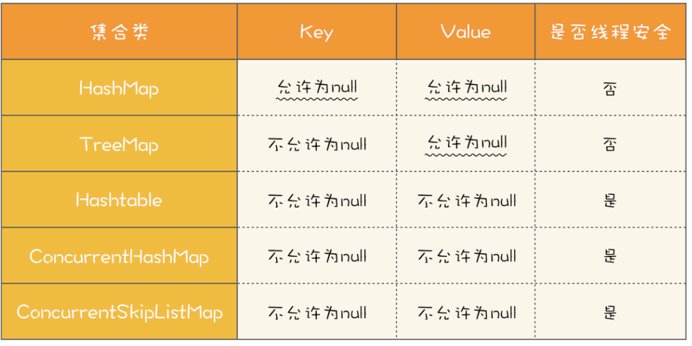
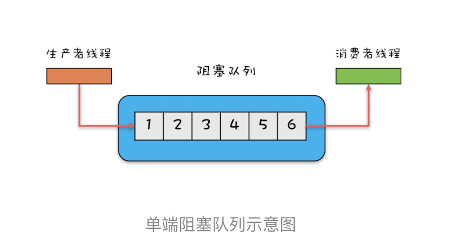
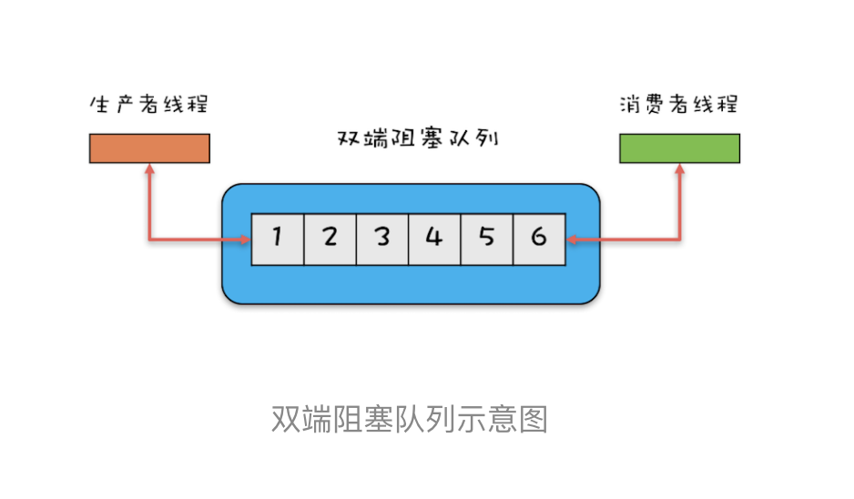

# 20| 并发容器：都有哪些“坑”需要我们填？

Java并发包有很大一部分内容都是关于 **并发容器**的，因此学习和搞懂这部分的内容很多必要。

Java 1.5 之前提供的 **同步容器**虽然也能保证线程安全，但是性能很差，而Java 1.5版本之后提供的并发容器在性能方面则做了很多优化，并且容器的类型也更加丰富了。下面通过对比二者来学习这部分的内容。

## 同步容器及其注意事项

Java中的容器主要可以分为四个大类，分别是List、Map、Set和Queue,但并不是所有的Java容器都是线程安全的。例如，我们常用的ArrayList、HashMap就不是线程安全的。在介绍线程安全的容器之前，我们先思考这样一个问题：如何将非线程安全的容器变成线程安全的容器？

在12，我们讲过实现思路其实很简单，只要把非线程安全的容器封装在对象内部，然后控制好访问路径就可以了。

下面我们就以ArrayList为例，看看如何将它变成线程安全的。在下面的代码中，SafeArrayList内部持有一个ArrayList的实例c，所有访问c的方法我们都增加了synchronized关键字，需要注意的是我们还增加了一个addIfNoExist()方法，这个方法也是用synchronized来保证原子性的。

```java

SafeArrayList<T>{
  //封装ArrayList
  List<T> c = new ArrayList<>();
  //控制访问路径
  synchronized
  T get(int idx){
    return c.get(idx);
  }

  synchronized
  void add(int idx, T t) {
    c.add(idx, t);
  }

  synchronized
  boolean addIfNotExist(T t){
    if(!c.contains(t)) {
      c.add(t);
      return true;
    }
    return false;
  }
}
```

所有非线程安全的类是不是都可以用这种包装的方式来实现线程安全呢？这一点Java SDK的开发人员也想到了，所以他们在Collections这个类中还提供了一整套完备的包装类，比如下面的示例代码中，分别把ArrayList、HashSet和HashMap包装成了线程安全的List、Set和Map。

```java

List list = Collections.
  synchronizedList(new ArrayList());
Set set = Collections.
  synchronizedSet(new HashSet());
Map map = Collections.
  synchronizedMap(new HashMap());
```

我们曾经多次强调，组合操作需要注意竞态条件问题，例如上面提到的 addIfNotExist() 方法就包含组合操作。组合操作往往隐藏着竞态条件问题，即便每个操作都能保证原子性，也并不能保证组合操作的原子性，这个一定要注意。

在容器领域一个容易被忽视的“坑”是用迭代器遍历容器，例如在下面的代码中，通过迭代器遍历容器 list，对每个元素调用 foo() 方法，这就存在并发问题，这些组合的操作不具备原子性。

```java

List list = Collections.
  synchronizedList(new ArrayList());
Iterator i = list.iterator(); 
while (i.hasNext())
  foo(i.next());
```

而正确做法是下面这样，锁住 list 之后再执行遍历操作。如果你查看 Collections 内部的包装类源码，你会发现包装类的公共方法锁的是对象的 this，其实就是我们这里的 list，所以锁住 list 绝对是线程安全的。

```java

List list = Collections.
  synchronizedList(new ArrayList());
synchronized (list) {  
  Iterator i = list.iterator(); 
  while (i.hasNext())
    foo(i.next());
}    
```

上面我们提到的这些经过包装后线程安全容器，都是基于 synchronized 这个同步关键字实现的，所以也被称为同步容器。Java 提供的同步容器还有 Vector、Stack 和 Hashtable，这三个容器不是基于包装类实现的，但同样是基于 synchronized 实现的，对这三个容器的遍历，同样要加锁保证互斥。

## 并发容器及其注意事项

Java在1.5版本之前所谓的线程安全的容器，主要指的就是 **同步容器**。不过同步容器有个最大的问题，那就是性能差，所有方法都用synchronized来保证互斥，串行度太高了。因此	Java在1.5及之后版本提供了性能更高的容器，我们一般称为 **并发容器。**

并发容器虽然数量多，但依然是前面我们提到的四大类：List、Map、Set、Queue，下面的并发容器关系图，基本上把我们经常用到的容器都覆盖到了。



鉴于并发容器的数量太多，这里只是把关键点介绍一下。

### List

List里面只有一个实现类就是 **CopyOnWriteArrayList**，CopyOnWrite，顾名思义就是写的时候会将共享变量新复制一份出来，这样做的好处是读操作完全无锁。

那CopyOnWriteArrayList的实现原理是怎么样的呢？下面来简单介绍一下

CopyOnWriteArrayList内部维护了一个数组，成员变量array就指向这个内部数组，所有的读操作就是基于array进行的，如下图所示，迭代器Iterator遍历的就是array数组。



如果在遍历array的同时，还有一个写操作，例如增加元素，CopyOnWrite是如何处理的呢？

CopyOnWriteArrayList会将array复制一份，然后在新复制处理的数组上执行增加元素的操作，执行完之后再将array指向这个新的数组。通过下图你可以看到，读写诗可以并行的，遍历操作一直都是基于原array执行，而写操作是基于新array进行。



使用CopyOnWriteArrayList需要注意的“坑”主要有两个方面。一个是应用场景，CopyOnWriteArrayList仅适用于写操作非常少的场景，并且能够容忍读写的短暂不一致。例如上面的例子中，写入的新元素并不能立刻被遍历到。另外一个需要注意的是，CopyOnWriteArrayList迭代器是只读的，不支持增删改。因为迭代器遍历的仅仅是一个快照，而对快照进行增删改是没有意义的。

### Map

Map接口的两个实现是 ConcurrentHashMap 和 ConcurrentSkipListMap，它们从应用的角度来看，主要区别在于 **ConcurrentHashMap 的 key 是无序的，而 ConcurrentSkipListMap 的 key 是有序的。**所以如果你需要保证 key 的顺序，就只能使用 ConcurrentSkipListMap。

使用 ConcurrentHashMap 和 ConcurrentSkipListMap 需要注意的地方是，它们的 key 和 value 都不能为空，否则会抛出NullPointerException这个运行时异常。下面这个表格总结了 Map 相关的实现类对于 key 和 value 的要求，你可以对比学习。



ConcurrentSkipListMap 里面的 SkipList 本身就是一种数据结构，中文一般都翻译为“跳表”。跳表插入、删除、查询操作平均的时间复杂度是 O(log n)，理论上和并发线程数没有关系，所以在并发度非常高的情况下，若你对 ConcurrentHashMap 的性能还不满意，可以尝试一下 ConcurrentSkipListMap。

### Set

Set 接口的两个实现是 CopyOnWriteArraySet 和 ConcurrentSkipListSet，使用场景可以参考前面讲述的 CopyOnWriteArrayList 和 ConcurrentSkipListMap，它们的原理都是一样的，这里就不再赘述了。

### Queue

Java 并发包里面 Queue 这类并发容器是最复杂的，你可以从以下两个维度来分类。

一个维度是**阻塞与非阻塞**，所谓阻塞指的是当队列已满时，入队操作阻塞；当队列已空时，出队操作阻塞。

另一个维度是**单端与双端**，单端指的是只能队尾入队，队首出队；而双端指的是队首队尾皆可入队出队。

Java 并发包里**阻塞队列都用 Blocking 关键字标识，单端队列使用 Queue 标识，双端队列使用 Deque 标识**。

这两个维度组合后，可以将Queue细分为四大类，分别是：

1. **单端阻塞队列**：

   其实现有： 

   - ArrayBlockingQueue
   - LinkedBlockingQueue
   - SynchronousQueue
   - LinkedTransferQueue
   - PriorityBlockingQueue
   - DelayQueue

   内部一般会持有一个队列，这个队列可以是数组(ArrayBlockingQueue)；也可以是列表（LinkedBlockingQueue）；甚至还可以不持有队列(SynchronousQueue)，此时生产者线程的入队操作必须等待消费者线程的出队操作。

   而LinkedTransferQueue融合LinkedBlockingQueue和SynchronousQueue的功能，性能比LinkedBlockingQueue更好；PriorityBlockingQueue支持按照优先级出队；DelayQueue支持延时出队。

   

2. **双端阻塞队列：**

   其实现是：LinkedBlockingDeque。

   

3. **单端非阻塞队列**：

   其实现是： ConcurrentLinkedQueue

4. **双端非阻塞队列：**

   其实现是：ConcurrentLinkedDeque

另外，使用队列时，需要格外注意队列是否支持有界。

实际工作中，一般都不建议使用无界的队列，因为数据量大了之后很容易导致OOM。

上面我们提到的这些Queue中，只有ArrayBlockingQueue和LinkedBlockingQueue是支持有界的，所以 **在使用其他无界队列时，一定要充分考虑是否存在导致OOM的隐患**。


## 总结

Java 并发容器的内容很多，但鉴于篇幅有限，我们只是对一些关键点进行了梳理和介绍。

而在实际工作中，你不单要清楚每种容器的特性，还要能**选对容器，这才是关键**，至于每种容器的用法，用的时候看一下 API 说明就可以了，这些容器的使用都不难。在文中，我们甚至都没有介绍 Java 容器的快速失败机制（Fail-Fast），原因就在于当你选对容器的时候，根本不会触发它。