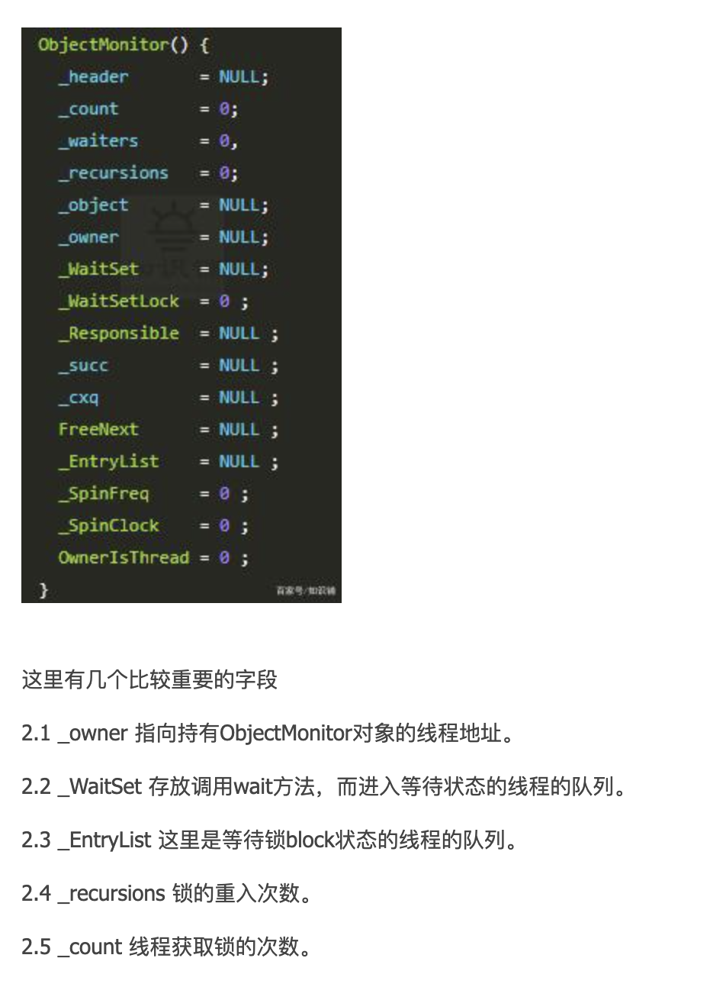
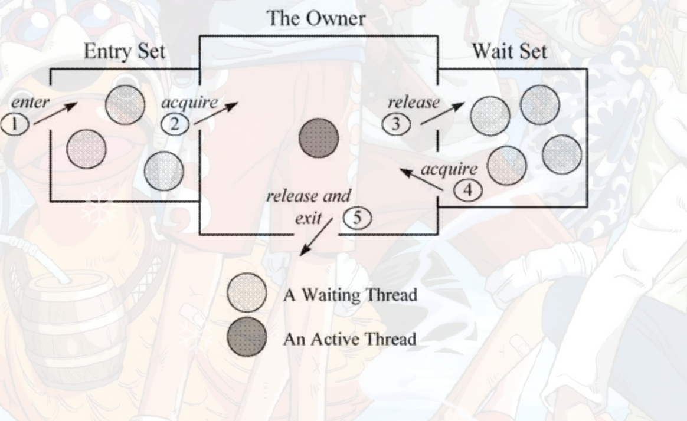

# moniter 在java中的实现

## moniter概念

管程，监视器。在操作系统中，存在着semaphore和mutex，即信号量和互斥量，使用基本的mutex进行开发时，需要小心的使用mutex的down和up操作，否则容易引发死锁问题。为了更好的编写并发程序，在mutex和semaphore基础上，提出了更高层次的同步原语，实际上，monitor属于编程语言的范畴，C语言不支持monitor，而java支持monitor机制。

一个重要特点是，在同一时间，只有一个线程/进程能进入monitor所定义的临界区，这使得monitor能够实现互斥的效果。无法进入monitor的临界区的进程/线程，应该被阻塞，并且在适当的时候被唤醒。显然，monitor作为一个同步工具，也应该提供这样管理线程/进程的机制。

monitor这个机制之所以被称为：更高级的原语，它不可避免的需要对外屏蔽这些机制，并且在内部实现这些机制，使得monitor成为一个简洁易用的借口。


## monitor基本元素

- 临界区
- monitor对象和锁
- 条件变量以及定义在monitor对象上的wait，signal操作

使用monitor主要是为了互斥进入临界区，为了能够阻塞无法进入临界区的进程，线程，需要一个monitor object来协助，这个object内部会有相应的数据结构，例如列表，用来保存被阻塞的线程；同时由于monitor机制本质是基于mutex原语的，所以object必须维护一个基于mutex的锁。

此外，为了在适当的时候能够阻塞和唤醒 进程/线程，还需要引入一个条件变量，这个条件变量用来决定什么时候是“适当的时候”，这个条件可以来自程序代码的逻辑，也可以是在 monitor object 的内部，总而言之，程序员对条件变量的定义有很大的自主性。不过，由于 monitor object 内部采用了数据结构来保存被阻塞的队列，因此它也必须对外提供两个 API 来让线程进入阻塞状态以及之后被唤醒，分别是 wait 和 notify。


## monitor在java中的实现

### 临界区的圈定

被synchronized关键字修饰的方法，代码块，就是monitor机制的临界区

```java
public class Monitor {

    private Object ANOTHER_LOCK = new Object();

    private synchronized void fun1() {
    }

    public static synchronized void fun2() {
    }

    public void fun3() {
        synchronized (this) {
        }
    }

    public void fun4() {
        synchronized (ANOTHER_LOCK) {
        }
    }
}
```

### moniter object

前面讲到 java.lang.Object 类定义了 wait()，notify()，notifyAll() 方法。 这些都是 native方法，底层是C++来实现的。 这些方法的具体实现，依赖一个叫做ObjectMonitor模式实现，这是JVM内部C++实现的机制。




在上述synchronized关键字被使用时，往往需要指定一个对象与之关联，例如synchronized（this）,总之，synchronized需要管理一个对象，这个对象就是monitor object。

monitor机制中，monitor 我不检测题充当着维护mutex和wait, signalAPI来管理线程的阻塞和唤醒。

Java 对象存储在内存中，分别分为三个部分，即对象头、实例数据和对齐填充，而在其对象头中，保存了锁标识；同时，java.lang.Object 类定义了 wait()，notify()，notifyAll() 方法，这些方法的具体实现，依赖于一个叫 ObjectMonitor 模式的实现，这是 JVM 内部基于 C++ 实现的一套机制，基本原理如下所示：



当一个线程需要获取 Object 的锁时，会被放入 EntrySet 中进行等待，如果该线程获取到了锁，成为当前锁的 owner。如果根据程序逻辑，一个已经获得了锁的线程缺少某些外部条件，而无法继续进行下去（例如生产者发现队列已满或者消费者发现队列为空），那么该线程可以通过调用 wait 方法将锁释放，进入 wait set 中阻塞进行等待，其它线程在这个时候有机会获得锁，去干其它的事情，从而使得之前不成立的外部条件成立，这样先前被阻塞的线程就可以重新进入 EntrySet 去竞争锁。这个外部条件在 monitor 机制中称为条件变量。

### moniter上锁 释放锁

上锁过程

1. 线程获取资源对象的锁，判断 _owner是否为空。这里操作是通过 CAS操作：比较和交换（Conmpare And Swap），比较新值和旧值的不同，替换，这里会发生ABA问题，接下来文章会详细说明。

2. 如果 _owner为null ，直接把其赋值，指向自己， _owner = self ,同时把重入次数 _recursions = 1， 获取锁成功。

3. 如果 _self == cur 和当前线程一致，说明是重入了， _recursions++ 即可

4. 线程进入对象资源，处理。 同时等待当前线程的释放信号，期间一致持有对象资源的锁。

释放锁

1. 通过 ObjectMonitor::exit 退出

2. 把线程插入到_EntryList中 _recursions--

3. 再次从 _EntryList 中取出线程

4. 调用unpark退出


## 参考：

shemlo:参考：

极客时间版权所有：https://time.geekbang.org/column/intro/100023901

Bean lam:https://segmentfault.com/a/1190000016417017

https://www.cnblogs.com/minikobe/p/12123065.html

