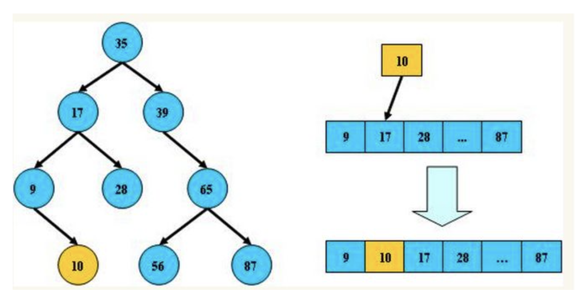
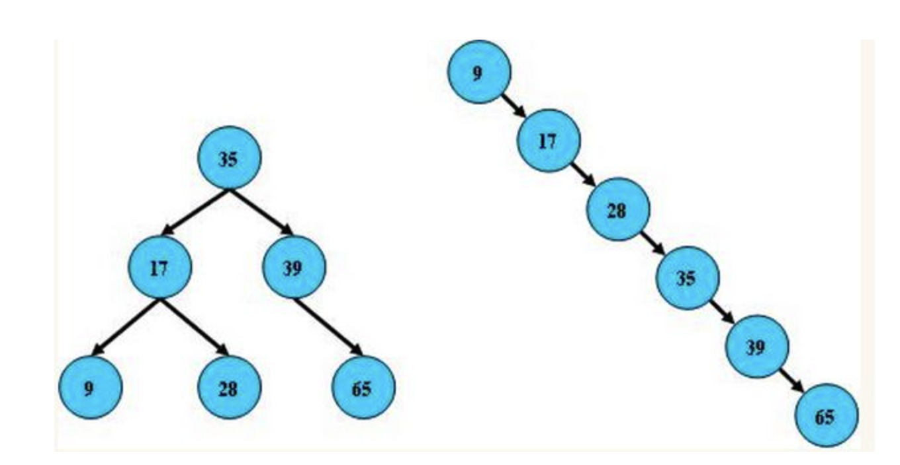
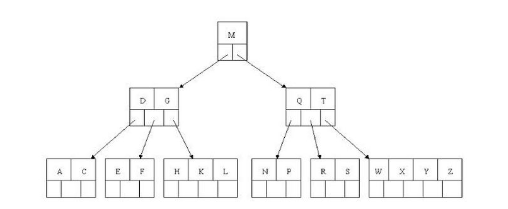
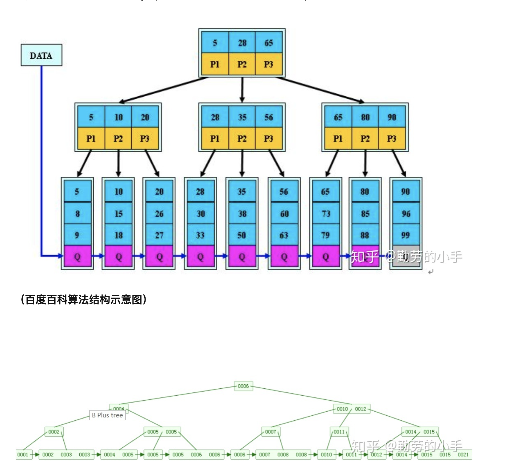
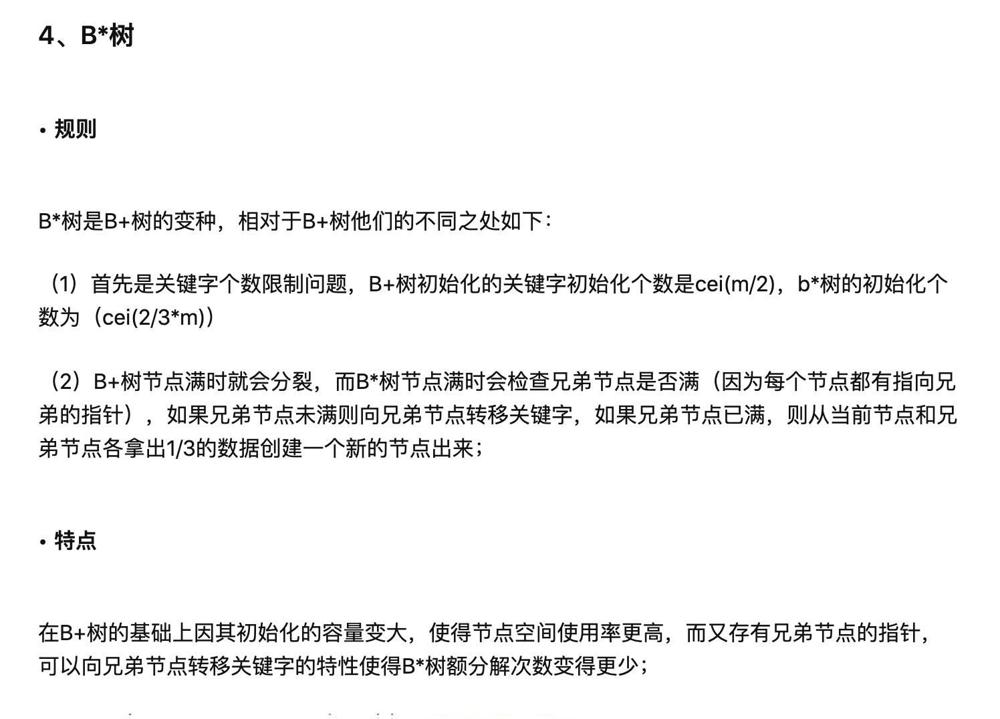

# 平衡二叉树、B树、B+树、B*树

为了学习MYSQL中索引B-Tree的实现，重新回顾这个方面的知识。

参考：https://zhuanlan.zhihu.com/p/27700617

## 平衡二叉树

- 概念

平衡二叉树是基于二分法的策略提高数据的查找速度的二叉树的数据结构。

- 特点：

平衡二叉树是采用二分法思维把数据按规则组装成一个树形结构的数据，用这个树形结构的数据减少无关数据的检索，大大提高了数据检索的速度；平衡二叉树的数据结构组装过程有以下规则：

1. 非叶子节点只能允许最多两个子节点存在。
2. 每一个非叶子节点数据分布规则为左边的子节点小于当前节点的值，右边的子节点大于当前点的值；

平衡树的层级结构:因为平衡二叉树的查询性能和树的层级（h高度）成反比，h值越小查询越快、为了保证树的结构左右两端数据大致平衡降低二叉树的查询难度一般会采用一种算法机制实现节点数据结构的平衡，实现了这种算法的比如有：Treap\红黑树，使用平衡二叉树能保证树的祖佑两边的节点层级相差不会大于1，通过这样避免树形结构由于删除增加变成线性链表影响查询效率，保证数据平衡的情况下查找数据的速度接近于二分法查找；

总结平衡二叉树特点：

1. 非叶子节点最多拥有两个子节点；
2. 非叶子节点值大于左边子节点、小于右边子节点；
3. 树的左右两边的层级数相差不会大于1；
4. 没有值相等重复的节点；

## B树（B-Tree）

- 概念：

B树和平衡二叉树稍有不同的是B树属于多叉树又名平衡多路查找树（查找路径不只两个），数据库索引技术里大量使用B树和B+树的数据结构，让我们来看看他有什么特点；

- 规则

1. 排序方式：所有节点关键字是按递增次序排列，并且遵循左小右大原则；

2. 子节点树：非叶节点的子节点树>1，且<=M，且M>=2，空树除外（注：M代表一个树节点最多有多少个查找路径，M=M路，当M=2则是2叉树，M=3则是3叉树）；
3. 关键字树：枝节点的关键字数量大于等于ceil(m/2)-1个小于等于M-1个，比如M=5，则关键字2<=key<=4
4. 所有叶子节点均在同一层、叶子节点除了包含关键字和关键字记录的指针外也有指向其子节点的指针只不过其指针地址都为null对应下图最后一层节点的空格子；

最后我们用一个图和一个实际的例子来理解B树

- B树的查询流程：

如上图我要从上图中找到E字母，查找流程如下：

1. 获取根节点的关键字进行比较，当前根节点关键字为M，E<M，所以往找到指向左边的子节点
2. 拿到关键字D和G，D<E<G，所以找到D和G中间的节点
3. 拿到E和F，因为E==E找到

插入和删除，这里就不做了解。

**特点：**

B树相对于平衡二叉树的不同是，每隔节点包含的关键字增多了，特别是在B树应用到数据库中的时候，数据库充分利用了磁盘快的原理把节点大小限制和充分使用在磁盘快大小范围；把树的节点关键字增多后树的层级比原来二叉树少了，减少了数据查找的次数和复杂度。

## B+ 树

- 概念

B+树是B树的一个升级版，相对于B树来说B+树更充分的利用了节点的空间，让查询速度更加稳定，其速度完全接近于二分法查找。

- 规则

1. B+跟B树不同：B+树的非叶子节点不保存关键字记录的指针，只进行数据索引，这样使得B+树每个非叶子节点所能保存的关键字大大增加；
2. B+树的叶子节点保存了父节点的所有关键字记录的指针，素有数据地址必须要到叶子节点才能获取到。所以每次数据查询到次数都一样。
3. B+树叶子节点的关键字从小到大有序排列，左边结尾数据都会保存右边节点开始数据的指针。
4. 非叶子节点的子节点树=关键字数。

特点：

1. B+树的层级更少：相较于B树B+树每个非叶子节点存储的关键字更多，树的层级更少所以查询数据更快；
2. B+树查询速度更稳定：B+所有关键字数据地址都存在叶子节点上，所以每次查找的次数都相同，所以查询速度要比B树更稳定；
3. B+树天然具备排序功能：B+树所有的叶子节点数据构成了一个有序链表，在查询大小区间的数据时更方便，数据紧密性很高，缓存的命中率也会比B树高；
4. B+树全节点遍历更快：B+树变量整棵树枝需要遍历所有的叶子节点即可，而不需要像B树一样需要对每一层进行遍历，这有利于数据库做全表嫂面。

B树相对于B+树对优点是，如果经常访问的数据离根节点很近，而B树的非叶子节点本身存有关键字其数据的地址，所有这种检索的时候会要比B+ 树快。

