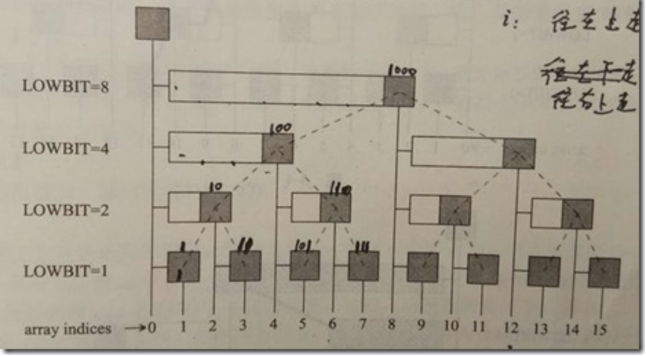

# Binary Indexed Tree

树状数组或二叉索引树（Binary Indexed Tree），又以其发明者命名为 Fenwick 树。其初衷是解决数据压缩里的累积频率的计算问题，现多用于高效计算数列的前缀和、区间和。

它可以以O*(log*n*) 的时间得到任意前缀和：
$$
\sum\limits_{i=1}^jA[i],i<=j<=N
$$
并同时支持在 O(log n)时间内支持动态单点值的修改。空间复杂度 O(n)。



在树状数组中，对于节点i，如果它是左子节点，父节点为i+lowbit(i);如果它是右子节点，那么父节点是i-lowbit(i)

设置一个数组C，
$$
C[i] = A[i - lowbit(i) + 1]+ A[i - lowbit(i) + 2]+...+A[i]
$$
C对应着上面的黑块和它左边的白色长块，长度为lowbit(i)，例如
$$
C12 = A9 + A10 + A11+A12
$$
计算前缀和S，从i开始向上、向左爬，不一定沿着🌲上的边，如S11=C11+C10+C8。

如果修改了一个Ai， 如何更新C？

从i开始向上、向右爬，修改沿途的C即可。如修改了A3，C3->C4->C8

代码：

```c
int sum(int x) {
	int ans = 0;
	while (x > 0) {
		ans += C[x];
		x -= lowbit(x);
	}
	return ans;
}
void add(int x, int d) {
  while (x <= n) {
    C[x] = d;
  	x += lowbit(x);
  }
}
```


完整的代码：

```java
class NumArray {
	int[] tree;
  // 计算最低位的1  1: 1 3:1   4:4   2：2   15：8
	int lowbit(int x) {
		return x & (-x);
	}
  // 查询前缀和的方法
  int query(int x) {
    int ans = 0；
     while (x > 0) {
       ans += tree[x];
       x -= lowbit(x);
     }
    return ans;
  }
  
  // 在树状数组x位置中增加值u
  void add(int x , int u) {
    while (x <= n) {
      tree[x] += u;
      x += lowbit(x);
    }
  }
  
  int[] nums;
  int n;
  // 初始化树状数组，要默认数组是从1开始
  public NumArray(int[] _nums) {
    nums = _nums;
    n = nums.length;
    tree = new int[n + 1];
    for (int i = 0; i < n; i++) {
      add (i + 1, nums[i]);
    }
  }
  
    
  // 使用树状数组
  public void update(int i, int val) {
    add(i + 1, val - nums[i]);
    nums[i] = val;
  }
  
  public int sumRange(int l, int r) {
    return query(r + 1) - query(l);
  }
  
}
```

