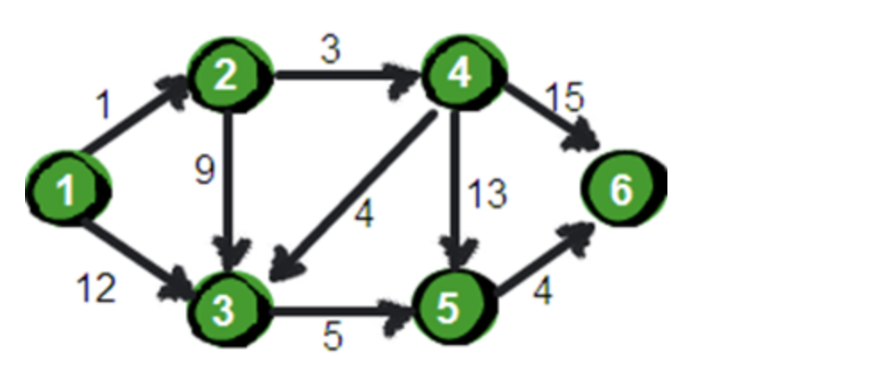
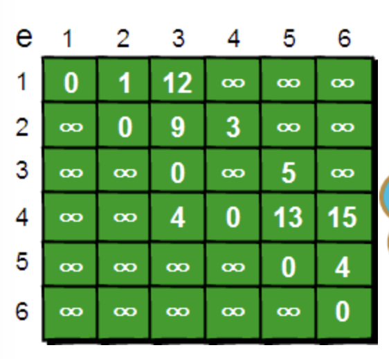
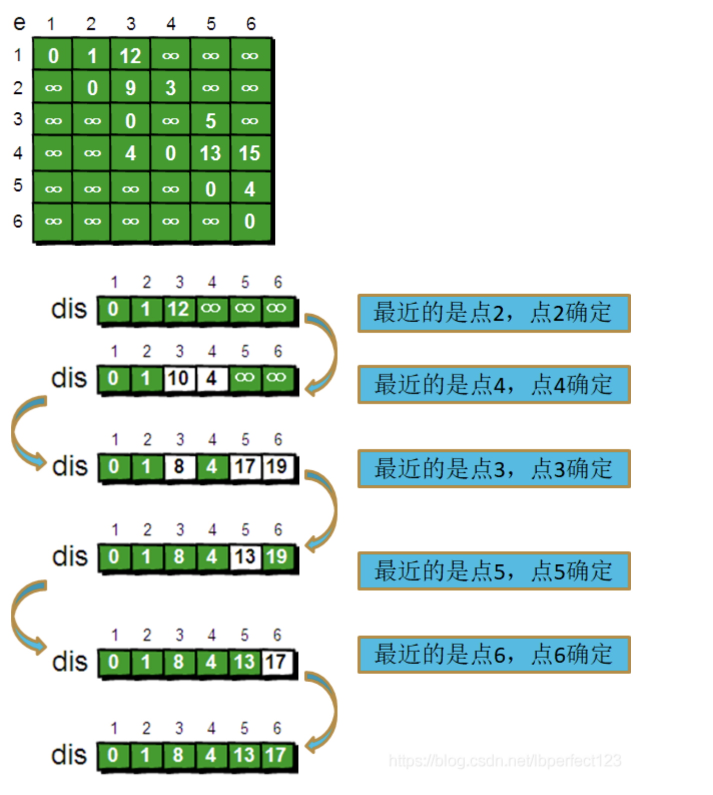

# Dijkstra算法

参考url：https://blog.csdn.net/lbperfect123/article/details/84281300 

Dijkstra算法是贪心思想实现的，首先把起点到所有点的距离存下来找个最短的，然后松弛一次再找出最短的，所谓松弛就是，遍历一遍看通过刚刚找到的距离最短的点作为中转站会不会更近，如果更近了就更新距离，这样把所有的点找遍之后就存下了起点到其他所有点的最短距离。

## 问题引入：

指定一个点到其余各个顶点的 **最短路径**， 也叫做“单源最短路径”。 例如求下图中的1号顶点到2、3、4、5、6号顶点的最短路径。



那么如何求1点到剩下点的最短路径呢？

首先使用一个数据结构存储图的信息



还需要一个一维数组dis来存储1号顶点到其余各个顶点的初始路程


下面是模拟：



代码：

```java
#include<cstdio>
#include<cstring>
#include<algorithm>
#include<iostream>
#define Inf 0x3f3f3f3f
 
using namespace std;
 
int map[1005][1005];
 
int vis[1005],dis[1005];
int n,m;//n个点，m条边
 
void Init ()
{
	memset(map,Inf,sizeof(map));
	for(int i=1;i<=n;i++)
	{
		map[i][i]=0;
	}
}
 
void Getmap()
{
	int u,v,w;
    for(int t=1;t<=m;t++)
	{
	  	scanf("%d%d%d",&u,&v,&w);
	  	if(map[u][v]>w)
		  {
		  map[u][v]=w;
		  map[v][u]=w;
	      }
	}	
	
}
 
void Dijkstra(int u)
{
	memset(vis,0,sizeof(vis));
	for(int t=1;t<=n;t++)
	{
		dis[t]=map[u][t];
	}
	vis[u]=1;
	for(int t=1;t<n;t++)
	{
    // 从最小的开始
		int minn=Inf,temp;
		for(int i=1;i<=n;i++)
		{
			if(!vis[i]&&dis[i]<minn)
			{
				minn=dis[i];
				temp=i;
			}
		}
    // 代表这个顶点已经被访问过了
		vis[temp]=1;
		for(int i=1;i<=n;i++)
		{
			if(map[temp][i]+dis[temp]<dis[i])
			{
				dis[i]=map[temp][i]+dis[temp];
			}
		}
	}
	
}
 
int main()
{
	
	scanf("%d%d",&m,&n);
	Init();
	Getmap();
	Dijkstra(n);
	printf("%d\n",dis[1]);
	
	
	return 0;
}

```

