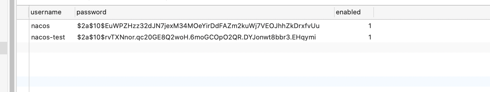

## 单机配置

这个方式并没有把数据写到mysql数据库当中去，那个问题之后再去解决吧。

**方式**

1. 拉取镜像

   docker pull nacos/nacos-server

2. docker run --env MODE=standalone --name nacos -d -p 8847:8848 nacos/nacos-server

3. curl -X POST "http://localhost:8847/nacos/v1/cs/configs?dataId=nacos.cfg.dataId&group=test&content=HelloWorld"

4. curl -X GET "http://localhost:8847/nacos/v1/cs/configs?dataId=nacos.cfg.dataId&group=test"


**今天再来尝试连接mysql数据库**

```sh
docker run -d \
-e MODE=standalone \
-e SPRING_DATASOURCE_PLATFORM=mysql \
-e MYSQL_SERVICE_HOST=ip \
-e MYSQL_SERVICE_PORT=3306 \
-e MYSQL_SERVICE_USER=root \
-e MYSQL_SERVICE_PASSWORD=root \
-e MYSQL_SERVICE_DB_NAME=psych \
-p 8848:8848 \
--restart=always \
--name nacos \
nacos/nacos-server

#ip 是你的mysql容器的ip（不要写成127.0.0.1）

查询方式：docker inspect mysql | grep IPAddress 查询出来写上去即可`
```

```sh
docker inspect mysql-server | grep IPAddress
            "SecondaryIPAddresses": null,
            "IPAddress": "172.17.0.2",
                    "IPAddress": "172.17.0.2",
```

```
docker run -d \
-e MODE=standalone \
-e SPRING_DATASOURCE_PLATFORM=mysql \
-e MYSQL_SERVICE_HOST=172.17.0.2 \
-e MYSQL_SERVICE_PORT=3306 \
-e MYSQL_SERVICE_USER=root \
-e MYSQL_SERVICE_PASSWORD=123456 \
-e MYSQL_SERVICE_DB_NAME=nacos \
-p 8847:8848 \
--restart=always \
--name nacos \
nacos/nacos-server
```

然后访问localhost:8847/nacos即可进入。

测试之后，确实已经连接成功了。




## 集群配置

docker inspect mysql-server | grep IPAddress

```
docker run -d \
-e MODE=cluster \
-e NACOS_APPLICATION_PORT=8849 \
-e NACOS_SERVERS=10.134.194.146:8849,10.134.194.146:8850,10.134.194.146:8851 \
-e SPRING_DATASOURCE_PLATFORM=mysql \
-e MYSQL_SERVICE_HOST=172.17.0.7 \
-e MYSQL_SERVICE_PORT=3306 \
-e MYSQL_SERVICE_USER=root \
-e MYSQL_SERVICE_PASSWORD=123456 \
-e MYSQL_SERVICE_DB_NAME=nacos \
-e NACOS_SERVER_IP=10.134.194.146 \
--restart=always \
-p 8849:8849 \
--name nacos8849 \
nacos/nacos-server
 
```

```
docker run -d \
-e MODE=cluster \
-e NACOS_APPLICATION_PORT=8850 \
-e NACOS_SERVERS=10.134.194.146:8849,10.134.194.146:8850,10.134.194.146:8851 \
-e SPRING_DATASOURCE_PLATFORM=mysql \
-e MYSQL_SERVICE_HOST=172.17.0.7 \
-e MYSQL_SERVICE_PORT=3306 \
-e MYSQL_SERVICE_USER=root \
-e MYSQL_SERVICE_PASSWORD=123456 \
-e MYSQL_SERVICE_DB_NAME=nacos \
-e NACOS_SERVER_IP=10.134.194.146 \
--restart=always \
-p 8850:8850 \
--name nacos8850 \
nacos/nacos-server
 
```

```
docker run -d \
-e MODE=cluster \
-e NACOS_APPLICATION_PORT=8851 \
-e NACOS_SERVERS=10.134.194.146:8849,10.134.194.146:8850,10.134.194.146:8851 \
-e SPRING_DATASOURCE_PLATFORM=mysql \
-e MYSQL_SERVICE_HOST=172.17.0.7 \
-e MYSQL_SERVICE_PORT=3306 \
-e MYSQL_SERVICE_USER=root \
-e MYSQL_SERVICE_PASSWORD=123456 \
-e MYSQL_SERVICE_DB_NAME=nacos \
-e NACOS_SERVER_IP=10.134.194.146 \
--restart=always \
-p 8851:8851 \
--name nacos8851 \
nacos/nacos-server
 
```

配置nginx

需要先去cp /etc/nginx/nginx.conf 文件和 /etc/nginx/conf.d/default.conf两个文件

```sh
docker run -d --name nginx -p80:80 -p 8847:8847 -v /Users/crazys/docker_mapping/docker-nginx/logs:/var/log/nginx -v /Users/crazys/docker_mapping/docker-nginx/html:/usr/share/nginx/html -v /Users/crazys/docker_mapping/docker-nginx/conf:/etc/nginx/conf.d -v /Users/crazys/docker_mapping/docker-nginx/nginx.conf:/etc/nginx/nginx.conf --privileged=true nginx
```

```sh
upstream nacoscluster { 
    server 10.134.194.146:8849;
    server 10.134.194.146:8850;
    server 10.134.194.146:8851;
}
server {
    listen       8847;
    server_name  10.134.194.146;

    #access_log  /var/log/nginx/host.access.log  main;

    location /nacos/ {
        proxy_pass http://nacoscluster/nacos/;
    }

    #error_page  404              /404.html;

    # redirect server error pages to the static page /50x.html
    #
    error_page   500 502 503 504  /50x.html;
    location = /50x.html {
        root   /usr/share/nginx/html;
    }

    # proxy the PHP scripts to Apache listening on 127.0.0.1:80
    #
    #location ~ \.php$ {
    #    proxy_pass   http://127.0.0.1;
    #}

    # pass the PHP scripts to FastCGI server listening on 127.0.0.1:9000
    #
    #location ~ \.php$ {
    #    root           html;
    #    fastcgi_pass   127.0.0.1:9000;
    #    fastcgi_index  index.php;
    #    fastcgi_param  SCRIPT_FILENAME  /scripts$fastcgi_script_name;
    #    include        fastcgi_params;
    #}

    # deny access to .htaccess files, if Apache's document root
    # concurs with nginx's one
    #
    #location ~ /\.ht {
    #    deny  all;
    #}
}


```

