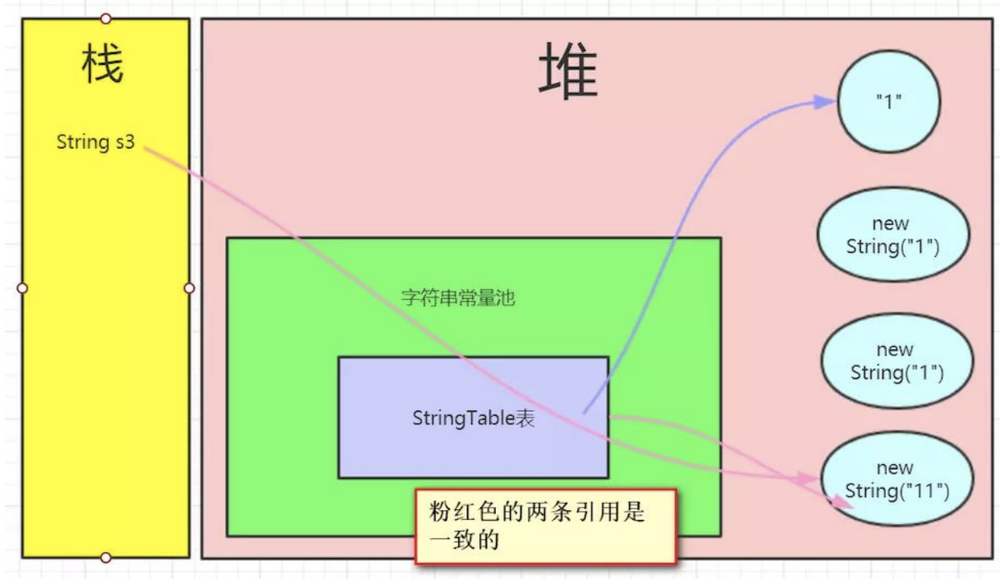

# 博客1

主要抄的动力节点的 url: https://www.zhihu.com/question/268821097/answer/1232848272


## 抄本篇博客的原因

看了1章半的jvm的书，又看了一下面试问题，有点懵逼，先看一篇博客，然后再去看书吧。

学习JVM的目的：

1. 能够知道JVM是干什么的
2. 面试问题
3. 装逼？？？

## 一、简单聊聊JVM

### 1.1 看下简单的Java程序

一个简单的JavaBean

```java
@Data
public class Java3y {
  private String name;
  private int age;
}
```

一个简单的测试类

```java
public class Java3yTest {
  public static void main(String[] args) {
    Java3y java3y = new Java3y();
    java3y.setName("Java3y");
    System.out.println(java3y);
  }
}
```

初学的时候知道用javac来编译.java文件，用过java 命令来执行编译后生成的.class 文件。

使用ide运行的时候其实是将这两个命令结合在一起的（编译并运行），方便我们开发。

### 1.2 编译过程

.java文件是由Java源码编译器（Javac）来完成，其流程图如下所示：


Java源码编译由以下三个过程组成：

- 分析和输入到符号表
- 注解处理
- 语义分析和生成class文件


#### 1.2.1 编译时期-语法糖

语法糖可以看作是编译器实现的一些“小把戏”，这些“小把戏”可能会使得效率大提升。

最值得说明的就是 **泛型**了，该语法糖我们会经常用到。

- 泛型只会在Java源码中存在，编译过后会被替换为原来的原生类型（Raw Type)。这个过程也被称为：泛型擦除

有了泛型语法糖以后：

- 代码更加简洁
- 程序健壮
- 可读性和稳定性（在编写集合的时候，就限定了类型）

之后在去学一下泛型的知识，还是继续看这个人的博客啦。

### 1.3 JVM实现跨平台

至此，我们通过javac.exe编译器编译我们的.java源代码生成出.class文件了。

这些.class文件很明显是不能直接运行的，它不像C语言，这些.class文件是交由JVM来解析运行的！

- JVM 是运行在操作系统之上的，每个操作系统的指令是不同的，而JDK是区分操作系统给的，只要你的本地系统装了JDK，这个JDK就是能够和当前系统兼容的。
- 而class字节码运行在JVM上，所以不用关心class字节码是在哪个操作系统编译的，只要符合JVM规范，这个字节码文件就是可以运行的。
- 所以java做到了跨平台。

### 1.4 class文件和jvm

#### 1.4.1 类的加载时机

现在我们例子中生成的两个.class文件都会被直接加载到JVM中麻？

虚拟机规范是严格规定了有且只有5种情况必须 **立即对类进行初始化**：

- 创建类的实例。访问某个类或者接口的静态变量，或者对该静态变量赋值，调用类的今天改方法
- 反射的方式
- 初始化某个类的子类，则其父类也会被初始化
- Java虚拟机启动时被标明为启动类的负累，直接使用Java.exe命令运行某个主类

所以说：

- java类的加载是动态的，它并不会一次性将所有类全部加载后再运行，而是保证程序运行的基础类完全加载到jvm中，至于其他类，则在需要的时候才加载。这都是为了节省内存开销。

#### 1.4.2 如何将类加载到jvm

class文件是通过类的加载器装载到jvm中的

java默认由三种类加载器：


各个加载器的工作责任：

- Bootstrap ClassLoader: 负责加载 $JAVA_HOME 中jre/lib/rt.jar里所有的class，由C++实现，不是CLASSLOADER子类
- Extension ClassLoader: 复杂加载Java平台扩展功能的一些jar包，包括 $JAVA_HOME中jre/lib/*.jar或者 -Djava.ext.dirs指定目录下的jar爆
- App ClassLoader：负责加载classpath中指定的jar包及目录中class

工作过程：

1. 当AppClassLoader加载一个class时，它首先不会自己去加载这个类，而是把类加载请求委派给父类加载器ExtClassLoader去完成。
2. 当ExtClassLoader加载一个class时，它首先也不会自己去尝试加载这个类，而是把类加载请求委派给BootStrapClassLoader去完成。
3. 如果BootStrapClassLoader加载失败，会使用ExtClassLoader来尝试加载；
4. 如果ExtClassLoader也加载失败，则会使用AppClassLoader来加载
5. 如果AppClassLoader也加载失败，则会报出ClassNotFoundException

其实这就是所谓的 **双亲委派模型**。简单来说： 如果一个类加载器收到了类加载的请求，它首先不会自己去加载这个类，而是把 **请求委托给父加载器**去完成。

好处： **防止内存中出现多份同样的字节码**

特别说明：

- 类加载器在成功加载某个类之后，会把得到的 java.lang.Class的实例缓存起来。下次再请求加载该类的时候，类加载器会直接使用缓存类的实例，而不会尝试再次加载。

#### 1.4.2 类加载详细过程

加载器加载到jvm中，接下来其实又分了好几个步骤：

- 加载，查找并加载类的二进制数据，在Java堆中也创建一个java.lang.Class类的对象。
- 连接，连接又包含三块内容：验证、准备、初始化
  1. 验证： 文件格式、元数据、字节码、符号引用验证；
  2. 准备：为类的静态变量分配内存，并将其初始化为默认值；
  3. 解析：把类中的符号引用转换为直接引用
- 初始化，为类的静态变量赋予正确的初始值。


#### 1.4.3 JIT 即使编译器

JVM实现：

- 将Java字节码重新编译优化，生成机器码，让CPU直接执行。这样编出来的代码效率会更高。
- 编译也是要话费时间的，我们一般对热点代码做编译，非热点代码直接解析就好了。

热点代码：多次调用的方法、多次执行的循环体

使用热点探测来检测是否为热点代码，热点探测有两种方式：

- 采样
- 计数器

目前HotSpot使用的是计数器的方式，它为每个方法准备了两类计数器：

- 方法调用计数器
- 回边计数器
- 在确定虚拟机运行参数的前提下，这两个计数器都有一个确定的阈值，当计数器超过阈值溢出了，就会触发JIT编译。


#### 1.4.4 回到例子中

该Java3yTest.class 文件会被AppClassLoader加载器加载（因为ExtClassLoader 和 BootStrap加载器都不回家在它（双亲委派模型））到JVM中。

随后发现了要使用Java3y这个类，Java3y仍然是被AppClassLoader加载。

### 1.5 类加载完以后JVM干了什么？

在类加载检查通过后，接下来虚拟机将为 **新生对象分配内存**。

jdk1.8的jvm内存模型。


- 堆： 存放对象实例
- 虚拟机栈：虚拟机栈描述的是Java方法执行的内存模型： 每个方法被执行的时候都会同时创建一个栈帧，用于存储局部变量、操作栈、动态链接、方法出口等信息
- 本地方法区：为虚拟机使用到的Native方法服务。
- 方法区：存储已被虚拟机加载的类元数据信息（元空间）
- 程序计数器：当前线程所执行的字节码的行号指示器

#### 1.5.2 例子中的流程


来宏观简述这个例子的工作流程：

1. 通过java.exe运行Java3yTest.class，随后被加载到JVM中，元空间存储着类的信息（类的名称、方法信息、字段信息...）。
2. 然后JVM找到Java3yTest的主函数入口，为main函数创建栈帧，开始执行main函数
3. Main函数的第一条命令是 Java3y java3y = new Java3y()；就是让JVM创建一个Java3y对象，但是这时候方法区中没有Java3y类的信息，所以JVM马上加载Java3y类，把Java3y类的类型信息放到方法区（元空间）
4. 加载完Java3y类之后，Java虚拟机做的第一件事就是在堆中为一个新的Java3y实例分配内存，然后调用构造函数初始化Java3y实例，这个Java3y实例持有者指向方法区的Java3y类的类型信息（其中包含有方法表、Java动态绑定的底层实现）的引用
5. 当使用Java3y.setName("Java3y")；的时候，JVM根据java3y引用找到Java3y对象，然后根据Java3y对象持有的引用定位到方法区中Java3y类的类型信息的方法表，获得setName()函数的字节码的地址 
6. 为setName()函数创建栈帧，开始运行setName()函数

### 1.6 简单聊聊常量池

jdk1.7之后：

- 运行时常量池位于堆中
- 字符串常量池位于堆中

常量池存储的是：

- 字面量（Literal): 文本字符串等--> 用双引号印起来的字符串字面量都会进这里面
- 符号引用(Symbolic References)
  - 类和接口的全限定名（Full Qualifield Name)
  - 方法的名称和描述符
  - 字段的名称和描述符

常量池（Constant Pool Table) ， 用于存放编译期生成的各种字面量和符号引用，这部分内容将在类加载后进入方法区的运行时常量池中存放

现在我们的运行时常量池只是换了一个位置（原来在方法区，现在在堆中），但可以明确的是： 类加载后， **常量池中的数据会在运行时常量池中存放*

常量池： Class文件中的内容，还不是运行时的内容，不要理解为一个池子，其实就是Class文件中的字节码

在HotSpot VM 里，记录interned string的一个全局表叫做StringTable，本质为HashSet<String>。 只存储对java.lang.String实例的引用，而不存储String对象的内容。

**字符串常量池只存储引用，不存储内容！**

看一下intern方法：

- **如果常量池中存在当前字符串，那么直接返回常量池中它的引用。**
- **如果常量池中没有此字符串，会将此字符串引用保存在常量池中，再直接返回该字符串的引用！**

#### 1.6.1 解析题目

```java
public static void main(String[] args) {
	String s = new String("1");
	s.intern();
	
	String s2 = "1";
	
	System.out.println(s == s2); // false
}
```

第一句： String s = new String("1")；

s 指向 String("1")这个对象

第二句： s.intern()； 发现字符串常量池中的StringTable表中已经存在“1”字符串对象，所以直接返回 **字符串常量池中对堆的引用**-> 此时s引用还是指着堆中的对象


第三句： String s2 = "1"；发现字符串常量池中已经保存了堆该对象的引用了，直接返回字符串常量池堆堆中字符串的引用


很明显， **两条引用是不一样的！** 所以返回false

```java
public static void main(String[] args) {
	String s3 = new String("1") + new String("1");
	s3.intern();
	
	String s4 = "11";
	System.out.println(s3 == s4); //true
}
```


第一句： String s3 = new String("1") + new String("1");

注意： 此次“11”对象并没有在字符串常量池中保存引用。


第二句： s3.intern()；发现"11"对象**并没有在字符串常量池中**，于是将"11"对象在字符串常量池中**保存当前字符串的引用**，并**返回**当前字符串的引用(但没有接收)



第三句：`String s4 = "11";`发现字符串常量池已经存在引用了，直接返回(**拿到的也是与s3相同指向的引用**)


## 二、JVM 面试题

做一些常见的JVM面试题：

- 详细JVM内存模型
- 讲讲什么情况下会出现内存溢出，内存泄漏
- 说说Java线程栈
- JVM年轻代到老年代的晋升过程的判断条件是什么
- JVM出现频繁的Full GC ，怎么去线上排查问题
- 类加载为什么要使用双亲委派模式，有没有什么场景是打破了这个模式
- 类的实例化顺序
- JVM垃圾回收机制，何时触发Minor GC 等操作
- JVM中一次完整的GC流程（从ygc到fgc)是怎样的
- 各种回收器，各自优缺点，重点CMS、G1
- 各种回收算法
- OOM错误，stackoverflow错误，permgen space 错误


### 2.1 详细jvm内存模型

根据JVM规范，JVM内存共分为

- 虚拟机栈
- 程序计数器
- 本地方法栈
- 方法区
- 堆

这5个部分。

jdk1.7之前是PermGen(永久代),被替换成了Metaspace(元共建)

- 原本永久代存储的数据： 符号引用转移到了native heap；

  字面量转移到了java heap； 类的静态变量转移到了java heap

- Metaspace:存储的是类的元数据信息

- 元空间的本质和永久代类似： 最大的区别： **元空间不在虚拟机中，而是使用本地内存。**

- **替换的好处： ** 

  - 字符串存在永久代中，可能出现性能问题和溢出。
  - 永久代会为GC带来不必要的复杂度，且回收率偏低

### 2.2 什么情况出现内存溢出，内存泄漏

**内存泄漏的原因：**

- 对象是可达的（一直被引用）
- 但是 **对象不会被使用**

常见内存泄漏例子：

```java
public static void main(String[] args) {
	Set set = new HashSet();
  for (int i = 0; i < 10; i++) {
  	Object object = new Object();
  	set.add(object);
  	object = null;
  }
  // set集合还维护着obj的引用，gc不会回收Object对象
}
```

解决： 将set设置为null


**内存溢出原因：**

- 内存泄漏导致堆栈内存不断睁大，从而引发内存溢出
- 大量jar，class文件加载，装载类的空间不够，溢出
- 操作大量的对象导致内存空间用满，溢出
- nio直接操作内存，内存过大导致溢出

解决：

- 查看程序是否存在内存泄漏问题
- 设置参数加大空间
- 代码中是否存在死循环或循环产生过多重复的对象实体
- 查看是否使用了nio直接操作内存

### 2.3 说说线程栈

这里的线程栈应该是指的是虚拟机栈

JVM规范让每个Java线程拥有自己的独立的JVM栈，也就是Java 方法的调用栈。

当方法调用的时候，会生成一个 **栈帧**。 栈帧是保存在虚拟机栈中的，    栈帧存储了方法的 **局部变量、操作数栈、动态链接和方法返回地址**等信息

线程运行过程中，只有一个栈帧是处于活跃状态，称为“当前活跃栈帧”，当前活动栈帧始终是虚拟机栈的 **栈顶元素**

可以通过jstack工具查看线程状态。


### 2.4 JVM年轻代到年老代的晋升过程的判断条件是什么呢？

1. 部分对象会在From和To区域中复制来复制去，如此交换15次，最终如果还是存活，就存入老年代
2. 如果对象的大小大于Eden的二分之一会直接分配在old，如果old 分配不下，会做一次majorGC,如果小于eden的一半，但是没有足够的空间，就进行minorgc。
3. minor gc 后，survivor仍然放不下，则放到老年代
4. 动态年龄判断， 大于等于某个年龄的对象超过了survivor空间一半，大于等于某个年龄的对象直接进入老年代


### 2.5 JVM 出现 full GC 很频繁，如何去线上排查问题

根据full GC 的触发条件来做：

- 如果有perm gen的话， 要给perm gen 分配空间，但是如果没有足够空间，会触发full gc
- 看看是不是perm gen 区的值设置太小了。
- System.gc()方法的调用
  - 一般没人去调用
- 统计到的Minor Gc晋升到major 生代的平均大小大于老年代的剩余空间，则会触发full gc。
  - 看是不是频繁创建了大对象（也有可能是Eden区设置过小）
  - 是不是老年代空间设置太小了。


### 2.6 类加载为什么使用双亲委派模式，有没有什么场景打破了这个模式？

双亲委派模型的重要用途是为了解决类载入过程中的安全性问题

- 假设有一个开发者自己编写了一个名为java.lang.Object的类，想借此欺骗JVM。现在他要使用自定义ClassLocader来加载自己编写的java.lang.Object。
- 然而幸运的是，双拼委派模式不会让他成功。因为JVM会优先在BootStrap ClassLoader的路径下找到java.lang.Object类，并载入它

**Java的类加载是否一定遵循双亲委派模式？**

- 在实际开发中，我们可以通过 **自定义ClassLoader**， 并重写父类的loadClass方法，来打破这一机制。
- SPI就是打破了双亲委派机制（SPI: 服务提供发现）。


### 2.7 类的实例化顺序

1. 父类静态成员和静态初始化块 ，按在代码中出现的顺序依次执行
2. 子类静态成员和静态初始化块 ，按在代码中出现的顺序依次执行
3. 父类实例成员和实例初始化块 ，按在代码中出现的顺序依次执行
4.  父类构造方法
5. 子类实例成员和实例初始化块 ，按在代码中出现的顺序依次执行
6. 子类构造方法

```java
作者：动力节点
链接：https://www.zhihu.com/question/268821097/answer/1232848272
来源：知乎
著作权归作者所有。商业转载请联系作者获得授权，非商业转载请注明出处。

class Dervied extends Base {


    private String name = "Java3y";

    public Dervied() {
        tellName();
        printName();
    }

    public void tellName() {
        System.out.println("Dervied tell name: " + name);
    }

    public void printName() {
        System.out.println("Dervied print name: " + name);
    }

    public static void main(String[] args) {

        new Dervied();
    }
}

class Base {

    private String name = "公众号";

    public Base() {
        tellName();
        printName();
    }

    public void tellName() {
        System.out.println("Base tell name: " + name);
    }

    public void printName() {
        System.out.println("Base print name: " + name);
    }
}
```

输出数据：

```java
Dervied tell name: null
Dervied print name: null
Dervied tell name: Java3y
Dervied print name: Java3y
```


### 2.8 JVM垃圾回收机制，何时出发MinorGC等操作

当eden区分配满的时候出发Minor GC 


### 2.9 JVM中一次完整的GC流程（从ygc到fgc）是怎样的


### 2.10 各种回收算法

- 标记-清除
- 标记-复制
- 标记-整理


### 2.11 各种回收器，各自优缺点，重点CMS、G1

- Serial收集器： 使用一个线程区回收，最稳定及效率高的收集齐，但可能会产生较长的停顿
- ParNew收集齐： Serial 收集器的多线程版本
- Parallel收集齐： 类似ParNew，但是更关注系统的吞吐量
- Parallel Old： Parallel Scavenge的old版本，使用的是 标记-整理算法
- CMS： CMS（Concurrent Mark Sweep）收集器是一种以**获取最短回收停顿时间**为目标的收集器。它需要**消耗额外的CPU和内存资源**，在CPU和内存资源紧张，CPU较少时，会加重系统负担。CMS**无法处理浮动垃圾**。CMS的“标记-清除”算法，会导致大量**空间碎片的产生**。
- G1收集器，G1 (Garbage-First)是一款面向服务器的垃圾收集器,主要针对配备多颗处理器及大容量内存的机器. **以极高概率满足GC停顿时间要求的同时,还具备高吞吐量性能特征**。

