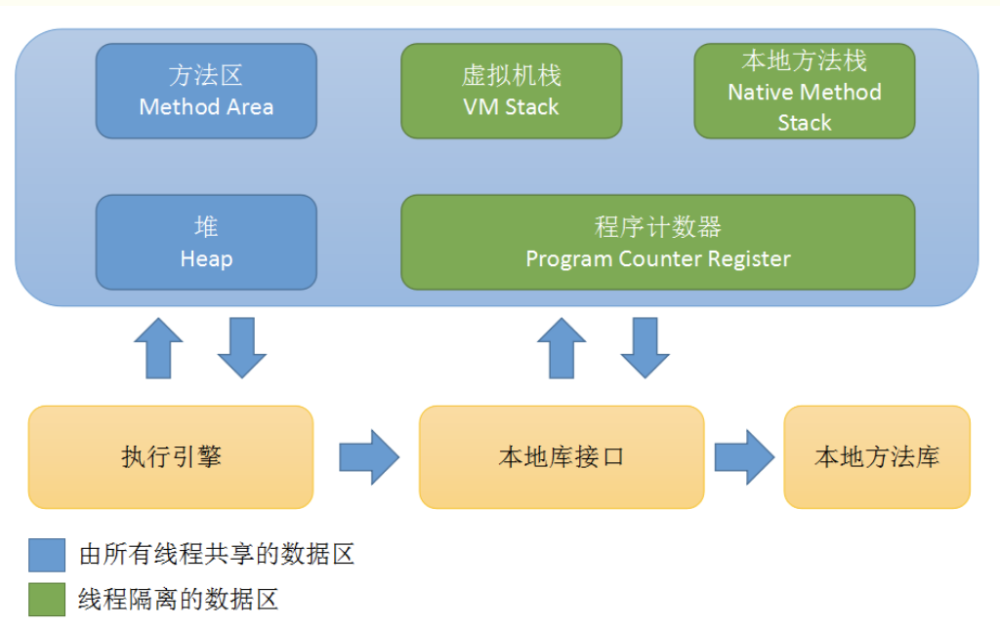
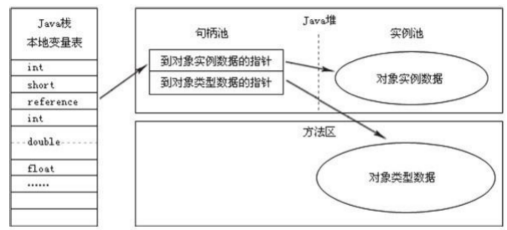
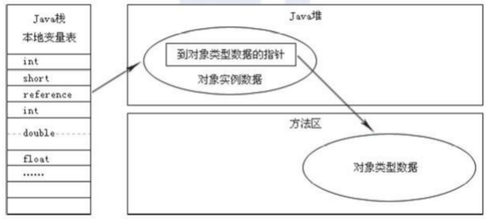

# 第2章 Java内存区域与内存溢出异常

## 2.1 概述

Java程序猿把内存控制的权利交给了Java虚拟机，出现了内存泄漏和溢出的问题，如果不了解虚拟机是如何使用内存的，排查错误就很困难。

本章是第二部分的第一章，将从概念上介绍Java虚拟机内存的各个区域，讲解这些区域的作用、服务对象以及其中可能产生的问题。

## 2.2 运行时数据区域

Java虚拟机在执行Java程序的过程中会把它所管理的内存划分为若干个不同的数据区域。

这些区域都有各自的用途，以及创建和销毁的时间，有的区域随着虚拟机进程的启动而存在，有些区域则依赖用户线程的启动和结束而建立和销毁。

根据规范，Java虚拟机所管理的内存将会包括以下几个运行时数据区域。

运行时数据区包括：

1. 方法区 Method Area

2. 堆 Heap

3. 虚拟机栈 VM Stack

4. 本地方法栈 Native Method Stack

5. 程序计数器 Program Couter Register

   

### 2.2.1 程序计数器

程序计数器是一块较小的内存空间，可以看作是当前线程所执行的字节码的行号指示器。

字节码解释器工作时通过改变这个计数器的值来选择下一条需要执行的字节码指令，分支、循环、跳转、异常处理、线程恢复等基础功能都需要依赖这个计数器来完成。

因为Java虚拟机的多线程通过轮流切换并分配处理器执行时间的方式来实现的，因此，为了线程切换后能恢复到正确的执行位置，每条线程都需要一个独立的程序计数器，各条线程之间计数器互不影响，独立存储，我们称这类内存区域为“线程私有”的内存。

如果线程正在执行的是一个Java方法，这个计数器记录的是正在执行虚拟机字节码指令的地址；

如果正在执行的是Native方法，这个计数器值为空。

### 2.2.2 Java 虚拟机栈

与程序计数器一样，Java虚拟机栈也是每个线程私有的，它的生命周期与线程相同。虚拟机栈描述的是Java方法执行的内存模型：每个方法在执行的同时都会**创建一个栈帧用于存储局部变量表、操作数栈、动态链接、方法出口等信息。**每一个方法从调用直至执行完成的过程，就对应着一个栈帧来虚拟机栈中入栈到出栈的过程。

经常有人把Java内存区分为堆内存和栈内存，这种分法比较粗糙，Java内存区域的划分实际上远比着这复杂。

该划分的流行只能说明大多数程序员最关注的，与对象内存分配关系最密切的内存区域就是这两块。其中所指的“堆”在后面讲诉，所指的“栈”就是现在将的虚拟机栈，或者说是虚拟机栈中局部变量部分。

局部变量表存放了编译期可知的各种基本数据类型（boolean,byte,char,short,int,float,double,long)，对象引用（reference类型，它不等同于对象本身，可能是一个指向对象起始地址的引用指针，也可能是指向一个代表对象的句柄或者其他与此对象相关的位置）和returnAddress类型（指向了一条字节码指令的地址）。

其中64位长度的long和double类型的数据会占用2个局部变量空间（slot），其余的数据类型只占1个。

**局部遍历表所需的内存空间在编译期间完成分配，**当进入一个方法时，这个方法需要在帧中分配多大的局部变量空间是完全确定的，在方法运行期间不会改变局部变量表的大小。

在Java虚拟机规范中，对这个区域规定了两种异常状况：如果线程请求的栈深度大于虚拟机所允许的深度，将抛出StackOverflowError异常；如果虚拟机可以动态扩展，如果扩展时无法申请到足够的内存，就会抛出OverOfMemoryError异常。

### 2.2.3 本地方法栈

本地方法栈与虚拟机所发挥的作用是非常相似的，它们之间的区别不过是虚拟机为虚拟机执行Java方法服务（也就是字节码）服务，而本地方法栈则为虚拟机使用的Native方法服务。在虚拟机规范中对本地方法栈中方法使用的语言、使用方式与数据结构并没有强制规定，因此具体的虚拟机可以自由实现它。甚至有的虚拟机直接就把本地方法栈和虚拟机栈合二为一。与虚拟机一样，本地方法区域也会抛出StackOverflowError和OutOfMemoryError异常。

### 2.2.4 Java堆

对于大多数应用来说，Java堆是Java虚拟机所管理的内存中最大一块。Java堆是被所有线程共享的一块内存区域，在虚拟机启动时创建。

此内存区域的唯一目的就是存放对象实例，几乎所有的对象实力都在这里分配内存。

这一点在Java虚拟机规范中的描述是：所有的对象实例以及数组都要在堆上分配内存，但是随着JIT编译器的发展与逃逸分析技术初见成熟，栈上分配、标量替换优化技术将会导致一些微妙的变化发生，所有对象都分配在堆上也不是那么绝对了。

Java堆是垃圾收集器管理的主要区域，因此很多时候也被称为“GC堆”（Garbage Collected Heap）。从内存回收的角度来看，由于现在收集器甚至都采用分代收集算法，所以Java堆中还可以细分为：**新生代和老年代**；在细致一点的有Eden空间、From Survior空间、To Survivor空间。

从内存分配的角度来看，线程共享的Java堆中可能划分出多个线程私有的分配缓冲区。不过无论如何发话，都与存放内容无关，无论哪个区域，存储的都仍然是对象实例，进一步划分的目的是为乐更好地回收内存，或者更快地分配内存。

本章主要讨论的是内存区域的作用，Java堆中的上述各个区域的分配、回收等细节将是第3章的主题。

根据Java虚拟机规范的规定，Java堆可以处理物理上不连续的内存的空间中，只要逻辑是连续的即可。在实现时，既可以实现称固定大小的，也可以是可扩展的，不过当前主流的虚拟机都是按照可扩展实现的。 如果在堆中没有内存完成实例分配，而且堆也无法再扩展时，将会抛出OutOfMemoryError异常。

### 2.2.5 方法区

方法区（Method Area) 与Java堆一样，是各个线程共享的内存区域，它用于存储已被**虚拟机加载的类信息、常量、静态变量、即时编译器编译后的代码等数据**。虽然Java虚拟机规范把方法区描述为堆的一个逻辑部分，但是它却有一个别名叫做NON-HEAP，目的是与Java堆区分开来。

原则上，如何实现方法区属于虚拟机实现细节，不受虚拟机规范约束，但使用永久代来实现方法去，现在看来不是一个好主意，因为这样更容易遇到内存溢出问题，而且会有极少数方法会因为这个原因导致不同虚拟机下有不通的表现。现在采用的是Native Memory来实现方法区的规划了。

Java虚拟机规范堆方法区的限制非常宽松，不需要连续的内存和可以选择固定大小或者可扩展外，还可以选择不实现垃圾收集。相对而言，垃圾收集行为在这个区域是较少出现的，但并非数据进入了方法区就如永久代的名字一样“永久”存在了。

这区域的内存回收目标主要是针对常量池的回收和对类型的卸载，一般来说，这个区域的回收“成绩”比较难以令人满意，尤其是类型的卸载，条件很苛刻。但是这部分区域的回收确实是必要的。

根据Java虚拟机规范的规定，当方法区无法满足内存分配需求时，将抛出OutOfMemoryError异常。

### 2.2.6 运行时常量池

运行时常量池（Runtime Constant Pool）是方法区的一部分。

Class文件中除了有类的版本、字段、方法、接口等描述信息外，还有一项信息是常量池。

用于存放编译期生成的各种字面量和符号引用，这部分内容将在类加载后进入方法区的运行时常量池中存放。

Java虚拟机对Class文件每一部分（自然也包括常量池）的格式都有严格规定，每一个字节用于存储哪种数据都必须符合规范上的要求才会被虚拟机认可、装载和执行，但对于运行时常量池，Java虚拟机规范没有做任何细节的要求，不同的提供商实现的虚拟机可以按照自己的需求来实现这个内存区域。

不过，一般来说，除了保存Class文件中描述的符号引用外，还会把翻译出来的直接引用也存储在运行时常量池中。

运行时常量池相对于CLass文件常量池的另外一个重要特征是具备动态性，Java语言并不要求常量一定只有编译期才能产生，也就是并非预置入Class文件中常量池的内容才能进入方法区运行时常量池，运行期间也可以将新的常量放入池中，这种特性被开发人员利用得比较多的便是String类的intern()方法。 （若池中存在相等字符串，则返回该字符串，否则将其加入池中）

### 2.2.7 直接内存

直接存在并不是虚拟机运行时数据区的一部分，也不是Java虚拟机规范中规定中定义内存区域。但是这部分内存也被频繁使用，而且也可能导致OutOfMemoryError遗产该出现，所以放在这里进行讲解。

在jdk1.4中加入了NIO（New input/output）类，引入了一种基于通道（Channel）与缓冲区（Buffer）的I/o方式，它可以使用Native函数库直接分配堆外内存，然后通过一个存储在Java堆中的DirectByteBuffer对象作为为这块内存的引用进行操作。这样能在一些场景中显著提高性能，因为避免了在Java堆和Native堆中来回复制数据。

显然，本机直接内存的分配不会受到Java堆大小的限制，但是，既然是内存，肯定还是会收到本机总内存（RAM、SWAP区或者分页文件）大小以及处理器寻址空间的限制。服务器管理员在配置虚拟机参数时，会根据实际内存设置 -Xmx等参数信息，但经常忽略直接内存，使得各个内存区域综合大于物理内存限制（包括物理的和操作系统级的限制），从而导致动态扩展时出现OutOfMemoryError异常。

## 2.3 HotSpot虚拟机对象探秘

通过前面的介绍，大致了解了虚拟机内存的概况，会进一步了解这些虚拟机内存中的数据的其他细节，比如它们是如何创建、如何布局以及如何访问的。

对于这样设计细节的问题，必须把讨论范围限定在具体的虚拟机和集中在某一个内存区域上才有意义。

基于实用优先的原则，以常用的Hotspot和常用的内存区域Java堆为例，深入探讨Hotspot虚拟机在Java堆中对象分配、布局和访问的全过程。

### 2.3.1 对象的创建

Java是一门面向对象的编程语言，在Java程序运行过程中无时无刻都有对象被创建出来。

在语言层面上，创建对象（例如克隆、反序列化）通常仅仅是一个new关键字而已，而在虚拟机中，对象的创建又是怎样一个过程呢？

虚拟机遇到一条new指令时，

1. 首先将区检查这个指令的参数是否能在常量池中定位到一个类的符号引用，

2. 并且检查这个符号引用代表的类是否已被加载、解析和初始化过。

   1. 如果没有，那必须先执行相应的类加载过程（第7章将探讨这部分的细节）。

   2. 在类加载检查通过后，接下来虚拟机将为新生对象分配内存。对象所需内存的大小在类加载完成后便可以完全确定（2.3.2会介绍如何去定），为对象分配空间的任务等同于把一块确定大小的内从从Java堆中划分出来。

      1. 假设Java堆中内存是绝对规整的，所有用过的内存都放在一边，空闲的内存放在另一边，中间放着一个指针座位分界点点指示器，那所分配内存就是仅仅把那个指针向空闲空间那边挪动一段与对象大小相等的距离，这种分配方式称为“指针碰撞”。
      2. 如果Java堆中的内存并不是规整的，已使用的内存和空闲的内存相互交错，那就没有办法简单地进行指针碰撞了，虚拟机就必须维护一个列表，记录上哪些内存块是可用的，在分配的时候从列表中找到一块足够大的空间划分给对象实例，并更新列表上的记录，这种分配方式称为“空闲列表”（Free List）。

      3. 选择哪种分配方式由Java对是否规整决定，而Java是否规整又由所采用的垃圾收集器是否带有压缩整理功能决定。
      4. i因此，在使用Seria、ParNew等Compact过程的收集器时，系统采用的分配算法是指针碰撞
      5. 使用CMS这种基于Mark-Sweep算法的收集器时，通常采用空闲列表。

3. 除如何划分可用空间之外，还有另外一个需要考虑的问题是对象创建在虚拟机中是非常频繁的行为，即使是仅仅修改一个指针指向的位置，在并发情况下也并不是线程安全的，可能出现正在给对象A分配内存，指针还没有来得及修改，对象B又同时使用了原来的指针来分配内存。

   解决这个问题有两种方案：1. 是对分配内存空间的动作进行同步处理--实际上虚拟机采用CAS配上失败重试的方式保证更新操作的原子性；2. 另一种是把内存分配的动作按照线程划分在不同的空间之中进行，即每个线程在Java堆中预先分配一小块内存，称为本地线程分配缓冲。哪个线程要分配内存，就在哪个线程的TLAB上分配，只有TLAB用完并分配新的TLAB时，才需要同步锁定。虚拟机是否使用TLAB，可以通过-XX：+/-UseTLAB参数来设定。

4. 内存分配完成后，虚拟机需要将分配到的内存空间都初始化为零值（不包括对象头），如果使用TLAB，这一操作也可以提前至TLAB分配时进行。这一步操作保证了对象的实例字段在Java代码中可以不赋初始值就直接使用，程序能访问到这些字段的数据类型所对应的零值。

5. 接下来，虚拟机要对对象进行必要的设置，例如这个对象是哪个类的实例、如何才能找到类的元数据信息、对象的哈希码、对象的GC分代年龄等信息。这些信息存放在对西那个的对象头之中（Object Header）。根据虚拟机当前的运行状态不通，如是否启用偏向锁等，对象头会有不同过得设置方式。关于对象头的具体内容，稍后再做详细介绍。

6. 在上面的工作都完成之后，从虚拟机的视角来看，一个新的对象已经产生了，但从Java程序的视角来看，对象创建才刚刚开始--init方法还没有执行，所有的字段都还为零。所以，一般来说，执行new指令之后会接着执行<init>方法，把对象按照程序猿的意愿进行初始化，这样一个真正可用的对西那个才算完全产生出来。

   现在看一下代码，虽然这个代码几乎用不到。

   ```cpp
   // 确保常量池中存放的是已解释的类
   if (!constans->tag_at(index).is_unresolved_klass()) {
     // 断言确保是klassOop和instanceKlassOp(这部分下一再看)
     oop entry =(klassoop) constants->obj_at_addr(index);
     // 如果这个为0，则打印后面的一句话
     assert(entry->is_klass(), "should be resovled klass");
     klassOop k_entry = (klassOop) entry;
     assert(, "Should be instanceKlass");
     instanceKlass* ik = (instanceKlass*) k_entry->klass_part();
     
     // 确保对西那个所属类型已经经过初始化阶段
     if ( ik->is_initialized() && ik->can_be_fastpath_allocated() ) {
       // 取对象长度
       size_t obj_size = ik->size_helper();
       oop result = NULL;
       // 记录是否需要将对象所有字段设置零值
       bool need_zero = !ZeroTLAB;
       // 是否在TLAB中分配对象
       if (UserTLAB) {
         result = (oop) THREAD->tlab().allocate(obj_size);
       } 
       
       if (result == NULL) {
         need_zero = true;
         // 直接在eden中分配对象
         retry: 
         	HeapWord* compare_to = *Universe::heap()->top_addr();
         	HeapWord* new_top = copare_to + obj_size;
         
       }
     }
     
   }
   ```

   

   

### 2.3.2 对象的内存布局

在HotSpot虚拟机中，对象在内存中存储的布局可以分为3块区域：对象头、实例数据和对齐填充。

HotSpot虚拟机的对象头包括两部分信息：

1. 第一部分用于存储对象自身的运行时数据，如哈希码（HashCode）、GC分代年龄、锁状态标志、线程持有的锁、偏向线程ID、偏向时间戳等，这部分数据的长度在32位和64位的虚拟机中分别为32bit和64Bit，官方称为 “Mark Word”。对象需要存储的运行时数据很多，其实已经超过了32位和64位Bitmap结构所能记录的限度，但是对象头信息是与对象自身定义的数据无关的额外存储成本，考虑到虚拟机空间效率，Mark Word被设计成一个非固定的数据结构以便在极小的空间内存储尽量多的信息，会根据对西那个的状态服用自己的存储空间。

   例如，在32位的HotSpot虚拟机中，如果对象处于未被锁定的状态下，那么Mark Word的32bit空间的25bit用于存储对象哈希码。

   4bit用于存储对象分代年龄，2bit用于用于存储锁标志位，1bit固定位0，而在其他状态下对象的存储内容见下表。

   

   | 存储内容                                 | 标志位 | 状态               |
   | ---------------------------------------- | ------ | ------------------ |
   | 对象哈希码、对象分代年龄                 | 01     | 未锁定             |
   | 指向锁记录的指针                         | 00     | 轻量级锁定         |
   | 质量重量级锁的指针                       | 10     | 膨胀（重量级锁定） |
   | 空，不需要记录信息                       | 11     | GC标记             |
   | 偏向线程ID、偏心啊个时间戳、对象分代年龄 | 01     | 可偏向             |

2. 对象头的另外一部分是类型指针，即对象指向它的类元数据的指针，虚拟机通过这个指针来确定这个对象是哪个类的实例。并不是所有的虚拟机实现都必须在对象数据上保留类型指针，换句话说，查找对象的元数据信息并不一定要经过对象本身，在2.3.3节讨论。

   另外，如果对象是一个Java数组，拿在对象头中还必须有一块用于记录数组长度的数据，因为虚拟机可以通过普通Java对象的元数据信息确定Java对象的大小，但是从数组的元数据中却无法确定数组的大小。

3. 接下来的实例数据部分是对象真正存储的有效信息，也是在程序代码中所定义的各种类型的字段内容，无论是从父类继承下来的，还是在子类中定义的，都需要记录起来。这部分的存储顺序会受到虚拟机分配策略参数和字段在Java源码中定义顺序的影响。

   HotSpot虚拟机默认的分配策略为longs/doubles,ints,shorts/chars/bytes/booleans,oops，从分配策略中可以看出，相同宽度的字段总是被分配到一起。在满足这个前提的条件下，在父类中定义的遍历那个会出现在子类之前。

4. 第三部分对齐填充并不是必然存在的，起占位符的作用。

### 2.3.3 对象的访问定位

建立对象是为了使用对象，我们的Java程序需要通过**栈上的reference数据来操作堆上的具体对象**。由于reference类型在Java虚拟机规范中只规定了一个指向对象的引用，并没有定义这个引用应该通过何种方式去定位、访问堆中规定堆中那个的具体位置，所以对象访问方式也是取决于虚拟机实现而定的。目前主流的访问方式有使用句柄和直接指针两种。

- 如果使用句柄访问的话，那么Java堆中将会划分出一块内存来作为句柄池，**reference中存储的就是对象的句柄地址**，句柄中包含了对象实例数据与类型数据各自的具体地址信息。

  

- 如果使用直接指针访问，那么Java堆对象的布局中就必须考虑如何放置访问类型数据的相关信息，而reference中存储的直接就是对象地址。

  

这两种对象访问方式各有优势，使用句柄访问的最大好处就是reference中存储的是稳定的句柄地址，在对象被移动时只需改变句柄中的实例数据指针，而reference本身不需要修改。

使用直接指针访问方式的最大好处就是速度快，它节省了一次指针定位的时间开销，由于对象的访问在 Java中非常平凡，因此这类开销积少成多后也是一项非常可观的执行或者成本。

就本书而言，Sun HotSpot而言，它是使用第二种方式来进行对象访问的，但从整个软件开发的范围来看，各种语言和框架使用句柄来访问的情况也十分常见。

## 2.4 实战： OutOfMemoryError异常

在Java虚拟机规范的描述中，除了程序计数器外，虚拟机内存的其他几个运行时区域都有发生OutOfMemoryError异常的可能，简单的验证一下场景，且初步介绍几个与内存相关的最基本的虚拟机参数。

目的：

1. 第一，通过代码验证Java虚拟机规范中描述的各个运行时区域存储的内容；
2. 第二，希望读者在工作中遇到实际的内存溢出时，来判断是哪个区域的内存溢出。

可以设置虚拟机的参数：

-verbose:gc 

-Xms20M

-Xmx20M

-Xmn10M

--XX:+PrintGCDetails 

-XX: SurvivorRatio = 8

虚拟机的运行参数可能会有所差别。

### 2.4.1 Java堆溢出

Java堆用于存储对象实例，只要不断创建对象，而且保证GC Roots到对象之间有可达路径来避免垃圾回收机制清楚这些对象，那么在对象数量到达最大堆的容量限制后就会产生内存溢出异常。

```java
// 将堆的最小值-Xms参数与最大值-Xmx参数设置为一样即可避免堆自动扩展，
// 通过参数 -XX:+HeapDumpOnOutOfMemoryError可以让虚拟机在出现内存溢出异常时Dump出当前的内存堆转储快照以便事后进行分析 
// VM Args: -Xms20m -Xmx20m
public class HeapOOM {
  static class OOMObject{
    
  }
  
  public static void main(String[] args) {
    List<OOMbject> list = new ..
    while (true) {
      list.add(new OOMObject());
    }
  }
}
```

要解决这个区域的异常，一般的手段是先通过内存印象分析工具堆Dump出来的堆转储快照进行分析，重点是确认内存中的对象是否是必要的，也就是要先分清楚到底是出现了内存泄漏还是内存溢出。

如果是内存泄漏，可进一步通过工具查看泄漏对象到GC Roots的引用链。就能找到泄漏对象是通过怎样的路径与GC Root6s相关联并导致垃圾收集器无法自动回收它们的。也可以比较准确地定位出泄漏代码的位置。

如果不存在泄漏，换句话说，就是内存中的对象确实都还必须存活着，那就应当检查虚拟机的堆参数（-Xmx与-Xms），与机器物理内存对比看是否还可以调大，从代码上检查是否存在某些对象的生命周期过长，持有状态时间过长的情况，尝试减少程序运行期的内存消耗。

### 2.4.2 虚拟机栈和本地方法栈溢出

栈容量只由 -Xss参数设定。关于虚拟机栈和本地方法栈，在Java虚拟机规范中描述了两种异常：

- 如果线程请求的栈深度大于虚拟机所运行的最大深度，将抛出StackOverflowError异常。
- 如果虚拟机在扩展栈时无法申请到足够的内存空间，则抛出OutOfMemoryError异常。

使用-Xss参数减少栈内存容量。结果：抛出SOE异常。

定义了大量的本地变量，增大方法帧中本地变量表的长度。结果：抛出SOE异常。

如果是建立过多线程导致的内存异常，在不能减少线程数或者更换64位虚拟机的情况下，就只能通过减少最大堆和减少栈容量来换取更多的线程。

### 2.4.3 方法区和运行时常量池溢出

由于运行时常量池是方法区的一部分，因此就着两个区域的溢出测试就放在一起进行。

String.intern()是一个native方法， 作用是：如果字符串常量池中已经包含了一个等于此String对象的字符串，则返回代表池中这个字符串的String对象；否则，将此String对象包含的字符串添加到常量池中，并且返回此String对象的引用。

方法区用于存放CLass的相关信息，如类名、访问修饰类、常量池、字段描述、方法描述等。

PermGen Space，方法区空间。

在经常动态生成大量Class的应用中，需要特别注意累的回收状况。这类场景除了使用CGLIB字节码增强和动态语言外，常见还有：基于OSGI的应用。

### 2.4.4 本机直接内存溢出

DirectMemory容量可通过-XX： MaxDirectMemorySize指定，如果不指定，则默认与Java堆最大值（-Xmx)一样。


## 2.5 本章小结

通过本章的学习，明白了虚拟机中的内存是如何划分的，哪部分区域，什么样的代码和操作可能导致内存溢出异常。

虽然Java有垃圾收集机制，但内存溢出异常离我们仍然并不遥远，本章仅仅讲解了各个区域出现内存溢出异常的原因，第3章将详细讲解Java垃圾收集机制为了避免内存溢出异常的出现都做了哪些努力。