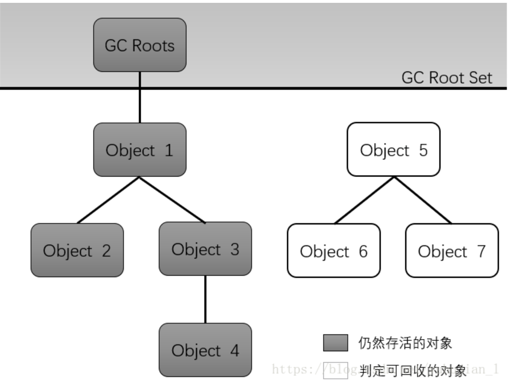
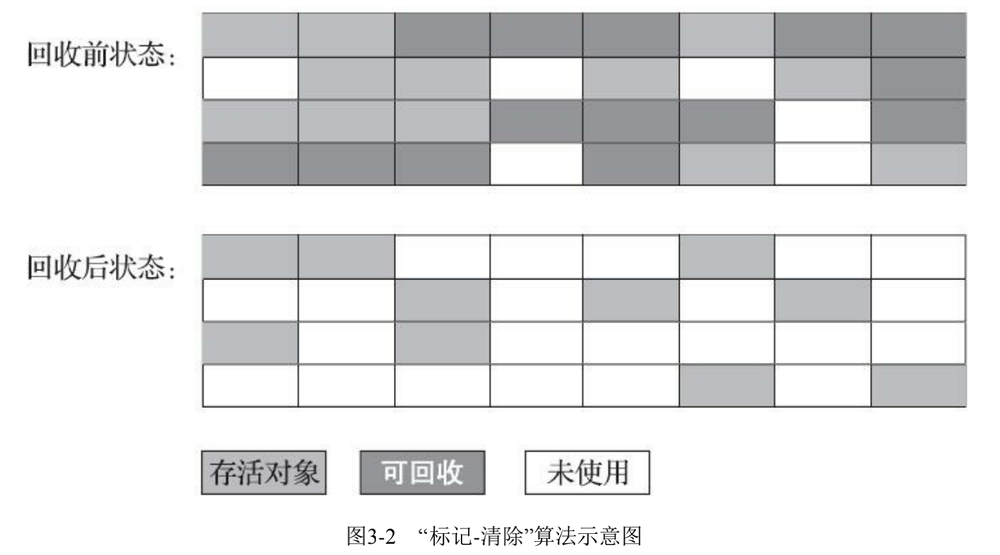
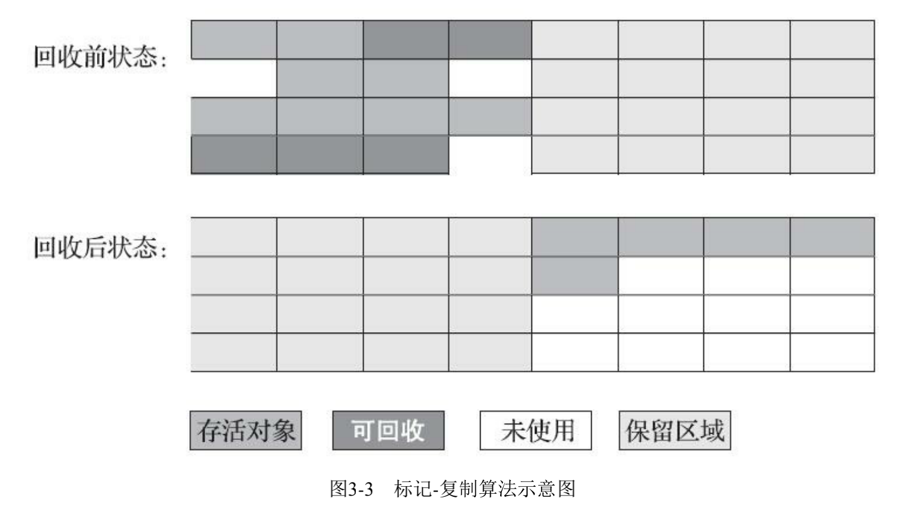
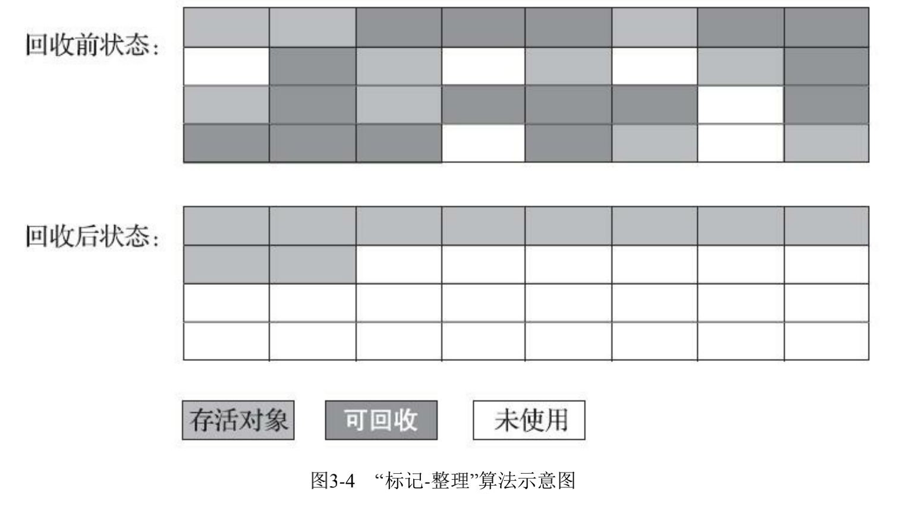

# 第3章 垃圾收集器与内存分配策略

## 3.1 概述

GC的历史比Java久远，1960年就有了。
GC需要完成的3件事情：

1. 哪些内存需要回收？
2. 什么内存需要回收？
3. 如何回收？

经过半个多世纪的发展，目前内存的动态分配与内存回收技术已经相当成熟，一切看起来都进入了“自动化”时代，那为什么我们还需要去了解GC和内存分配呢？

答案： 当需要排查各种内存溢出、内存泄漏问题时，当垃圾手机称为系统达到更高并发量的瓶颈时，我们就需要对这些“自动化”的技术实施必要的监控和调节。

第2章介绍了Java内存运行时区域的各个部分，其中程序计数器、虚拟机栈、本地方法栈3个区域随线程而生，随线程而灭；栈中的栈帧随着方法的进入和退出而有条不紊地执行着出栈和入栈操作。每一个栈帧中分配多少内存基本上是在类结构确定下来时就已知的，因此这几个区域的内存分配和回收都具备确定性，在这几个区域内就不需要过多考虑回收的问题，因为方法结束或者线程结束时，内存自然就跟着随着回收了。

而Java堆和方法区则不一样，一个接口中的多个实现类需要的内存可能不一样，一个方法中的多个分支需要的内存也可能不一样，我们只有在程序处于运行期间才能知道会创建哪些对象，这部分内存的分配和回收都是动态的，垃圾收集器所关注的是这部分内存，本章后续所讨论的“内存”分配与回收也仅指这一部分内存。

## 3.2 对象已死吗

在堆里存放着Java世界中几乎所有的对西那个实例，垃圾收集器在对堆进行回收前，第一件事就是要确定这些对象之中哪些还“存活”着，哪些已经“死去”。

### 3.2.1 引用计数算法

很多教科书中判断是否存活的算法是这样的：

1. 给对象中添加一个引用计数器，每当有一个地方引用它时，计数器值就加1
2. 当引用失效时，计数器值就减1
3. 任何时刻计数器为0的对象就是不可能再被使用的。

客观地说，引用计数法的实现简单，判定效率也很高，在大部分情况下它都是一个不错的算法，也有一些著名的应用案例，例如Python语言和在游戏脚本领域被广泛应用的Squirrel中都使用了引用计数算法进行内存管理。

但是，至少主流的Java虚拟机里面没有选用引用计数法来管理内存，其中最主要的原因是它很难解决对象之间相互循环引用的问题。

虚拟机并没有因为这两个对象互相引用就不回收它们，也从侧面说明虚拟机并不是通过引用计数算法来判断对象是否存活的。

### 3.2.2 可达性分析算法

在主流的商用语言（Java、C#）的主流实现中，都是称通过可达性分析来判定对象是否存活的。

这个算法的基本思想就是通过一系列的称为“GC Roots”的对象作为起始点，从这些节点开始向下搜索，搜索走过的路径称为引用链，当一个对象到GC Roots没有任何引用链相连时，则证明此对象是不可用的。

在Java技术体系里面，固定可作为GC Roots的对象包括以下几种：

- 在虚拟机栈（栈帧中的本地变量）中引用的对象，譬如各个线程被调用的方法堆栈中使用到的参数、局部变量、临时变量等。
- 在方法区中类静态属性引用的对象，譬如Java类的引用类型静态变量。
- 在方法区中常量引用的对象，譬如字符串常量池（String Table)里的引用。
- 在本地方法栈中JNI引用的对象。
- Java虚拟机内部的引用，如基本数据类型对应的Class对象，一些常驻的异常对象等，还有还有系统类加载器。
- 所有被同步锁持有的对象。
- 反映Java虚拟机内部情况的JMX bean，JVM中注册的回调、本地代码缓存等。

除了这些固定的GC Rowots集合意外，根据用户所选用的垃圾收集器以及当前回收的内存区域不同，还可以有其他对象“临时性”地加入，共同构成完成GC Roots集合。譬如后文将会提到的分代收集和局部回收，如果只针对Java堆中某一块区域发起垃圾收集时，必须考虑到内存区域是虚拟机自己的实现细节，更不是孤立封闭的，所以某个区域里的对象完全有可能被位于堆中其他区域的对象所引用，这时候需要将着写关联区域的对象也一并加入GC Roots集合中去，才能保证可达性分析的正确性。

目前最新的几款垃圾收集器无一例外都具备了局部回收的特征，为了避免GC Roots包含过多对象而过度膨胀，它们在实现上也做出了各种优化处理。

### 3.2.3 再谈引用

无论是通过引用计数算法判断对象的引用数量，还是通过可达性分析算法判断对象是否引用链可达，判定对象是否存活都和“引用”离不开关系。

在JDK1.2之后，Java堆引用的概念进行了扩充，将引用分为强引用、软引用、弱引用和虚引用，这4种引用强度依次初见减弱。

- 强引用： 程序代码之间普遍存在的引用赋值
- 软引用：描述一些还有用，但非必须的对象，只被软引用关联着的对象，在系统将要发生内存溢出异常前，会把这些对象列进回收范围内进行第二次回收，如果这次回收还没有足够的内存，才会抛出内存溢出异常。
- 弱引用：描述非必须对象，强度更弱一些，被弱引用关联的对象只能生存到下一次垃圾收集发生为止。
- 虚引用：为一个对象设置虚引用关联的唯一目的只是为了能在这个对象被垃圾回收时收到一个系统通知。

### 3.2.4 生存还是死亡

宣告一个对象死亡，至少要经历两次标记过程：如果对象在进行可达性分析后发现没有与GC Roots相连接的引用链，那么它将会被第一次标记，随后进行一次筛选，筛选的条件是此对象是否有必要执行finalize()方法。假如对象没有覆盖finalize()方法，或者finalize()方法已经被虚拟机调用过，那么虚拟机将这两种情况都是为没有必要执行。

任何一个对象的finalize()方法都只会被系统自动调用一次，如果对象面临下一次回收，它的finalize()方法不会被在此执行。

还有一点需要特别说明，关于对象死亡时finalize()方法的描述可能带点悲情的艺术加工，不建议使用这个方法来拯救对象。其运行代价高昂，不确定性大，无法保证各个对象的调用顺序。

### 3.2.5 回收方法区

方法区的垃圾收集主要回收两部分内容：废弃的常量和不再使用的类型。

判定一个常量是否“废弃”相对简单

常量：如果一个字符串曾经进入常量池中，但是系统当前又没有任何一个字符串对象的值为该常量，且虚拟机中也没有其他地方引用这个字面量。如果在这时发生内存回收，而且垃圾收集器判断有必要的话，这个常量就会被系统清理出常量池。

类：该类的所有实例都已经被回收、加载该类的类加载器都已经被回收、对应的Class对象没有在任何地方被引用，无法在任何地方通过反射访问该类的方法。

在大量使用反射、动态代理、CGLib等字节码框架，动态生成JSP以及OSGI这类频繁自定义类加载器的场景中，通常都需要Java虚拟机具备类型卸载的能力，以保证不会对方法区造成过大的内存压力。

## 3.3 垃圾收集算法

从如何判定对象消亡的角度出发，垃圾收集算法可以划分为：“引用计数式垃圾收集”和“追踪式垃圾收集”两大类，这两类也常被称为“直接垃圾收集”和“间接垃圾收集”。

### 3.3.1 分代收集理论

当前商业虚拟机的垃圾收集器，大多数都遵循了“分代收集”的理论进行设计，分代收集名为理论，实际是一套符合大多数程序运行实际情况的经验法则，它建立在两个分代假说之上：

1）弱分代假说：绝大数对象都是朝生夕灭的。

2） 强分代假说：熬过越多次垃圾收集过程的对象就越难消亡。

收集器应该将Java堆划分出不通的区域，然后将回收对象依据其年龄分配到不同的区域之中存储。

显而易见，如果一个区域中大多数对象都是朝生夕灭，难以熬过垃圾收集过程的话，那么把它们集中放在一起，每次回收时只关注如何保留少量存活而不是去标记哪些大量将要被回收的对象，就能以较低代价回收大量的空间：如果剩下的都是难以消亡的对象，那把它们集中放在一块，虚拟机便可以使用较低的频率来回收这个区域，这就同时兼顾了垃圾收集的时间开销和内存的空间有效利用。

第三条经验法则：

3） 跨代引用假说：跨代引用相对于同代利用来说仅占极少数。

这其实是可根据前两条假说逻辑推理得出的隐含推论：存在互相利用关系的两个对象，是应该倾向于同时生存或者同时消亡的。举个例子，如果某个新生代存在跨代引用，由于老年代对象难以消亡，该引用会使得新生对象在收集时同样得以存活，进而在年龄增长之后晋升到老年代中，这时跨代引用也随即被消除了。

依据这条假说，我们就不应为了少量的跨代引用去扫描整个老年代，也不必浪费空间专门记录每一个对象是否存在及存在哪些跨代引用，只需在新生代上建立一个全局的数据结构，这个结构把老年代划分成若干小块，标识出老年代的哪一块内存会存在跨代引用。此后发生Minor GC 时，只有包含了跨代引用的小块内存里的对象才会被加入到GC  Roots进行扫描。虽然这个方法需要在对象改变引用关系时维护记录数据的正确性，会增加一些运行时开销，但比起收集时整个老年代来说仍然是划算的。

- 部分收集（ Partial GC): 
  - 新生代收集（ Minor GC / Young GC) : 
  - 老年代收集（ Major GC /Old GC): 只有CMS收集齐会有单独收集老年代的行为
  - 混合收集（ Mixed GC):
- 整堆收集（ Full GC ) : 

### 3.3.2 标记-清除法（1960年）

最早出现也是最基础的垃圾收集算法是“标记-清除”算法。如它的名字一样，算法分为“标记”和“清除”两个极端：首先标记出所有需要回收的对象，在标记完成后，统一回收掉所有被标记的对西那个，也可以反过来，标记存活的对象，同一回收所有未被标记的对象。标记过程就是对象是否属于垃圾的判定过程。在前一节讲述垃圾对象标记判定算法已经介绍过了。（引用计数算法、可达性分析算法）

之所以它是最基础的收集算法，是因为后续的收集算法大多都是以标记-清除算法为基础的，对其缺点进行改进而得到的。它的主要缺陷有两个：

- 第一个是执行效率不稳定，如果Java堆中包含大量对象，而且其中大部分是需要被回收的，这时必须进行大量标记和清除的动作，导致标记和清除两个过程的执行效率都随对西那个数量增长而降低
- 第二个是内存空间的碎片话问题，标记、清除之后会产生大量不连续的内存碎片，空间碎片太多可能会导致当以后在程序运行过程中需要分配较大对象时无法找到足够连续的内存而不得不提前触发另一次垃圾收集动作。

标记-清除算法的执行过程如下图。

### 3.3.3 标记-复制算法 （ 1969年）

标记-复制算法常被简称为复制算法。为了解决标记-清除算法面对大量可回收对象时执行效率低的问题，1969年XXX提出了一种称为“半区复制”的垃圾收集算法，它将可用内存按容量划分为大小相等的两块，每次只使用其中的一块。

当这一块的内存用完了，就将还存活着的对象复制到另外一块上面，然后再把已使用过的内存空间一次清理掉。如果内存中多数对象都是存活的，这种算法将会产生大量的内存间复制的开销，但对于多数对象都是可回收的情况，算法复制的就是占少数的存活对象，而且每次都是针对整个半区进行内存回收，分配内存时也就不用考虑有空间碎片的复杂情况，只要一动堆顶指针，按顺序分配即可。

这样实现简单，运行高效，不过其缺陷也显而易见，这种复制回收算法的代价是将可用内存缩小为了原来的一半，空间浪费未免太多了一点。

标记-复制算法的执行过程如图所示。

现在商用Java虚拟机大多都优先采用了这种收集算法区回收新生代，IBM公司曾有一项专门研究堆新生代“朝生夕灭”的特点坐了更量化的诠释-新生代中的对象有98%熬不过第一轮收集。因此并不需要按照1:1的比例来划分新生代的内存空间。

在1989年，Andrew Appel针对具备“朝生夕灭”特点的对象，提出了一种更优化的半区复制分代策略，现在称为“Appel式回收”。HotSpot虚拟机的Serial、ParNew等新生代收集器均采用了这种策略来设计新生代的内存布局。

Appel式回收的具体做法是把新生代分为一块较大的Eden空间和凉快较小的Survivor空间，每次分配内存只使用Eden和其中一块Survivor。发生垃圾搜集时，将Eden和Survivor中仍存活的对象一次性复制到另外一块Survivor空间上，然后直接清理掉Eden和已用过的那块Survivor空间。

HotSpot虚拟机默认Eden和Survivor的大小比例是8:1，也即每次新生代中可用内存空间为整个新生代容量的90%，只有一个Survivor空间，即10%的新生代是会被“浪费的”。当然Appel回收还有一个充当罕见情况的“逃生门”的安全设计，当Survivor空间不足以容纳一次minor GC 之后存活的对象时，就需要依赖其他内存区域进行分配担保。

### 3.3.4 标记-整理算法

标记-复制算法在对象存活率较高时就要进行较多的复制操作，效率将会降低。更关键的是，如果不想浪费50%的空间，就需要有额外的空间进行分配担保，以应对被使用的内存中所有对象都100%存活的极端情况，所以在老年代一般不能直接选用这种算法。

针对老年代对象的存亡特征，1974年Edward Luelders提出了另外一种有针对性的“标记-整理”算法，其中的标记过程仍然与“标记-清除”算法一样，但后续步骤不是直接堆可回收对象进行清理，而是让所有存活的对象都向内存空间的一断移动，然后直接清理掉边界以外的内存，“标记-整理”算法示意图如下图所示。

标记-清除算法与标记-整理算法的本质差异在于前者是一种非移动式的回收算法，而后者是移动式的。是否移动回收后的存活对象是一项优缺点并存的风险决策：

如果移动存活对象，尤其是在老年代这种每次回收都有大量对象存活区域，移动存活对象并更新所有引用这些对象的地方将会是一种极为负重的操作，而且这种对象移动操作必须全程暂停用户引用才能进行，这就更加让使用者不得不小心翼翼地权衡其弊端了，像这样的停顿被最初的虚拟机设计者形象地描述为“Stop The World”。

但如果跟标记-清除算法那样完全不考虑移动和整理存活对象的话，弥散于堆中的存活对象导致的空间碎片化问题就只能依赖更复杂的内存分配起和内存访问其来解决。譬如通过“分区空闲分配链表”来解决内存分配问题。内存的访问是用户程序最平凡的操作，甚至都没有之一，假如在这个环节上增加了额外的负担，势必会影响应用程序的吞吐量。

基于以上两点，是否移动对象都存在弊端，移动则内存回收时会更复杂，不移动则内存分配时会更复杂。

从垃圾收集的停顿时间来看，不移动对象停顿时间会更短，甚至可以不需要停顿，但是从整个程序的吞吐量来看，移动对象会更划算。

此语境中，吞吐量的实质是赋值器与收集器效率综合。即使不移动对象会使得收集齐的效率提升一些，但因内存分配和访问相比垃圾收集频率要高得多，这部分的耗时增加，总吞吐量仍然是下降的。HotSpot虚拟机里面关注吞吐量的Parallel Scavenge收集齐是基于标记-整理算法的，而关注延迟的CMS收集齐则是给予标记-清除算法的，这也从侧面印证这点。

还有一种解决方案：虚拟机多数时间都采用标记-清除算法，暂时容忍内存碎片的存在，直到内存空间的碎片化程度已经大到影响对象分配时，再采用标记-整理算法收集一次，以获得规整的内存空间。