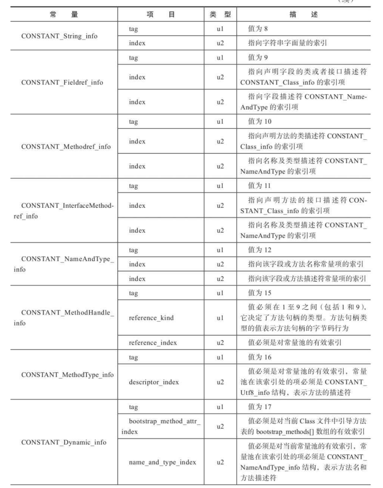

# 第6章 类文件结构

代码编译的结果从本地机器码转变为字节码，是存储格式发展的一小步，确实编程语言发展的一大步

## 6.1 概述

今天的计算机仍然只能是被01，但是由于最近10年内虚拟机以及大量建立在虚拟机之上的语言蓬勃发展，把我们写的程序编译成二进制本地机器码已经不再是唯一选择，越来越多程序语言选择了与操作系统和机器指令集无关的、平台中立的格式作为程序编译后的存储格式。

## 6.2 无关性

Java虚拟机不与包括Java语言在内的任何程序语言绑定，只和“Class文件”这种特定的二进制文件格式所关联，Class文件中包含了Java虚拟机指令集、符号表、以及其他若干辅助信息。

基于安全方面的考虑，《Java虚拟机规范》中要求在CLass文件必须应用许多强制性的语法和结构化约束，但图灵完备的字节码格式，保证了任意一门功能性语言都可以表示为一个能被Java虚拟机所接受的有效的Class文件。

作为一个通用的、与机器无关的执行平台，任何其他语言的实现都可以将Java虚拟机作为他们语言的运行基础，以Class文件作为他们产品的交付媒介。例如，使用Java编译起可以把Java代码编译为存储字节码的Class文件，使用JRuby等其他语言的编译起一样可以把它们的源程序编译成Class文件。虚拟机丝毫不关心Class的来源是什么语言，其与程序语言之间的关系如下图所示。

Java语言中的各种语法、关键字、常量变量和运算符号的语义最终都会由多条字节码指令组合来表达，这决定了字节码指令所能提供的语言描述能力必须比Java语言本身更加强大。


## 6.3 Class类文件的结构

解析Class文件的数据结构是本章的最主要内容。这部分很无聊，但是这部分内容又是Java虚拟机的重要基础之一，是了解虚拟机的必经之路，如果想要深入学习虚拟机相关知识，这部分是无法回避的。

Java的向后兼容性与Class文件结构的稳定息息相关。

注意： 任何一个Class文件都对应唯一的一个类或者接口的定义信息，但是反过来说，类或接口并不一定都得在文件里（例如，类和接口可以动态生成，直接送入类加载器中）。

本章中，只是通俗地讲一个有效的类或接口所应当满足的格式称为“Class文件格式”，实际上，它完全不需要以磁盘文件的形式存在。

Class文件是一组以8个字节为基础单位的二进制流，各个数据项目严格按照顺序紧凑地排列在文件之中，中间没有添加任何分隔符，这使得整个Class文件中存储的内容几乎全是程序运行的必要数据，没有空隙存在。当遇到需要8个字节以上空间的数据项时，则会按照 **高位在前**的方式分割成若干个8个字节进行存储。

> 这中顺序是指 高位字节在地址最低位，最低字节在地址最高位来存储数据。x86是地位在前。

根据《Java虚拟机规范》规定，Class文件格式采用一种类似C语言结构题的伪结构来存储数据，这种伪结构中只有两种数据类型： “无符号数”和“表”。

- 无符号数：基本数据类型，u1,u2,u4,u8来分别代表1个字节、2个字节、4个字节和8个字节的无符号数，无符号数可以用来描述数字、索引引用、数量值或者按照UTF-8编码构成字符串值。
- 表：多个无符号数或者其他表作为数据项构成的复合数据类型，为了便于区分，所有表的命名都习惯性以“_info”结尾。表用于描述有层次关系的复合结构的数据，整个Class文件也可以视作一张表，这张表如下图所示的数据项按严格顺序排列构成。


无论是符号数还是表，当需要描述同一类型但数量不多定的多个数据时，经常会使用一个前置的容器计数器加若干个连续的数据量的形式，这时候称这一系列连续的某一类型的数据为某一类型的“集合”。

### 6.3.1 魔数与Class文件的版本

魔数：每个Class文件的头4个字节被称为魔数，唯一作用为确定这个文件是否为一个能被虚拟机接受的Class文件。

Class文件的魔术取得很有“浪漫气息”，值为“0xCAFFBABE”。

Class文件的版本号：紧接着魔数的4个字节存储的是Class文件的版本号： Minor Version ： 次版本号， Major Version：主版本号

Java的版本号是从45开始的，JDK1.1之后的每个JDK大版本发布主版本号向上加1， 高版本的JDK能向下兼容以前版本的Class文件，但不能运行以后版本的Class文件，因为《Java虚拟机规范》在Class文件校验部分明确要求了即使文件格式并未发生任何变化，虚拟机也必须拒绝执行超过其版本号的Class文件。

### 6.3.2 常量池

紧接着主、次版本号之后的是常量池入口，常量池可以比喻为Class文件里的资源仓库，它是Class文件结构中与其他项目关联最多的数据，通常也是占用Class文件空间最大的数据项目之一，另外，它还是在Class文件中第一个出现的表类型数据项目。

由于常量池中常量的数量是不固定的。

所以在常量池的入口需要放置一项u2类型的数据，代表常量池容量计数值（constant_pool_count)。

与Java语言习惯不同，这个容量计数是从1开始的。

```java
package org.fenixsoft.claszz;

public class TestClass {
	private int m;
	public int inc() {
		return m + 1;
	}
}
```


如图所示，常量池容量（偏移地址为0x00000008)为十六进制数0x0016，即十进制22，这就代表常量池中有21项常量，索引值范围为1～21。

其将第0项常量空出来是有特殊考虑的，目的为： 如果后面某些指向常量池的索引的数据在特定情况下需要表达“不引用任何一个常量池项目”的含义，可以把索引值设置为0来表示。

Class文件结构中只有常量池的容量计数是从1开始的，对于其他类型，包括接口索引结合、字段表结合、方法表集合等的容量计数都与一般习惯相同，是从0开始的。

常量池中主要存放两大常量： **字面量（Literal）**和 **符号引用（Symbolic References）**。

字面量比较接近于Java语言层面的常量概念，如文本字符串、被声明为final的常量值等。

符号引用则属于编译原理方面的概念，主要包括下面几类常量：

- 被模块导出或者开放的包（Package）
- 类和接口的全限定名 （Fully Qualified Name）
- 字段的名称和描述符(Descriptor)
- 方法的名称和描述符
- 方法句柄和方法类型（Method Handle 、Method Type、 Invoke Dynamic）
- 动态调用点和动态常量(Dynamically-Computed Call Site、Dynamically-Computed Constant)

Java代码在进行Javac编译的时候，没有连接这一步骤，而是在虚拟机在家Class文件的时候进行动态连接。

也就是说，在Class文件中不会保存各个方法、字段最终在内存的布局信息，这些字段、方法的符号引用不经过虚拟机在运行期转换的话是无法得到真正的内存入口地址，也就无法直接被虚拟机使用的。

当虚拟机做类加载时，将会从常量池获得对应的符号引用，再再类创建时或运行时解析、翻译到具体的内存地址之中。

常量池中每一项都是一个表，最初常量表中共有11种结构各不相同的表结构数据，后来为了支持动态语言调用，额外增加了4种动态语言相关的常量，为了支持Java模块化系统，又加入了CONSTANT_Module_info和CONSTANT_Package_info两个常量，所以到JDK13，常量表中分别有17种不同类型的常量。

这17类表都有一个共同特点，表结构起始的第一位是个u1类型的标识为(tag)，代表当前常量属于哪种常量类型。


之所以说常量池是最烦的数据，是因为这17种常量类型各自有着完全独立的数据结构，两两之间并没有共性和联系，因此只能逐项讲解。

回头看常量池的第一项常量，其标识为(Ox0000000A)是0xo7,查表，知道这个常量属于CONSTANT_Class_info类型，此类型的常量代表一个类或者接口的符号引用。

CONSTANT_Class_info 的结构比较简单。


tag: 标识位，用于区分常量类型，这里为7

name_index: 常量池的索引值，指向常量池中的一个CONSTANT_Utf8_info类型常量，此常量代表了这个类的全限定名，本例中的name_index为，0x0002，代表了指向常量池中的第二项常量。

其标志位位；1，代表确实是一个CONSTATN_Utf8_info类型的常量。

 

length： 字符串长度是多少个字节。

顺便提一下，由于Class文件中方法、字段等都需要引用CONSTANT_Utf8_info型常量来描述名称，所以CONSTATN_Utf8_info型常量的最大长度也就是Java中方法、字段名的最大长度。而这里的最大长度就是length的最大值，65535。所以Java程序中如果定义了超过64KB英文字符的变量或者方法名，即使规则和全部字符合法，也会无法编译。


后续18个常量的计算过程就不需要手工去做了，可以借助计算机软件来帮忙完成。在JDK bin的目录下，有一个专门用于分析Class文件字节码的工具:javap。

-verbose: 输出


从输出的结果可以看到，计算机帮我们把Class文件“翻译了”，并且第1、2项和我们手工计算的结果完全一致。

“LineNumberTable”，“LocalVariableTable”这些看起来在源代码中不存在的常量是哪里来的？

这部分常量的确不来源于Java源代码，他们都是编译器自动生成的，会被后面即将讲到的字段表、方法表、属性表所引用。它们会被用来描述一些不方便使用”固定字节“进行表达的内容，譬如方法的返回值是什么，有几个参数，每个参数的类型是什么。





> 经jdk7 增加了： 
>
> - CONSTANT_MethodHandle_info
> - CONSTATN_MethodType_info
> - CONSTATN_InvokeDynamic_info
>
> jdk11增加了
>
> - CONSTANT_Dynamic_info

### 6.3.3 访问标志

常量池结束之后，紧接着2个字节代表访问标志，该标志用于识别一些雷或者接口层次的访问信息，包括：这个Class是类还是接口；是否定位为public类型；是否定义为abstract类型；如果是类的话，是否被声明为final，等。


### 6.3.4 类索引、父类索引与接口索引集合

类索引和父类索引都是一个u2类型的数据，接口索引集合是一组u2类型的数据的集合，Class文件中由这三项数据来确定该类型的继承关系。

类索引：确定这个类的全限定名

父类索引：用于确定这个类的父类的全限定名

接口索引：描述这个类实现了哪些接口，这些被实现的接口将按implements关键字后的接口顺序从左到右排列在接口索引集合中。

类索引、父类索引和接口索引都按顺序排列在访问标志之后，类索引和父类索引用两个u2类型的索引值表示，它们各自指向一个名为CONSTANT_Class_info的类描述常量，通过CONSTANT_Class_info类型的常量中的索引值可以找到定义在CONSTANT_Utf8)info类型的常量中的全限定名字符串。


对于接口索引集合，入口的第一项u2类型的数据为接口计数器，表示索引表的容量。如果该类没有实现任何接口，则该计数器值为0，后面接口的索引表不再占用任何字节。


