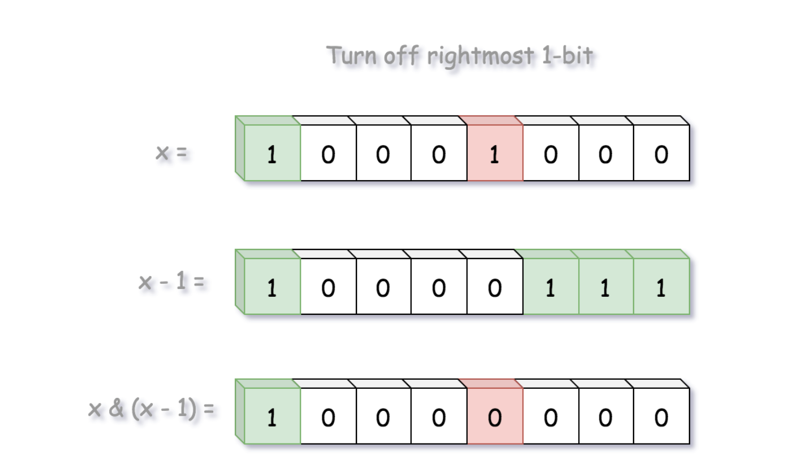

# 461. 汉明距离

URL：https://leetcode-cn.com/problems/hamming-distance/

两个整数之间的汉明距离指的是这两个数字对应二进制位不同的位置的数目。

给出两个整数 x 和 y，计算它们之间的汉明距离。

注意：
0 ≤ x, y < 231.

示例:

输入: x = 1, y = 4

输出: 2

解释:
1   (0 0 0 1)
4   (0 1 0 0)
       ↑   ↑

上面的箭头指出了对应二进制位不同的位置。

来源：力扣（LeetCode）
链接：https://leetcode-cn.com/problems/hamming-distance
著作权归领扣网络所有。商业转载请联系官方授权，非商业转载请注明出处。

---

2021年 5月 8日 星期六 11时41分53秒 CST

我就是硬模拟了一下：显然，如果x和y都为0,可以跳出循环； 否则，去判断他们的最低位是否相同，用于计算汉明距离。

```java
class Solution {
    public int hammingDistance(int x, int y) {
        int res = 0;
        for (int i = 0; i <32; i++) {
            if ((x & 1) != (y & 1)) res++;
            x >>= 1;
            y >>= 1;
            if (x == 0 && y == 0) break;
        }
        return res;
    }
}
```

---

参考： 官解： https://leetcode-cn.com/problems/hamming-distance/solution/yi-ming-ju-chi-by-leetcode/

**汉明距离官方应用于多个领域。在编码理论中用于错误检测，在信息论中量化字符串之间的差异。**

> 两个整数之间的汉明距离是对应位置上数字不同的位数。

根据以上定义，提出一种XOR的位运算，当前仅当输入位不同时输出为1。

计算x和y之间的汉明距离，可以先计算x XOR y，然后统计结果中等于1的位数。

**思路1: 内置位计数功能**

大多数变成语言中，都存在各种内置计算等于1的位数的函数。项目中，则直接使用内置函数，而不是重复造轮子。

```java
class Solution{
	public int hammingDistance(int x , int y) {
		return Integer.bitCount(x ^ y);
	}
}
```

**思路2: 布莱恩。克尼根算法**

方法二是逐位移动，逐位比较边缘位置是否位1。寻找一种更快的方法找出等于1的位数。

> 是否可以像人类直观的计数比特位1的位数，跳过两个1之间的0. 例如： 10001000

上面例子中，遇到最右边的1后，如果可以跳过中间的0，直接跳到下一个1，效率会高很多。

这是布莱恩位计数算法的基本思想。该算法使用特定比特位和算数运算移除等于1的最右比特位。

> 当我们在number和number-1上做AND位运算时，原数字number的最右边等于1的比特会被移除。



通过2次迭代就可以知道10001000中1的位数，而不需要8次。

```java
class Solution {
  public int hammingDistance(int x, int y) {
    int xor = x ^ y;
    int distance = 0;
    while (xor != 0) {
      distance += 1;
      // remove the rightmost bit of '1'
      xor = xor & (xor - 1);
    }
    return distance;
  }
}

作者：LeetCode
链接：https://leetcode-cn.com/problems/hamming-distance/solution/yi-ming-ju-chi-by-leetcode/
来源：力扣（LeetCode）
著作权归作者所有。商业转载请联系作者获得授权，非商业转载请注明出处。
```

