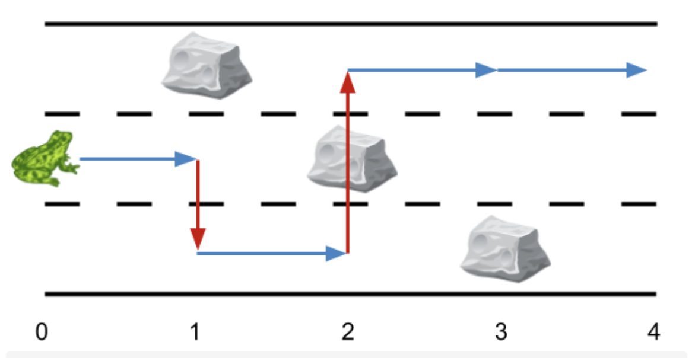
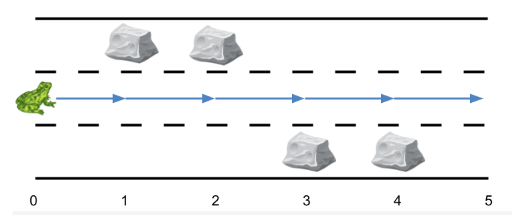
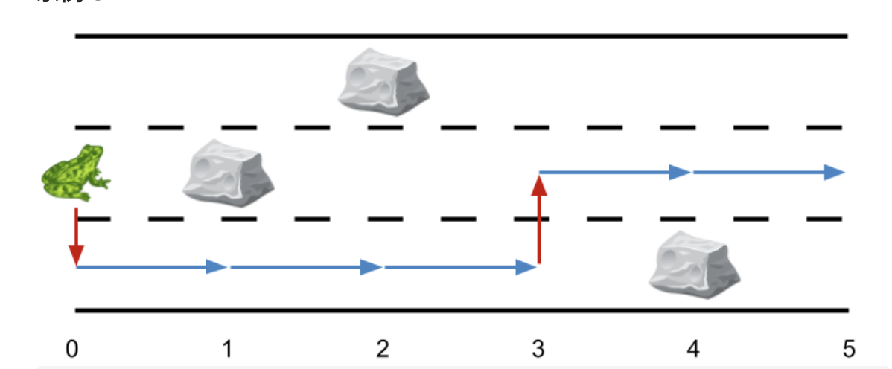

# 1824. 最少侧跳次数

URL：https://leetcode-cn.com/problems/minimum-sideway-jumps/

给你一个长度为 n 的 3 跑道道路 ，它总共包含 n + 1 个 点 ，编号为 0 到 n 。一只青蛙从 0 号点第二条跑道 出发 ，它想要跳到点 n 处。然而道路上可能有一些障碍。

给你一个长度为 n + 1 的数组 obstacles ，其中 obstacles[i] （取值范围从 0 到 3）表示在点 i 处的 obstacles[i] 跑道上有一个障碍。如果 obstacles[i] == 0 ，那么点 i 处没有障碍。任何一个点的三条跑道中 最多有一个 障碍。

比方说，如果 obstacles[2] == 1 ，那么说明在点 2 处跑道 1 有障碍。
这只青蛙从点 i 跳到点 i + 1 且跑道不变的前提是点 i + 1 的同一跑道上没有障碍。为了躲避障碍，这只青蛙也可以在 同一个 点处 侧跳 到 另外一条 跑道（这两条跑道可以不相邻），但前提是跳过去的跑道该点处没有障碍。

比方说，这只青蛙可以从点 3 处的跑道 3 跳到点 3 处的跑道 1 。
这只青蛙从点 0 处跑道 2 出发，并想到达点 n 处的 任一跑道 ，请你返回 最少侧跳次数 。

注意：点 0 处和点 n 处的任一跑道都不会有障碍。

 

示例 1：



输入：obstacles = [0,1,2,3,0]
输出：2 
解释：最优方案如上图箭头所示。总共有 2 次侧跳（红色箭头）。
注意，这只青蛙只有当侧跳时才可以跳过障碍（如上图点 2 处所示）。
示例 2：



输入：obstacles = [0,1,1,3,3,0]
输出：0
解释：跑道 2 没有任何障碍，所以不需要任何侧跳。
示例 3：



输入：obstacles = [0,2,1,0,3,0]
输出：2
解释：最优方案如上图所示。总共有 2 次侧跳。


提示：

obstacles.length == n + 1
1 <= n <= 5 * 105
0 <= obstacles[i] <= 3
obstacles[0] == obstacles[n] == 0

来源：力扣（LeetCode）
链接：https://leetcode-cn.com/problems/minimum-sideway-jumps
著作权归领扣网络所有。商业转载请联系官方授权，非商业转载请注明出处。

---

## DP

这个题，自己写了好久，建立DP和DP状态都不是很久吧，不过DP状态开始没建立好，在写的过程中，知道了正确的DP状态，但是写的不是很简略。

**状态的定义：** dp [i] [j] 表示  🐸跳到第i个点，第j跑道道路，所需要点最少侧跳数， 其中 0 <= i <= n - 1， 1<=j <=3

**状态转移方程：**

-  如果obstacles[i] = x,  那么表示第i个点的第x道无法到达，那么可以让 dp[i] [j] 为最大值，这样最后比较好进行比较

- 这样如果dp[i] [j] 不为MAX的话，就代表这个点是可以到达的。

  - 如果dp[i] [j] 为MAX，那么这个点的跑道就只能从这个点的其他跑道跳跃。
  - 如果dp[i] [j] 不为MAX，那么这个点的跑道可以从上个点的该跑道跳跃。

  > 上面的这两点应该是可以合并的，我当时写的时候怕麻烦，结果倒是写麻烦了。

```java
class Solution {
    public int minSideJumps(int[] obstacles) {
        int n = obstacles.length;
        int MAX = Integer.MAX_VALUE;
        // dp[i][j] 表示跳到 第i个点，第j跑道所需要的最小侧跳数
        int[][] dp = new int[n][4];
        dp[0][1] = 1;
        dp[0][3] = 1;

        // 最后一跳跑道没有障碍，因此，跳到倒数第二条即可。
        for (int i = 1; i < n - 1; i++) {
            int x = obstacles[i];
            dp[i][x] = MAX;
            for (int j = 1; j <= 3; j++) {
                if (dp[i][j] != MAX) {
                    if (dp[i - 1][j] != MAX) {
                        dp[i][j] = dp[i - 1][j];
                     }
                }
            }
            //判断上一跳的位置有没有哪个位置是障碍，并且该位置不是障碍
            for (int j = 1; j <= 3; j++) {
                if (dp[i - 1][j] == MAX && dp[i][j] != MAX) {
                    if (j == 1) {
                        dp[i][j] = Math.min(dp[i][2], dp[i][3]);
                    } else if (j == 2) {
                        dp[i][j] = Math.min(dp[i][1], dp[i][3]);
                    } else {
                        dp[i][j] = Math.min(dp[i][1], dp[i][2]);
                    }
                    dp[i][j]++;
                }
            }
        }
        return Math.min(Math.min(dp[n - 2][1], dp[n - 2][2]), dp[n - 2][3]);
    }
}
```

---

## 贪心：

贪心策略：

1. 当青蛙所在跑道没有障碍，就向前移动，直到遇到该跑道的第一个障碍，此时需要侧跳，有两个跑道供选择。
2. 选择跑道的依据为：青蛙跳到该跑道后遇到的第一个障碍的位置，哪条跑道的障碍越靠后就选哪条。

```c++
class Solution {
public:
    int minSideJumps(vector<int>& obstacles) {
        int n = obstacles.size();
        int num = 2;
        int res = 0;
        for(int i = 0; i < n;){
            //若当前跑道无障碍一直前进
            if(obstacles[i+1] != num){
                i++;
                continue;
            }
            //other和another为另外两条跑道编号
            int other = (num + 1) % 3, another = (num + 2) % 3;
            other = (other == 0) ? 3 : other;
            another = (another == 0)?3 : another;
            int t = i;
            //计算测跳道other号跑道时遇到的第一个障碍位置
            while(t < n && obstacles[t] != other){
                t++;
            }
            //计算测跳道another号跑道时遇到的第一个障碍位置
            while(i < n && obstacles[i] != another){
                i++;
            }
            //选择靠后的那条跑道，更新当前跑道序号和当前位置。
            if(t > i){
                num = other;
            }else{
                num = another;
            }
            i = max(t, i) - 1;
            res++;
        }
        return res;
    }
};

作者：helloworld-62
链接：https://leetcode-cn.com/problems/minimum-sideway-jumps/solution/tan-xin-jiu-hao-by-helloworld-62-1eum/
来源：力扣（LeetCode）
著作权归作者所有。商业转载请联系作者获得授权，非商业转载请注明出处。
```


