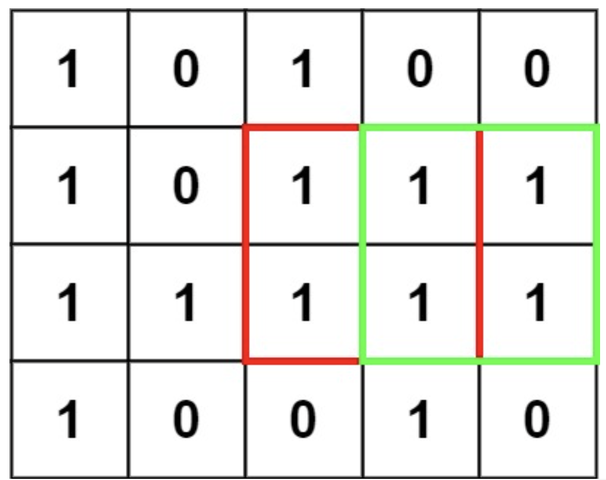
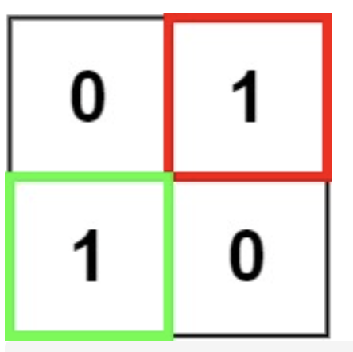

# 221. 最大正方形

URL：https://leetcode-cn.com/problems/maximal-square/

在一个由 '0' 和 '1' 组成的二维矩阵内，找到只包含 '1' 的最大正方形，并返回其面积。

 

示例 1：



输入：matrix = [["1","0","1","0","0"],["1","0","1","1","1"],["1","1","1","1","1"],["1","0","0","1","0"]]
输出：4
示例 2：



输入：matrix = [["0","1"],["1","0"]]
输出：1
示例 3：

输入：matrix = [["0"]]
输出：0


提示：

m == matrix.length
n == matrix[i].length
1 <= m, n <= 300
matrix[i][j] 为 '0' 或 '1'

来源：力扣（LeetCode）
链接：https://leetcode-cn.com/problems/maximal-square
著作权归领扣网络所有。商业转载请联系官方授权，非商业转载请注明出处。

---

对于本题，设DP【i】【j】表示，以（i， j）为右下角构成的正方形的长度，则该点的左边的点，上面的点，左上角点点均可以构成正方形，且有下面的DP公式：

则可以得到公式： dp[i][j] = Math.min(Math.min(dp[i - 1] [j], dp[i] [j - 1]), dp[i - 1] [j - 1]) + 1;

```java
class Solution {
    public int maximalSquare(char[][] matrix) {
        int m = matrix.length;
        int n = matrix[0].length;

        // 0表示以该点为右下角无法构成正方形
        // dp[m][n]表示以该点为右下角的正方形长度
        int[][] dp = new int[m + 1][n + 1];

        int res = 0;
        for (int i = 1; i <= m; i++) {
            for (int j = 1; j <= n; j++) {
                if (matrix[i - 1][j - 1] != '0') {
                    dp[i][j] = Math.min(Math.min(dp[i - 1][j], dp[i][j - 1]), dp[i - 1][j - 1]) + 1;
                    res = Math.max(res, dp[i][j]);
                }
                
            }
        }
        return res * res;
    }
}
```

