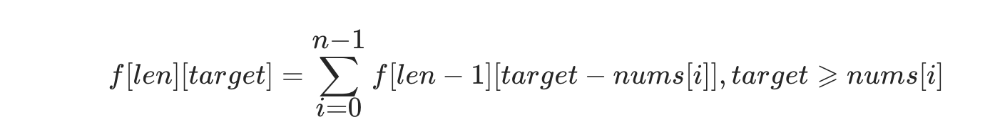

# 377. 组合总和IV4⃣️

URL：https://leetcode-cn.com/problems/combination-sum-iv/

给你一个由 不同 整数组成的数组 nums ，和一个目标整数 target 。请你从 nums 中找出并返回总和为 target 的元素组合的个数。

题目数据保证答案符合 32 位整数范围。

 

示例 1：

输入：nums = [1,2,3], target = 4
输出：7
解释：
所有可能的组合为：
(1, 1, 1, 1)
(1, 1, 2)
(1, 2, 1)
(1, 3)
(2, 1, 1)
(2, 2)
(3, 1)
请注意，顺序不同的序列被视作不同的组合。
示例 2：

输入：nums = [9], target = 3
输出：0


提示：

1 <= nums.length <= 200
1 <= nums[i] <= 1000
nums 中的所有元素 互不相同
1 <= target <= 1000

来源：力扣（LeetCode）
链接：https://leetcode-cn.com/problems/combination-sum-iv
著作权归领扣网络所有。商业转载请联系官方授权，非商业转载请注明出处。

---

给出条件：不同整数组成nums，目标target。 

返回：情况的可能数。

这个题：我上来就用回溯法做了一遍，然后发现超时了。

```java
class Solution {
    Deque<Integer> stack = new LinkedList<>(); 
    int res = 0;
    int n;
    public int combinationSum4(int[] A, int a) {
        Arrays.sort(A);
        n = A.length;
        dfs(A, a);
        return res;
    }
    public void dfs(int[] A, int a) {
        if (a == 0) res++;
        for (int i = 0; i < n; i++) {
            if (A[i] > a) break;
            stack.push(A[i]);
            dfs(A, a - A[i]);
            stack.pop();
        }
    }
}
```


然后果断用dp思考：定义状态：f[n] 表示总和为target的组合个数。那么f[n] 只能由有限个状态转移而来。

f[n] = sum(f[n - A[i]])

```java
class Solution {
    public int combinationSum4(int[] A, int a) {
        int n = A.length;
        int[] f = new int[a + 1];
        f[0] = 0;
        for (int i = 0; i < n; i++) {
            if (A[i] <= a) f[A[i]] = 1;
        }
        for (int i = 1; i <= a; i++) {
            for (int j = 0; j < n; j++) {
                if (i - A[j] >= 0)
                    f[i] += f[i - A[j]];
            }
        }
        return f[a];
    }
}
```

---

还是来看三叶姐的题解怎么解的吧。

URL：https://leetcode-cn.com/problems/combination-sum-iv/solution/gong-shui-san-xie-yu-wan-quan-bei-bao-we-x0kn/

##  **动态规划**

本题与【完全背包求方案数】问题的差别在于：**选择方案中的不同的物品顺序代表不同方案。**

在完全背包问题中，凑成总价值为6的方案算是一种方案，但是在本题算是3\*2\*1= 6种方案。

因此我们不能直接代入【完全背包】的思路（状态定义）来求解。

可以从【构成答案的组合】入手：利用 1<=nums[i]<=1000和1=target<=1000条件可以确定，组合长度必然在[1,1000]。

**定义f[i] [j] 为组合长度为i，凑成总和为j的方案数是多少。**

由于对组合方案的长度没有限制，因此我们最终答案为所有的 **f[x] [target]的总和。**

同时有显而易见的初始条件（有效值：）f[0] [0] = 1。

那么对任意的f[len] [target]而言，组合中的最后一个数字可以选择nums中的任意数值，因此f[len] [target]应该为以下所有方案总和：

1. 最后一个数选择nums[0], 方案数为f[len - 1] [target - nums[0]]

2. 最后一个数选择nums[1], 方案数为f[len - 1] [target - nums[1]]

3. 最后一个数选择nums[2],方案数为f[len - 1] [target - nums[2]]

   ...

即转移方程为：



```java
class Solution {
    public int combinationSum4(int[] nums, int t) {
        // 因为 nums[i] 最小值为 1，因此构成答案的最大长度为 target
        int len = t;
        int[][] f = new int[len + 1][t + 1];
        f[0][0] = 1;
        int ans = 0;
        for (int i = 1; i <= len; i++) {
            for (int j = 0; j <= t; j++) {
                for (int u : nums) {
                    if (j >= u) f[i][j] += f[i - 1][j - u];
                }
            }
            ans += f[i][t];
        }
        return ans;
    }
}

作者：AC_OIer
链接：https://leetcode-cn.com/problems/combination-sum-iv/solution/gong-shui-san-xie-yu-wan-quan-bei-bao-we-x0kn/
来源：力扣（LeetCode）
著作权归作者所有。商业转载请联系作者获得授权，非商业转载请注明出处。
```

## **动态规划（降纬优化）**

我们知道【完全背包】可以通过取消物品为度来实现降纬优化。

本题可以使用相同手段：**定义f[i]为凑成总和为i的方案数是多少。**

由于nums的数都是正整数，因此我们有显然的初始化条件f[0] = 1（代表什么都不选，凑成总和为0的方案数为1），同时最终答案为f[target]。

不失一般性的考虑f[i]该如何转移，由于每个数值可以被选择无限次，因此在计算总和时，我们保证nums中的每一位都会被考虑到即可（即确保对组合总和target的便利在外，对数组nums的便利在内）。

即转移方程为：


```java
class Solution {
    public int combinationSum4(int[] nums, int t) {
        int[] f = new int[t + 1];
        f[0] = 1;
        for (int j = 1; j <= t; j++) {
            for (int u : nums) {
                if (j >= u) f[j] += f[j - u];
            }
        }
        return f[t];
    }
}

作者：AC_OIer
链接：https://leetcode-cn.com/problems/combination-sum-iv/solution/gong-shui-san-xie-yu-wan-quan-bei-bao-we-x0kn/
来源：力扣（LeetCode）
著作权归作者所有。商业转载请联系作者获得授权，非商业转载请注明出处。
```

