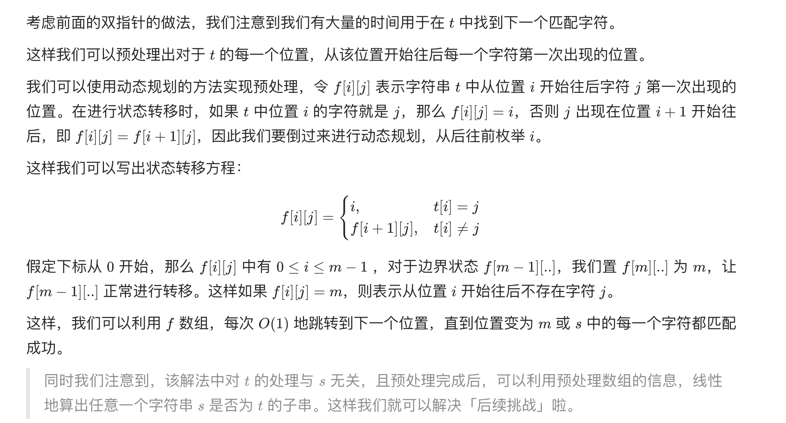

# 392. 判断子序列

URL：https://leetcode-cn.com/problems/is-subsequence/

给定字符串 s 和 t ，判断 s 是否为 t 的子序列。

字符串的一个子序列是原始字符串删除一些（也可以不删除）字符而不改变剩余字符相对位置形成的新字符串。（例如，"ace"是"abcde"的一个子序列，而"aec"不是）。

进阶：

如果有大量输入的 S，称作 S1, S2, ... , Sk 其中 k >= 10亿，你需要依次检查它们是否为 T 的子序列。在这种情况下，你会怎样改变代码？

致谢：

特别感谢 @pbrother 添加此问题并且创建所有测试用例。

 

示例 1：

输入：s = "abc", t = "ahbgdc"
输出：true
示例 2：

输入：s = "axc", t = "ahbgdc"
输出：false


提示：

0 <= s.length <= 100
0 <= t.length <= 10^4
两个字符串都只由小写字符组成。

来源：力扣（LeetCode）
链接：https://leetcode-cn.com/problems/is-subsequence
著作权归领扣网络所有。商业转载请联系官方授权，非商业转载请注明出处。

---

本题主要的掌握点是进阶如何去思考，让我深深感受到：万物皆可DP。

普通的方法贪心：

```java
class Solution {
    public boolean isSubsequence(String ss, String tt) {
        char[] s = ss.toCharArray();
        char[] t = tt.toCharArray();
        int m = s.length;
        int n = t.length;
        if (m > n) return false;
        
        int i = 0, j = 0;
        while (i < m && j < n) {
            if (s[i] == t[j]) i++;
            j++;
        }
    
        return i == m;
    }
}
```

---

参考官解是如何去思考这个问题的：

URL :https://leetcode-cn.com/problems/is-subsequence/solution/pan-duan-zi-xu-lie-by-leetcode-solution/

我开始考虑得是 存储一个hashset，但是这样所需要的空间复杂度太高了。



```java
class Solution {
    public boolean isSubsequence(String s, String t) {
        int n = s.length(), m = t.length();

        int[][] f = new int[m + 1][26];
        for (int i = 0; i < 26; i++) {
            f[m][i] = m;
        }

        for (int i = m - 1; i >= 0; i--) {
            for (int j = 0; j < 26; j++) {
                if (t.charAt(i) == j + 'a')
                    f[i][j] = i;
                else
                    f[i][j] = f[i + 1][j];
            }
        }
        int add = 0;
        for (int i = 0; i < n; i++) {
            if (f[add][s.charAt(i) - 'a'] == m) {
                return false;
            }
            add = f[add][s.charAt(i) - 'a'] + 1;
        }
        return true;
    }
}

作者：LeetCode-Solution
链接：https://leetcode-cn.com/problems/is-subsequence/solution/pan-duan-zi-xu-lie-by-leetcode-solution/
来源：力扣（LeetCode）
著作权归作者所有。商业转载请联系作者获得授权，非商业转载请注明出处。
```

