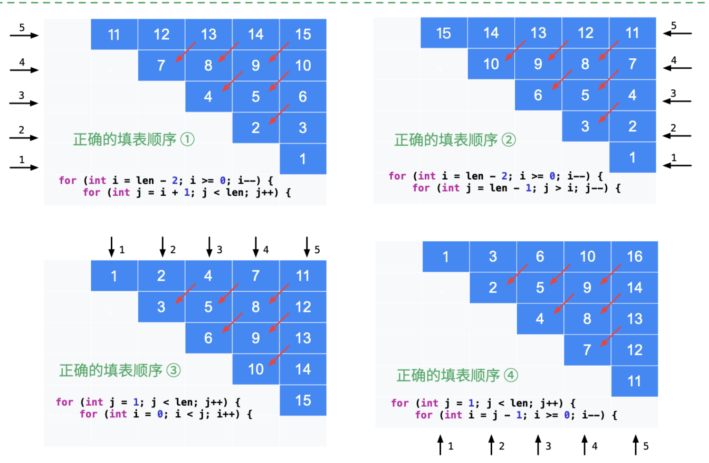

# 5. 最长回文子串

URL：https://leetcode-cn.com/problems/longest-palindromic-substring/

给你一个字符串 s，找到 s 中最长的回文子串。

 

示例 1：

输入：s = "babad"
输出："bab"
解释："aba" 同样是符合题意的答案。
示例 2：

输入：s = "cbbd"
输出："bb"
示例 3：

输入：s = "a"
输出："a"
示例 4：

输入：s = "ac"
输出："a"


提示：

1 <= s.length <= 1000
s 仅由数字和英文字母（大写和/或小写）组成

来源：力扣（LeetCode）
链接：https://leetcode-cn.com/problems/longest-palindromic-substring
著作权归领扣网络所有。商业转载请联系官方授权，非商业转载请注明出处。

---

首先考虑暴力法，i为左端点，j为右端点，然后判断由i为j是不是回文串，对于每一个子串，判断回文串。

但是这样的时间复杂度太高了，因为做了大量的重复计算，因此，我们需要利用之前已经的计算。

设dp【i】【j】表示s(i,j)是不是回文串，然后可以得到

i < j 这个很重要呀！

do【i】【j】 = s.charAt(i) == s.charAt(j) && dp 【i+1】【j-1】

每个dp【i】【j】的取值只与之前的 dp【i+1】【j-1】 相关

即dp【】【】需要先计算左下角的数据。

写了好久呀，核心思想就是 遍历顺序沿着写对角线，总右下角，像左上角。

```java
class Solution {
    public String longestPalindrome(String s) {
        char[] array = s.toCharArray();
        int len = array.length;
        boolean[][] dp = new boolean[len][len];
        for (int i = 0; i < len; i++) dp[i][i] = true;
        int i = len - 2 , j = len - 1;
        int resX = 0;
        int resY = 0;
        while (i >= 0) {
            int x = i, y = j;
            while (x >= 0) {
                int lenTemp = y - x + 1;
                if (lenTemp >= 3) {
                    dp[x][y] = array[x] == array[y] && dp[x+1][y-1]; 
                } else {
                    dp[x][y] = (array[x] == array[y]);
                }
                if (dp[x][y] && lenTemp > (resY - resX + 1)) {
                    resX = x;
                    resY = y;
                }
                x--;
                y--; 
            }
            i--;
        }
        return s.substring(resX,resY + 1);
        
    }
}
```

---

现在来看看weiwei哥的题解

URL： https://leetcode-cn.com/problems/longest-palindromic-substring/solution/zhong-xin-kuo-san-dong-tai-gui-hua-by-liweiwei1419/

说明： 暴力算法 -  基础    动态规划 - 必须掌握。 中心扩散 - 方法要求会写  马拉车算法- 可以放弃

**方法一： 暴力匹配（Brute Force）**

- 根据回文子串的定义，枚举所有长度大于等于2的子串，依次判断它们是否是回文；
- 在具体实现时，可以只针对大于“当前得到的回文子串长度”的子串进行回文验证；
- 在记录最长回文子串的时候，可以只记录“当前子串的起始位置”和“子串长度”，不必做截取。这一步我们放在后面的方法中实现。

说明： 暴力解法的时间复杂度高，但是思路清晰、编写简单。由于编写正确性的可能性很大，**可以使用暴力匹配算法检验我们编写的其他算法是否正确。**优化的解法在很多时候，是基于“暴力算法”，以空间换时间得到的，因此思考清楚暴力解法，分析其缺点，很多时候能为我们打开思路。

```java
public class Solution {

    public String longestPalindrome(String s) {
        int len = s.length();
        if (len < 2) {
            return s;
        }

        int maxLen = 1;
        int begin = 0;
        // s.charAt(i) 每次都会检查数组下标越界，因此先转换成字符数组
        char[] charArray = s.toCharArray();

        // 枚举所有长度大于 1 的子串 charArray[i..j]
        for (int i = 0; i < len - 1; i++) {
            for (int j = i + 1; j < len; j++) {
                if (j - i + 1 > maxLen && validPalindromic(charArray, i, j)) {
                    maxLen = j - i + 1;
                    begin = i;
                }
            }
        }
        return s.substring(begin, begin + maxLen);
    }

    /**
     * 验证子串 s[left..right] 是否为回文串
     */
    private boolean validPalindromic(char[] charArray, int left, int right) {
        while (left < right) {
            if (charArray[left] != charArray[right]) {
                return false;
            }
            left++;
            right--;
        }
        return true;
    }
}


作者：liweiwei1419
链接：https://leetcode-cn.com/problems/longest-palindromic-substring/solution/zhong-xin-kuo-san-dong-tai-gui-hua-by-liweiwei1419/
来源：力扣（LeetCode）
著作权归作者所有。商业转载请联系作者获得授权，非商业转载请注明出处。
```

**复杂度分析：**

- 时间复杂度：O(n^3)
- 空间复杂度：O（1）


**方法二：动态规划**

这种方法，我自己实现了，主要考虑的就是如何去解决重复计算的问题。 下面抄一下weiwei哥的思路。

**特别说明：**

- 以下动态规划的解释只帮助大家了解动态规划问题的基本思想；
- 动态规划问题难道非常难，在学习的时候建议不要钻到特别难的问题中去；
- 掌握经典的动态规划问题的解法，理解状态的定义的由来、会列出状态转移方程；
- 然后再配合适当难度的问题的联系练习；
- 有时间和感兴趣的话可以做一些不太常见的类型的问题，拓阔视野；
- 动态规划讲得比较好的经典书籍是算法导论



这个里面我比较喜欢的填表方法就是第二种和第三种，当然，我也很喜欢自己的那种斜着填表的方法。


**方法三：中心扩展法**

暴力法采用双指针两边夹，验证是否是回文子串。

**除了枚举字符串的左右边界以外，比较容易想到的是枚举可能出现的回文子串的“中心位置”，从“中心位置尝试尽可能扩散出去，得到一个回文串”。**

因此中心扩散法的思路是：遍历每一个索引，以这个索引为中心，利用“回文串”中心对称的特点，往两边扩展，看最多能扩散多远。

枚举“中心位置”时间复杂度为O（n)，从“中心位置”扩散得到“回文子串”的时间复杂度为O（n），因此时间复杂度可以降到O(n^2)

细节：回文串在长度为奇数和偶数的时候，“回文中心”的形式是不一样的。

- 奇数： 单个字符
- 偶数：两个字符的空袭

```java
public class Solution {

    public String longestPalindrome(String s) {
        int len = s.length();
        if (len < 2) {
            return s;
        }
        int maxLen = 1;
        String res = s.substring(0, 1);
        // 中心位置枚举到 len - 2 即可
        for (int i = 0; i < len - 1; i++) {
            String oddStr = centerSpread(s, i, i);
            String evenStr = centerSpread(s, i, i + 1);
            String maxLenStr = oddStr.length() > evenStr.length() ? oddStr : evenStr;
            if (maxLenStr.length() > maxLen) {
                maxLen = maxLenStr.length();
                res = maxLenStr;
            }
        }
        return res;
    }

    private String centerSpread(String s, int left, int right) {
        // left = right 的时候，此时回文中心是一个字符，回文串的长度是奇数
        // right = left + 1 的时候，此时回文中心是一个空隙，回文串的长度是偶数
        int len = s.length();
        int i = left;
        int j = right;
        while (i >= 0 && j < len) {
            if (s.charAt(i) == s.charAt(j)) {
                i--;
                j++;
            } else {
                break;
            }
        }
        // 这里要小心，跳出 while 循环时，恰好满足 s.charAt(i) != s.charAt(j)，因此不能取 i，不能取 j
        return s.substring(i + 1, j);
    }
}


作者：liweiwei1419
链接：https://leetcode-cn.com/problems/longest-palindromic-substring/solution/zhong-xin-kuo-san-dong-tai-gui-hua-by-liweiwei1419/
来源：力扣（LeetCode）
著作权归作者所有。商业转载请联系作者获得授权，非商业转载请注明出处。
```

