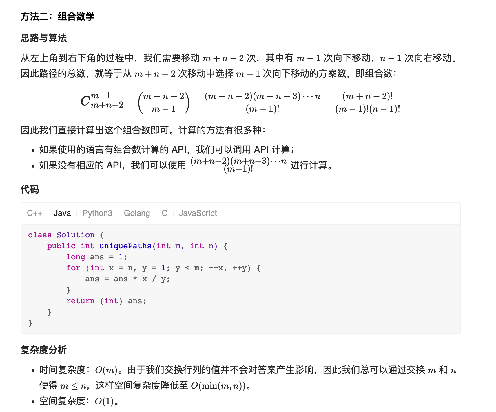

# 62. 不同路径

URL：https://leetcode-cn.com/problems/unique-paths/

一个机器人位于一个 m x n 网格的左上角 （起始点在下图中标记为 “Start” ）。

机器人每次只能向下或者向右移动一步。机器人试图达到网格的右下角（在下图中标记为 “Finish” ）。

问总共有多少条不同的路径？

 

示例 1：

输入：m = 3, n = 7
输出：28

示例 2：

输入：m = 3, n = 2
输出：3
解释：
从左上角开始，总共有 3 条路径可以到达右下角。
1. 向右 -> 向下 -> 向下
2. 向下 -> 向下 -> 向右
3. 向下 -> 向右 -> 向下

示例 3：

输入：m = 7, n = 3
输出：28

示例 4：

输入：m = 3, n = 3
输出：6

 

提示：

    1 <= m, n <= 100
    题目数据保证答案小于等于 2 * 109

来源：力扣（LeetCode）
链接：https://leetcode-cn.com/problems/unique-paths
著作权归领扣网络所有。商业转载请联系官方授权，非商业转载请注明出处。

---

首先还是往暴力法上面去想：感觉想不出来。

但是假设到达一个点的不同路径数为DP 【x】【y】，那么很明显可以看出DP 【X】【Y】= DP【X】【Y-1】 + DP 【X-1】【Y】

遍历的顺序也很正常，那么这个题就很好做了。

```java
class Solution {
    public int uniquePaths(int m, int n) {
        int[][] dp = new int[m][n];
        for (int i = 0; i < m; i++) dp[i][0] = 1;
        for (int j = 0; j < n; j++) dp[0][j] = 1;
        for (int i = 1; i < m; i++) {
            for (int j = 1; j < n; j++) {
                dp[i][j] = dp[i][j-1] + dp[i-1][j];
            }
        }
        return dp[m-1][n-1];
    }
}
```


---

果然，我不会的，别人都会。

我会的，别人能玩出花来。

 方法题解： URL：https://leetcode-cn.com/problems/unique-paths/solution/bu-tong-lu-jing-by-leetcode-solution-hzjf/

看着题解二，这好像就是当初高中的一道很简单的数学题，果然，读计算机把自己读傻了。



