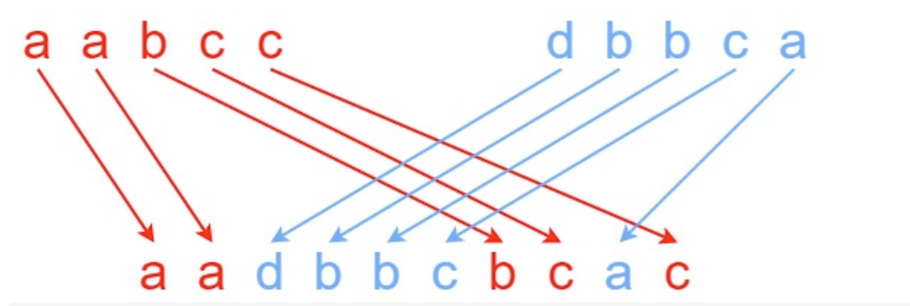

# 97. 交错字符串

URL：https://leetcode-cn.com/problems/interleaving-string/

给定三个字符串 s1、s2、s3，请你帮忙验证 s3 是否是由 s1 和 s2 交错 组成的。

两个字符串 s 和 t 交错 的定义与过程如下，其中每个字符串都会被分割成若干 非空 子字符串：

s = s1 + s2 + ... + sn
t = t1 + t2 + ... + tm
|n - m| <= 1
交错 是 s1 + t1 + s2 + t2 + s3 + t3 + ... 或者 t1 + s1 + t2 + s2 + t3 + s3 + ...
提示：a + b 意味着字符串 a 和 b 连接。

 

示例 1：




输入：s1 = "aabcc", s2 = "dbbca", s3 = "aadbbcbcac"
输出：true
示例 2：

输入：s1 = "aabcc", s2 = "dbbca", s3 = "aadbbbaccc"
输出：false
示例 3：

输入：s1 = "", s2 = "", s3 = ""
输出：true


提示：

0 <= s1.length, s2.length <= 100
0 <= s3.length <= 200
s1、s2、和 s3 都由小写英文字母组成

来源：力扣（LeetCode）
链接：https://leetcode-cn.com/problems/interleaving-string
著作权归领扣网络所有。商业转载请联系官方授权，非商业转载请注明出处。

---

等做完PPT再来去思考这个问题吧，现在的思绪都在PPT上面了。

看了很多题解，然后在明白那个交错小于等于一在于：字符串a和b交错需要字符串a和字符串b被分割成若干非空子串，且顺序不变。

定义f【i】【j】表示字符串ss1和字符串ss2能够用交错ss3中前n + m -1个字符。

我们使用 dp[i] [j]表示s1的前i个元素和s2的前j字符是否能构成s3的前i+ j个元素。

```java
class Solution {
    public boolean isInterleave(String ss1, String ss2, String ss3) {
        char[] s1 = ss1.toCharArray();
        char[] s2 = ss2.toCharArray();
        char[] s3 = ss3.toCharArray();
        int m = s1.length;
        int n = s2.length;
        int y = s3.length;
        if (m + n != y) return false;

        boolean[][] f = new boolean[m + 1][n + 1];
        
        f[0][0] = true;
        for (int i = 0; i <= m; ++i) {
            for (int j = 0; j <= n; ++j) {
                int t = i + j - 1;
                if (i > 0) {
                    f[i][j] = f[i][j] || (s1[i - 1] == s3[t]&& f[i - 1][j]);
                }
                if (j > 0) {
                    f[i][j] = f[i][j] || (s2[j - 1] == s3[t] && f[i][j - 1]);
                }
            }
        }

        return f[m][n];
    }
}
```

