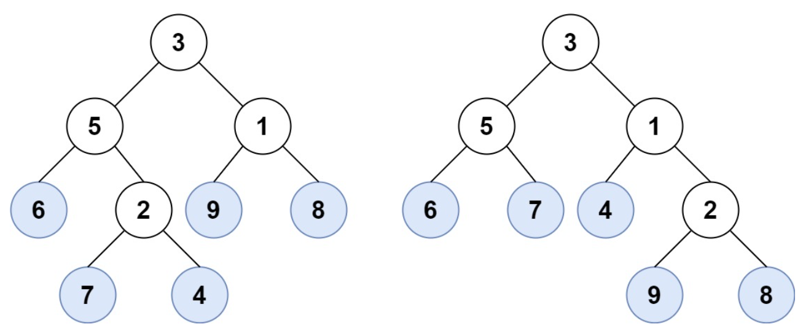
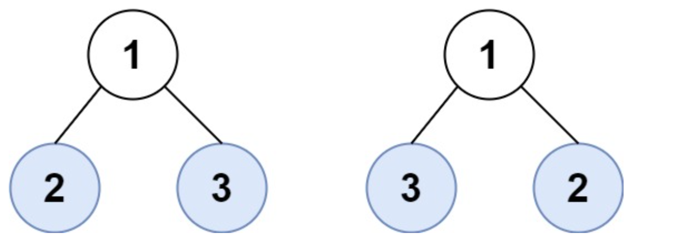

# 872. 叶子相似的🌲

URL：https://leetcode-cn.com/problems/leaf-similar-trees/

请考虑一棵二叉树上所有的叶子，这些叶子的值按从左到右的顺序排列形成一个 叶值序列 。


举个例子，如上图所示，给定一棵叶值序列为 (6, 7, 4, 9, 8) 的树。

如果有两棵二叉树的叶值序列是相同，那么我们就认为它们是 叶相似 的。

如果给定的两个根结点分别为 root1 和 root2 的树是叶相似的，则返回 true；否则返回 false 。

 

示例 1：



输入：root1 = [3,5,1,6,2,9,8,null,null,7,4], root2 = [3,5,1,6,7,4,2,null,null,null,null,null,null,9,8]
输出：true
示例 2：

输入：root1 = [1], root2 = [1]
输出：true
示例 3：

输入：root1 = [1], root2 = [2]
输出：false
示例 4：

输入：root1 = [1,2], root2 = [2,2]
输出：true
示例 5：



输入：root1 = [1,2,3], root2 = [1,3,2]
输出：false


提示：

给定的两棵树可能会有 1 到 200 个结点。
给定的两棵树上的值介于 0 到 200 之间。

来源：力扣（LeetCode）
链接：https://leetcode-cn.com/problems/leaf-similar-trees
著作权归领扣网络所有。商业转载请联系官方授权，非商业转载请注明出处。

---

2021年 5月11日 星期二 18时30分50秒 CST

一颗二叉树，将叶子的值从左到右的顺序形成一个 叶值序列。

如果两个二叉树的叶值序列是相同的，就认为它们是 叶相似的。 判断两颗树是否是叶相似的。

思路：得到两颗🌲的叶值序列，然后比较是否叶值序列相同。遍历树2次，遍历3次。

想办法遍历2颗树，然后就可以判断是否叶值相同。

1. 使用栈，第一颗🌲，叶子的访问顺序为左->右，同时将叶子结点放入栈中。
2. 对第二颗树，首先判断flag是否为false,如果false，则返回。
3. 第二颗🌲，叶子的访问顺序为右->左，如果这个节点是叶子结点，然后判断栈顶元素和该叶子结点的值是否相同：

   1. 如果相同：  则弹栈
   2. 如果不相同： 则将flag标志置为false，并且向栈中push一个元素。


```java
/**
 * Definition for a binary tree node.
 * public class TreeNode {
 *     int val;
 *     TreeNode left;
 *     TreeNode right;
 *     TreeNode() {}
 *     TreeNode(int val) { this.val = val; }
 *     TreeNode(int val, TreeNode left, TreeNode right) {
 *         this.val = val;
 *         this.left = left;
 *         this.right = right;
 *     }
 * }
 */
class Solution {
    public boolean leafSimilar(TreeNode root1, TreeNode root2) {
        Deque<Integer> stack = new LinkedList<>();
        dfs1(root1, stack);
        boolean flag = true;
        dfs2(root2, stack, flag);
        return stack.isEmpty();
    }
    public void dfs1(TreeNode root, Deque<Integer> stack) {
        if (root != null) {
            dfs1(root.left, stack);
            if (root.left == null && root.right == null) stack.push(root.val);
            dfs1(root.right, stack);
        }
    }
    
    public void dfs2(TreeNode root, Deque<Integer> stack, boolean flag) {
        if (!flag) return;
        if (root != null) {
            if (root.left == null && root.right == null) {
                if (stack.peek() != root.val) {
                    stack.push(201);
                    flag = false;
                }else {
                    stack.pop();
                }
            }
            dfs2(root.right, stack, flag);  
            dfs2(root.left, stack, flag);
        }
    }
    
}
```

