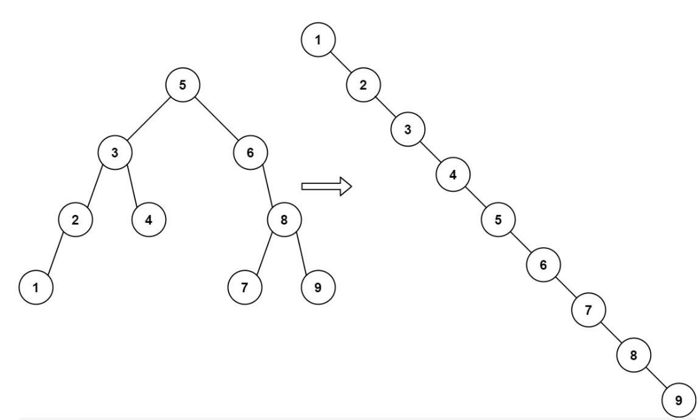
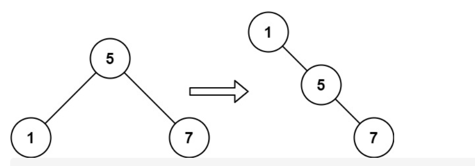

# 897. 递增顺序搜索树

URL： https://leetcode-cn.com/problems/increasing-order-search-tree/

给你一棵二叉搜索树，请你 按中序遍历 将其重新排列为一棵递增顺序搜索树，使树中最左边的节点成为树的根节点，并且每个节点没有左子节点，只有一个右子节点。

 

示例 1：



输入：root = [5,3,6,2,4,null,8,1,null,null,null,7,9]
输出：[1,null,2,null,3,null,4,null,5,null,6,null,7,null,8,null,9]
示例 2：



输入：root = [5,1,7]
输出：[1,null,5,null,7]


提示：

树中节点数的取值范围是 [1, 100]
0 <= Node.val <= 1000

来源：力扣（LeetCode）
链接：https://leetcode-cn.com/problems/increasing-order-search-tree
著作权归领扣网络所有。商业转载请联系官方授权，非商业转载请注明出处。

---

2021年4月26日，整理。

## 方法一： 递归

没有啥特殊的方法，加了个list。

```java
class Solution {
    List<TreeNode> list = new ArrayList<>(); 
    public TreeNode increasingBST(TreeNode root) {
        backtrack(root);
        TreeNode res =  list.get(0);
        TreeNode pre = res;
        for (int i = 1; i < list.size(); i++) {
            pre.right = list.get(i);
            pre.left = null;
            pre = pre.right;
        }
        pre.left = null;
        pre.right = null;
        return res;
    }
    private void backtrack(TreeNode root) {
        if (root == null) return;
        backtrack(root.left);
        list.add(root);
        backtrack(root.right);
    }
}
```

根据加了list的思路，重新加了个pre，然后在递归中将树构建

```java
class Solution {
    TreeNode res = null;
    TreeNode pre = null;

    public TreeNode increasingBST(TreeNode root) {
        backtracking(root);
        pre.left = null;
        pre.right = null;
        return res;
    }
    
    private void backtracking(TreeNode root) {
        if (root == null) return;
        backtracking(root.left);

        if (pre == null && res == null) {
            res = root; 
            pre = root;
        } else {
            pre.left = null;
            pre.right = root;
            pre = root;
        }
  
        backtracking(root.right);
    }
}
```

## 方法二：迭代

使用栈结构进行二叉树的非递归

其实就是使用栈来模拟递归过程。

这里使用的三叶姐的答案：https://leetcode-cn.com/problems/increasing-order-search-tree/solution/gong-shui-san-xie-yi-ti-shuang-jie-di-gu-yc8l/

```java
class Solution {
    List<TreeNode> list = new ArrayList<>();
    public TreeNode increasingBST(TreeNode root) {
        Deque<TreeNode> d = new ArrayDeque<>();
        while (root != null || !d.isEmpty()) {
            while (root != null) {
                d.add(root);
                root = root.left;
            }
            root = d.pollLast();
            list.add(root);
            root = root.right;
        }   
        TreeNode dummy = new TreeNode(-1);
        TreeNode cur = dummy;
        for (TreeNode node : list) {
            cur.right = node;
            node.left = null;
            cur = node;
        }
        return dummy.right;
    }
}

作者：AC_OIer
链接：https://leetcode-cn.com/problems/increasing-order-search-tree/solution/gong-shui-san-xie-yi-ti-shuang-jie-di-gu-yc8l/
来源：力扣（LeetCode）
著作权归作者所有。商业转载请联系作者获得授权，非商业转载请注明出处。
```

