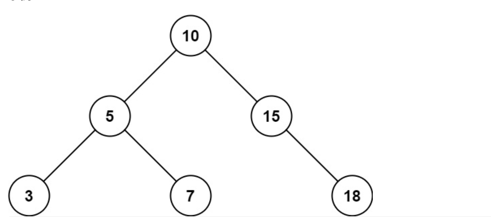
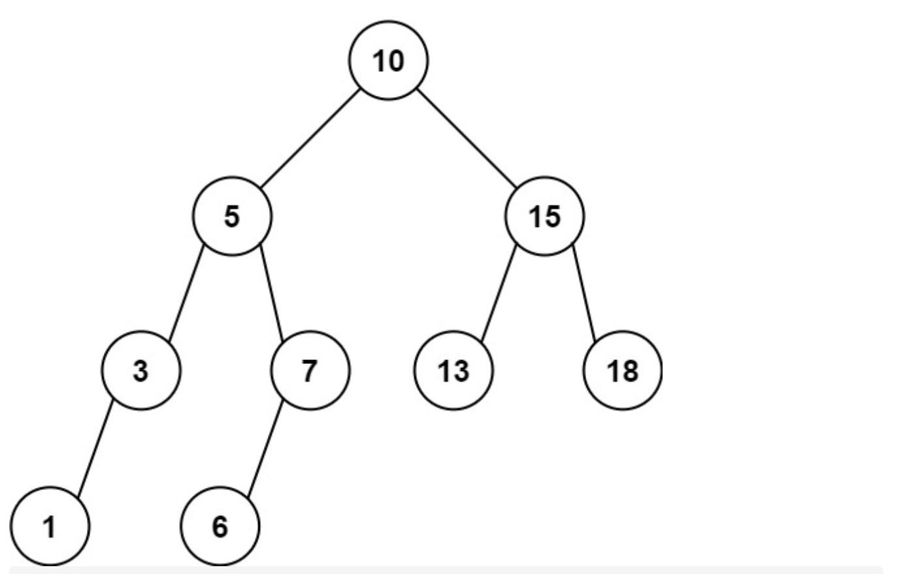

# 938. 二叉搜索树的范围和

URL：https://leetcode-cn.com/problems/range-sum-of-bst/

给定二叉搜索树的根结点 root，返回值位于范围 [low, high] 之间的所有结点的值的和。

 

示例 1：



输入：root = [10,5,15,3,7,null,18], low = 7, high = 15
输出：32
示例 2：




输入：root = [10,5,15,3,7,13,18,1,null,6], low = 6, high = 10
输出：23


提示：

树中节点数目在范围 [1, 2 * 104] 内
1 <= Node.val <= 105
1 <= low <= high <= 105
所有 Node.val 互不相同

来源：力扣（LeetCode）
链接：https://leetcode-cn.com/problems/range-sum-of-bst
著作权归领扣网络所有。商业转载请联系官方授权，非商业转载请注明出处。

---

2021年4月28日

本题没有特别多注意的地方，就是利用了二叉搜索树的中序遍历的 递增性。

然后在其中进行一定的减🌿。 然后中序遍历的方式有两种： 迭代和递归。

然后就没有去想递归的解法，直接用迭代去解决问题了。

因为该节点的左边的节点都比该节点小，如果遍历到某一个节点，他比low小，那么他左边的就不用去访问了。

因为在该节点以后遍历到的节点都比该节点的值大，如果该节点的值比high大，那么在他之后的节点就不用遍历了，因此可以跳出循环。

```java
/**
 * Definition for a binary tree node.
 * public class TreeNode {
 *     int val;
 *     TreeNode left;
 *     TreeNode right;
 *     TreeNode() {}
 *     TreeNode(int val) { this.val = val; }
 *     TreeNode(int val, TreeNode left, TreeNode right) {
 *         this.val = val;
 *         this.left = left;
 *         this.right = right;
 *     }
 * }
 */
class Solution {
    public int rangeSumBST(TreeNode root, int l, int h) {
        
        Deque<TreeNode> stk = new LinkedList<>();
        int res = 0;
        while (root != null || !stk.isEmpty()) {
            while (root != null) {
                stk.push(root);
                if (root.val < l) break;
                root = root.left;
            }
            root = stk.pop();
            int tmp = root.val;
            if (tmp > h) break;
            if (tmp >= l) res+= tmp;
         
            root = root.right;
        }
        return res;
    }
}
```

