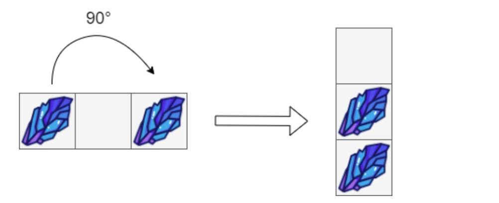
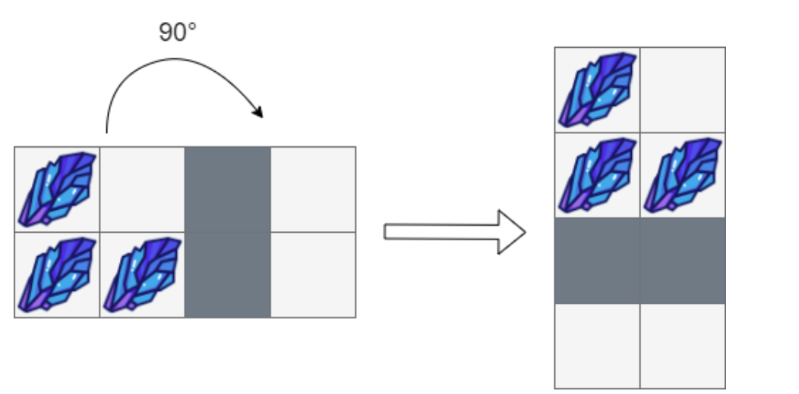
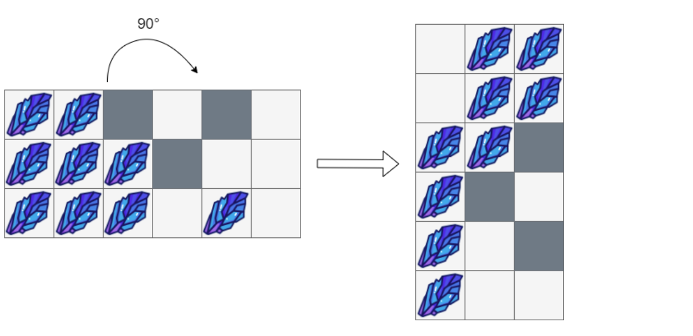

# 1861. 旋转盒子 medium

URL : https://leetcode-cn.com/problems/rotating-the-box/

给你一个 m x n 的字符矩阵 box ，它表示一个箱子的侧视图。箱子的每一个格子可能为：

'#' 表示石头
'*' 表示固定的障碍物
'.' 表示空位置
这个箱子被 顺时针旋转 90 度 ，由于重力原因，部分石头的位置会发生改变。每个石头会垂直掉落，直到它遇到障碍物，另一个石头或者箱子的底部。重力 不会 影响障碍物的位置，同时箱子旋转不会产生惯性 ，也就是说石头的水平位置不会发生改变。

题目保证初始时 box 中的石头要么在一个障碍物上，要么在另一个石头上，要么在箱子的底部。

请你返回一个 n x m的矩阵，表示按照上述旋转后，箱子内的结果。

 

示例 1：



输入：box = [["#",".","#"]]
输出：[["."],
      ["#"],
      ["#"]]
示例 2：



输入：box = [["#",".","*","."],
            ["#","#","*","."]]
输出：[["#","."],
      ["#","#"],
      ["*","*"],
      [".","."]]
示例 3：



输入：box = [["#","#","*",".","*","."],
            ["#","#","#","*",".","."],
            ["#","#","#",".","#","."]]
输出：[[".","#","#"],
      [".","#","#"],
      ["#","#","*"],
      ["#","*","."],
      ["#",".","*"],
      ["#",".","."]]


提示：

m == box.length
n == box[i].length
1 <= m, n <= 500
box[i][j] 只可能是 '#' ，'*' 或者 '.' 。

来源：力扣（LeetCode）
链接：https://leetcode-cn.com/problems/rotating-the-box
著作权归领扣网络所有。商业转载请联系官方授权，非商业转载请注明出处。

---

2021/5/17 

模拟题：

```java
class Solution {
    public char[][] rotateTheBox(char[][] box) {
        int m = box.length;
        int n = box[0].length;
        for (int i = 0; i < m; i++) {
            int j = 0;
            while (j < n) {
                int j1 = j;
                // 计算障碍物的下标
                while (j1 < n && box[i][j1] != '*') j1++;
                int tmp = 0; //盒子个数
                int j2 = j;
                while (j2 < n && j2 <= j1) {
                    if (box[i][j2] == '#') tmp++;
                    j2++;
                }
                j2 = j1 != n ? j2 - 2: j2 - 1;
                // 填空格和盒子
                while (j2 >= j) {
                    if (tmp > 0) box[i][j2] = '#';
                    else box[i][j2] = '.';
                    j2--;
                    tmp--;
                }
                j = j1 + 1;
            }
        }
        // (0, 0) -> (0, 2) (0,1)->(1,2) ... (0,5) -> (5, 2);
        // (2, 0) -> (0 , 2) (2,1)->(1, 0) ... (2, 5) -> (5，0);
        char[][] res = new char[n][m];
        for (int i = 0; i < m; i++) {
            for (int j = 0; j < n; j++) {
                res[j][m - 1 - i] = box[i][j];
            }
        }
        
        return res;
    }
}
```

