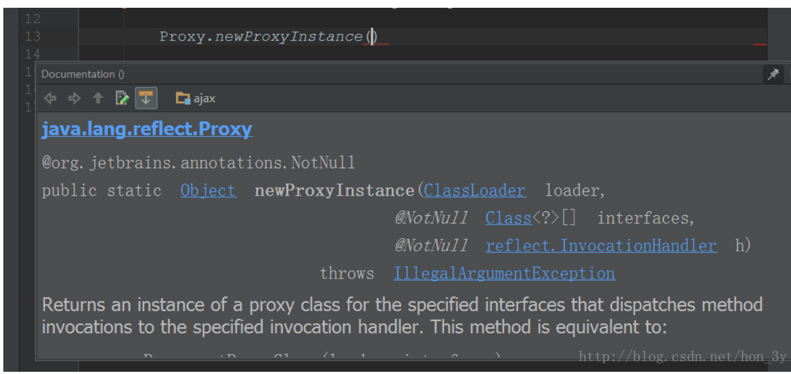

# 代理模式

摘抄URL：https://blog.csdn.net/hon_3y/article/details/70655966

## 代理介绍

代理：是一种设计模式，提供了对目标对象另外的访问方式；即通过代理访问目标对象。

好处：可以在目标对象实现的基础上，增加额外的功能操作。

可以做到在不修改目标的功能前提下，对目标对象功能扩展。

## 简单理解代理

一个很简单的例子：

- 我是一个明星，粉丝希望我给他们唱歌，都找我，那么我就太忙了，于是我聘请了一个经纪人。
- 经纪人就代表了我，当粉丝想要我唱歌的时候，就去找经纪人，告诉经纪人想让我唱歌
- 但是我很红，要收费，自己说不太好，因此，让经纪人对粉丝说：给钱，我才唱歌
- 无论外界想要我干嘛，都要经过我的经纪人，经纪人也可以在其中考虑收费、或者推脱他们的请求。

## 静态代理

1. interface

```java
public interface IUserDao {
	void save();
}
```

2. 实现类

```java


public class UserDao implements IUserDao{

    @Override
    public void save() {
        System.out.println("-----已经保存数据！！！------");
    }

}

```

3. 变更需求，在save()方法保存数据前开启事物、保存数据之后关闭事物

```java

    public void save() {

        System.out.println("开启事务");
        System.out.println("-----已经保存数据！！！------");

        System.out.println("关闭事务");
    }
```


带来的问题：

1. 如果有很多个业务都需要开启事物、关闭事物，那么会导致重复的代码有很多

解决方式：

1. 静态代理： 当用户调用UserDao的方法的时候，找到的是代理对象，让代理去解决这个业务
2. 代理要有和userDao有相同的方法：如果没有相同的方法，用户无法调用
3. 代理知识对userDao进行增强，真正做事的还是userDao


4. 因此，建立代理类实现IUserDao接口，这样代理就和userDao有相同的方法了。

```java

public class UserDaoProxy implements IUserDao{

    // 接收保存目标对象【真正做事的还是UserDao】，因此需要维护userDao的引用
    private IUserDao target;
    public UserDaoProxy(IUserDao target) {
        this.target = target;
    }

    @Override
    public void save() {
        System.out.println("开始事务...");

        target.save();          // 执行目标对象的方法

        System.out.println("提交事务...");
    }
}
```

**外界并不是直接去找UserDao，而是通过代理才能找到userDao**

```java

    public static void main(String[] args) {
        // 目标对象
        IUserDao target = new UserDao();

        // 代理
        IUserDao proxy = new UserDaoProxy(target);
        proxy.save();  // 执行的是，代理的方法
    }

```

## 静态代理的不足与动态代理的优点

**静态代理的不足：**

1. 如果接口改了，代理也要跟着改，比较麻烦
2. 因为每个代理对象都需要与目标对象实现一样的接口，所以会有很多代理类，类太多了。

**动态代理的优点：**

1. 代理对象，**不需要实现接口**
2. 代理对象的生成，是利用的JDKAPI，**动态地在内存中构建代理对象（需要我们指定创建 代理对象/目标对象 实现的接口的类型）**


## 动态代理快速入门

**Javatrigging了一个Proxy类，调用它的newInstance方法可以生成某个对象的代理对象，该方法需要三个参数：**



- 参数一： 生成代理对象使用哪个类装载器【一般我们使用的是代理类的装载器】
- 参数二： 生成的是哪个对象的代理，通过接口指定【指定要代理类的接口】
- 参数三： 生成的代理对象的方法里干什么事【实现handle接口】

在编写动态代理之前，明确的概念：

1. **代理对象拥有和目标对象相同的方法【因为参数二指定了对象的接口】**
2. **用户调用代理对象的什么方法，都是在调用处理器的invoke方法。**
3. 使用JDK动态代理必须有接口【参数二需要接口】

## 动态代理例子

1. 接口

```java
public interface Person {
	void sing(String name);
	void dance(String name);
}
```

2. 实现类

```java

public class XiaoMing implements Person {

    @Override
    public void sing(String name) {

        System.out.println("小明唱" + name);
    }

    @Override
    public void dance(String name) {

        System.out.println("小明跳" + name);

    }
}
```

3. 代理类

```java
public class XiaoMingProxy {
	
  // 1. 代理类需要包含有实现类
  private XiaoMing xiaoMing = new XiaoMing();
  
  // 2. 返回代理对象
  public Person getProxy() {
    
    //3. 调用代理类的newProxyInstance方法
    return (Person)Proxy.newProxyInstance(
    	//1. 参数1， 使用代理类自己的构造器
      XiaoMingProxy.class.getClassLoader(),
      //2. 参数2， 实现类所实现的 接口方法
      xiaoMing.getClass().getInterfaces(),
      //3. 参数3， 实现InvocationHandler实现类
      new InvocationHandler() {
        
        @Override
        public Object invoke(Object proxy, Method method, Object[] args) {
         	Object res = null;
          
          // 当调用到唱歌方法
          if (method.getName().equals("sing")) {     	
          	  // 1. 对方法进行增强
        	 		System.out.println("给小明100万，给我1万块");   
      	   }
    	     // 实现类调用方法
           res = method.invoke(xiaoMing, args);
          	return res;
        }
      }
    )
    
    
  }
	
}
```

```
后面也可以使用lambda表达式
(proxy, method, args) -> {
	
}
```


4. 测试类

```java

    public static void main(String[] args) {

        //外界通过代理才能让小明唱歌
        XiaoMingProxy xiaoMingProxy = new XiaoMingProxy();
        Person proxy = xiaoMingProxy.getProxy();


        proxy.sing("我爱你");

    }
```


