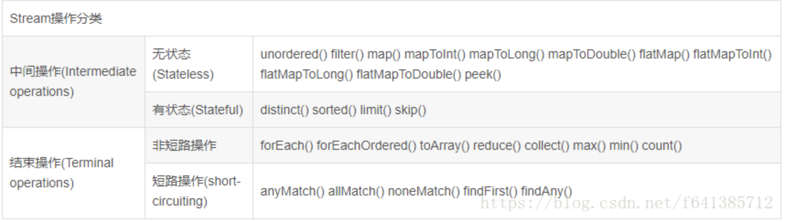
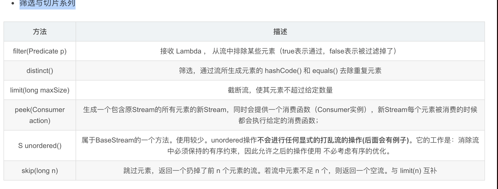
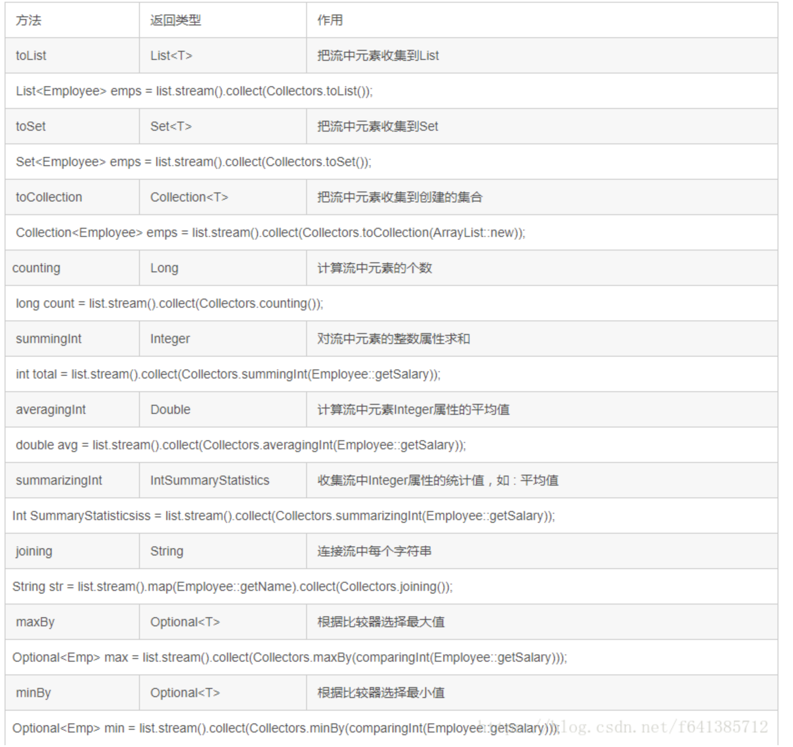
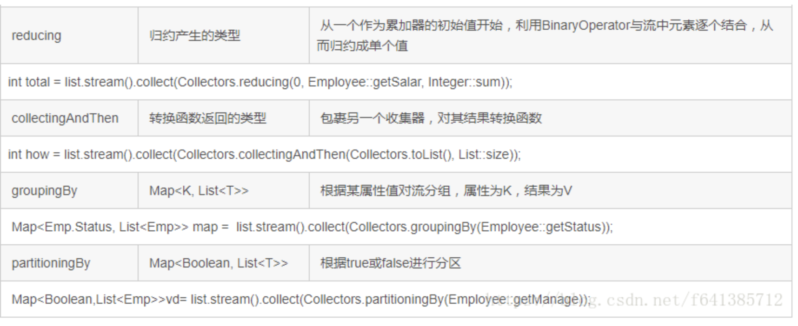

# Stream API

之前做过一个Stream API的文档，但是当初学的也不咋滴（好像就记得了2个函数，stream()和forEach()），这次再来学一下。

以下内容摘抄于： https://fangshixiang.blog.csdn.net/article/details/81513796?utm_medium=distribute.pc_relevant.none-task-blog-2%7Edefault%7EBlogCommendFromMachineLearnPai2%7Edefault-6.baidujs&depth_1-utm_source=distribute.pc_relevant.none-task-blog-2%7Edefault%7EBlogCommendFromMachineLearnPai2%7Edefault-6.baidujs

## 我们为什么需要Stream API

Stream作为Java 8的一大亮点，与java.io中的InputStream和OutputStream是完全不同的概念。

> 集合将的数据，流将的是计算

Java 8 中的Stream是对集合对象功能的增强，它专注于对集合对象进行各种便利、高效的聚合操作，或者大批量数据操作。Stream API借助于同样新出现的Lambda表达式，极大的提高编程效率和程序可读性。

同时它提供串行和并行两种模式进行汇聚操作，并发模式能够充分利用多核处理器的优势，使用fork/join并行方式来拆分任务和加速处理过程。通常编写并行代码很难而且容易出错，但使用Stream API 无需编写一行多线程的代码，就可以很方便地写出高性能的并发程序。 Java 8中首次出现的java.util.stream是一个函数式编程➕多核时代综合影响的产物。

## 浅谈聚合操作（Stream API能协助解决）

在传统的J2EE应用中，Java 代码经常不得不依赖于关系型数据库的聚合操作来完成诸如：

- 客户每月平均消费金额
- 最昂贵的在售商品
- 取十个数据样本作为首页推荐

但是在当今这个数据大爆炸的时代，在数据来源多样化、数据海量化的今天，很多时候不得不脱离RDBMS，或者以底层返回的数据为基础进行更上层的统计。

这个时候，如果没有Java8提供的StreamAPI，那简直就是噩梦。在Java 8 使用Stream，代码更加简洁易读；并且使用并发模式，程序执行速度更快。

## 对Stream进一步理解

简单说，对Stream的使用就是实现一个filter-map-reduce的过程，产生一个最终结果，或者导致一个副作用。

Stream不是集合元素，它不是数据结构并不保存数据，它是有关算法和计算的，更像一个高级版本的Iterator。

对于Stream，用户只要给出需要对其包含的元素执行什么操作，比如“过滤掉长度大于10的字符串”、“获取每个字符串的首字母”等，Stream会隐式地在内部进行遍历，作出相应的数据转换。

Stream就如同一个迭代器，单向，不可往复，数据只能便利一次，遍历过一次后即用尽了。

Java 的并行API演变历程基本如下：

1.  Thread
2. concurrent
3. Phasers
4. Fork/Join框架
5. Stream

Stream的另外一大特点是，数据源本身可以是无限大（即无限流）。

## 对流操作概述

流的操作类型分为两种：

- **中间操作：** 一个流可以后面跟随0个或者多个中间操作。其目的主要是打开流，作出某种程度的数据映射/过滤，然后返回一个新的流，交给下一个操作使用。这类操作都是惰性化的，就是说，仅仅调用这类方法，并没有真正开始流的遍历。

  > map(mapToInt,flatMap)，filter,distinct,sorted,peek,limit,skip,parallel,sequential,unordered

- **终止操作**： 一个流只有终止操作，当这个操作执行后，流就被使用光了，无法再被操作。所以这必定是流的最后一个操作。终止操作的执行，才会真正开始流的遍历，并且会生成一个结果，或者一个副作用。

  > forEach,forEachOrdered, toArray,reduce, collect, min, max, count,anyMatch,allMatch,noneMatch,findFirst,findAny,iterator

还有一种为短路操作。用以指：

- 对于一个中间操作，如果它接收的是一个无限流，它可以返回一个有限的新Stream

- 对于一个terminal操作，如果它接收的是一个无限流，但能在有限的时间计算出结果

  > anyMatch,allMatch,noneMatch,findFirst,findAny,limit

  




## IntStream、LongStream、DoubleStream

IntStream、LongStream、DoubleStream，特别为三种基本数值型提供了对应的Stream。

> Java 8 中还没有提供其他数值型Stream。

数值流的构造：

```java
IntStream.of(new int[]{1,2,3}).forEach(System.out::println);
IntStream.range(1,3).forEach(System.out::println);
IntStream.rangeClosed(1,3).forEach(System.out::println);
```

range，需要传入开始节点和结束节点两个参数，返回的是一个有序的LongStream。包含开始节点和结束节点两个参数之间所有的参数，间隔为1.
rangeClosed的功能和range类似。差别就是rangeClosed包含最后的结束节点，range不包含。

## 进阶：自己生成流（无限流）

```java
 public static<T> Stream<T> generate(Supplier<T> s) {
        Objects.requireNonNull(s);
        return StreamSupport.stream(
                new StreamSpliterators.InfiniteSupplyingSpliterator.OfRef<>(Long.MAX_VALUE, s), false);
    }
```

生成10个随机整数：

```java
public static void main(String[] args) {
        Stream.generate(new Random()::nextInt).limit(10).forEach(System.out::println);
        //采用IntStream流的方式(推荐使用 逼格很高)
        IntStream.generate(() -> (int) (System.nanoTime() % 100)).
                limit(10).forEach(System.out::println);
    }
IntStream.generate(() -> (int)(System.nanoTime() % 100).limit(10).forEach(System.out::println);
```


**另外一种方式自己生成流**：

```java
public static<T> Stream<T> iterate(final T seed, final UnaryOperator<T> f) {}
```

iterator跟reduce操作操作很像，接受一个种子值，和一个UnaryOperator。然后种子值称为Stream的第一个元素，f(seed)为第2个，f(f(seed))第三个，以此类推。

如生成一个等差数列。

```java
Stream.iterate(0, n -> n + 1).limit(10).forEach(x -> System.out.print(x + " "))
```

与Stream.generate相仿，在iterate时候管道必须有limit这样的操作来限制Stream大小。


## Stream实操案例

**创建流Stream**

Java8的Collection接口被扩展，提供两个获取流的方法：

1. default Stream stream(): 返回一个顺序流
2. default Stream parallelStream(): 返回一个并行流

由数组创建流：

Java8的Arrays的静态方法stream()可以获取数组流：static Stream stream(T[] array):返回一个流

重载形式，能够处理对应基本类型的数组IntStream/LongStream/DoubleStream。

由值创建流
可以使用静态方法 Stream.of(), 通过显示值创建一个流，它可以接收任意数量的参数：public static Stream of(T… values) : 返回一个流

由方法创建流 : 创建无限流
可以使用静态方法 Stream.iterate() 和 Stream.generate(), 创建无限流

迭代
public static Stream iterate(final T seed, final UnaryOperator f)

生成
public static Stream generate(Supplier s)


### **Stream的中间操作实操**

多个中间操作可以连接起来形成一个流水线，除非流水线上触发终止操作，否则中间操作不会执行任何的处理。而在终止操作时一次性全部处理，称为**“惰性求值”**

- 筛选与切片系列

  

peek使用的比较少，下面是其介绍。

```java
Stream.of("one", "two", "three", "four").peek(e -> System.out.println(e));
输出：这样不会有任何的输出；

Stream.of("one", "two", "three", "four").peek(e -> System.out.println(e)).collect(Collectors.toList());
输出：
one
two
three
four

Stream.of("one", "two", "three", "four")
    .peek(e -> System.out.println("Peeked value: " + e))
    .map(String::toUpperCase)
    .peek(e -> System.out.println("Mapped value: " + e))
    .collect(Collectors.toList());
输出：
Peeked value: one
Mapped value: ONE
Peeked value: two
Mapped value: TWO
Peeked value: three
Mapped value: THREE
Peeked value: four
Mapped value: FOUR

```

unordered的使用案例：

```java
public static void main(String[] args) {
        List<Integer> list = Arrays.asList(1, 2, 3, 4, 5, 6, 7, 8, 9);
        list.stream().forEach(System.out::print); //123456789

        System.out.println();

        //使用unordered之后输出
        list.stream().unordered().forEach(System.out::print); //123456789
    }

```

我们会发现，输出的顺序没有改变。所以它并不是来打乱这个顺序的。所以大家使用的时候不要误解了。正确的使用 姿势：

```java
//使stream无序：对于 distinct() 和 limit() 等方法，如果不关心顺序，则可以使用并行：
LongStream.rangeClosed(5, 10).unordered().parallel().limit(3);
IntStream.of(14, 15, 15, 14, 12, 81).unordered().parallel().distinct();

这样使用，能提高CPU的利用率，进而提高处理的效率

```

- 映射系列

  ```java
  | :-: | -: map(Function f) | 接收一个函数作为参数，该函数会被应用到每个元素上，并将其映射成一个新的元素
  ```

  mapToDouble(ToDoubleFunction f)| 同上
  mapToInt(ToIntFunction f)| 同上
  mapToLong(ToLongFunction f)| 同上
  flatMap(Function f)| 接收一个函数作为参数，将流中的每个值都换成另一个流，然后把所有流连接成一个流

  ```java
    public static void main(String[] args) {
          final long count = 10;
          List<Long> list = new ArrayList<>();
          for (long i = 0; i < count; i++) {
              list.add(i);
          }
  
          //使用mapToLong来处理
          list.stream().mapToLong(x -> x + 10).forEach(System.out::println);
      }
  
  ```

  普通的Map映射相对来说比较简单，因此这里也先一笔带过了。现在重点讲解一下flatMap的使用和场景：

````
//给定一个需求：给定一个列表{"aaa","bbb","ddd","eee","ccc"}。需要在控制台直接输出aaabbbdddeeeccc字样
````

看如下代码实现，对比下map和flatMap的区别

```java
 public static void main(String[] args) {
        List<String> list = Arrays.asList("aaa", "bbb", "ddd", "eee", "ccc");
        //采用map来做(这里采用了两次forEach循环进行输出，显然不太优雅)
        list.stream().map(x -> {
            List<Character> characterList = new ArrayList<>();
            char[] chars = x.toCharArray();
            for (char c : chars) {
                characterList.add(c);
            }
            return characterList.stream();
        }).forEach(xStream -> xStream.forEach(System.out::print)); //aaabbbdddeeeccc

        //采用flatMap来做  体会一下flatMap的魅力吧
        list.stream().flatMap(x -> {
            List<Character> characterList = new ArrayList<>();
            char[] chars = x.toCharArray();
            for (char c : chars) {
                characterList.add(c);
            }
            return characterList.stream();
        }).forEach(System.out::print); //aaabbbdddeeeccc

    }

```

再看一个例子

```
//给定一个需求：给定单词列表["Hello","World"]，要返回列表["H","e","l", "o","W","r","d"]

```

对于这样的需求，我们可能想到的第一个版本可能是这样子的

```
  public static void main(String[] args) {
        List<String> list = Arrays.asList("hello", "world");
        List<String[]> collect = list.stream().map(word -> word.split(""))
                .distinct()
                .collect(Collectors.toList());
    }

```

不用输出结果，一看返回值的结构就肯定不是我们想要的结果.
这个方法的问题在于，传递给map方法的Lambda为每个单词返回了一个String[]（String列表）。因此， map 返回的流实际上是Stream<String[]> 类型的。你真正想要的是用Stream来表示一个字符流。因此，这是行不通的。
正确的姿势：

```java
 public static void main(String[] args) {
        List<String> list = Arrays.asList("hello", "world");
        list.stream().flatMap(x -> Arrays.stream(x.split("")))
                .distinct().forEach(System.out::print); //helowrd
    }
```

其实map和flatMap的差别特别像List的add方法和addAll方法的差异，可参照理解一下，看下面这个例子

```java
  public static void main(String[] args) {
        List list = new ArrayList();
        list.add(1);
        list.add(2);

        List list1 = new ArrayList();
        list1.add(3);
        list1.add(4);

        //注意add和addAll输出的区别
        //list.add(list1);
        //System.out.println(list); //[1, 2, [3, 4]]

        list.addAll(list1);
        System.out.println(list); //[1, 2, 3, 4]

    }

```

- sorted() | 产生一个新流，其中按自然顺序排序
  sorted(Comparator comp) | 产生一个新流，其中按比较器顺序排序
  这个比较简单，这里就不举例子了

### Strean的终止操作

终端操作会从流的流水线生成结果，其结果可以是任何不是流的值，例如 : List、 Integer，甚至是 void

**allMatch(Predicate p) | 检查是否匹配所有元素**
**anyMatch(Predicate p) | 检查是否至少匹配一个元素**
**noneMatch(Predicate p) | 检查是否没有匹配所有元素**
**findFirst() | 返回第一个元素**
**findAny() | 返回当前流中的任意元素**
**count() | 返回流中元素总数**
**max(Comparator c) | 返回流中最大值**
**min(Comparator c) | 返回流中最小值**
**forEach(Consumer c) | 内部迭代(使用 Collection 接口需要用户去做迭代，称为外部迭代。相反， Stream API 使用内部迭代)**
**forEachOrdered(Consumer c) | 基本同forEach，后面会有示例比较**
**toArray() toArray(IntFunction g) | 这个使用起来和List的toArray差不多**

```java
 public static void main(String[] args) {
        List<Integer> list = Arrays.asList(1, 2, 3, 4, 5, 6, 7, 8);
        //因为并行 所以输出完全无序
        list.stream().parallel().forEach(x -> System.out.print(x)); //65387421
        System.out.println();
        //使用了forEachOrdered 所以是顺序输出的 即使你是并行流也是顺序的
        list.stream().parallel().forEachOrdered(x -> System.out.print(x)); //12345678
        System.out.println();
        //使用了toList，然后其实也是顺序输出了  内部原理同forEachOrdered（可当面试题哟）
        List<Integer> collect = list.stream().parallel().collect(Collectors.toList());
        System.out.println(collect); //[1, 2, 3, 4, 5, 6, 7, 8]
    }

```

除了使用forEachOrdered保证顺序外，Collectors.toList（）也可以保证顺序，二都最终都是通过ForEachOrderedTask类来实现的，具体可以参看ForEachOp.ForEachOrderedTask类中的代码。


### Reduce

| **方法**                                                  | **描述**                                              |
| --------------------------------------------------------- | ----------------------------------------------------- |
| reduce(T iden, BinaryOperator b)                          | 可以将流中元素反复结合起来，得到一个值，返回 T        |
| reduce(BinaryOperator b)                                  | 可以将流中元素反复结合起来，得到一个值，返回 Optional |
| reduce(U identity, BiFunction a, BinaryOperator combiner) | 可以将流中元素反复结合起来，得到一个值，返回 Optional |

> : map 和 reduce 的连接通常称为 map-reduce 模式，因 Google 用它来进行网络搜索而出名

educe是很重要的一种变成思想。这里重点介绍一下。reduce的作用是把stream中的元素给组合起来。至于怎么组合起来：

- 它需要我们首先提供一个起始种子，然后依照某种运算规则使其与stream的第一个元素发生关系产生一个新的种子，这个新的种子再紧接着与stream的第二个元素发生关系产生又一个新的种子，就这样依次递归执行，最后产生的结果就是reduce的最终产出，这就是reduce的算法最通俗的描述；

所以运用reduce我们可以做sum,min,max,average,所以这些我们称之为针对具体应用场景的reduce，这些常用的reduce，stream api已经为我们封装了对应的方法。

```java
//求和 sum
List<Integer> integers = Arrays.asList(1, 2, 3, 4, 5);

        // 没有起始值时返回为Optional类型
        Optional<Integer> sumOptional = integers.stream().reduce(Integer::sum);
        System.out.println(sumOptional.get()); //15

        // 可以给一个起始种子值
        Integer sumReduce = integers.stream().reduce(0, Integer::sum);
        System.out.println(sumReduce); //15

        //直接用sum方法
        Integer sum = integers.stream().mapToInt(i -> i).sum();
        System.out.println(sum); //15


```

**重点说说三个参数的Reduce**

三个参数时是最难以理解的。 分析下它的三个参数：

- identity: 一个初始化的值；这个初始化的值其类型是泛型U，与Reduce方法返回的类型一致；注意此时Stream中元素的类型是T，与U可以不一样也可以一样，这样的话操作空间就大了；不管Stream中存储的元素是什么类型，U都可以是任何类型，如U可以是一些基本数据类型的包装类型Integer、Long等；或者是String，又或者是一些集合类型ArrayList等；后面会说到这些用法。
- accumulator: 其类型是BiFunction，输入是U与T两个类型的数据，而返回的是U类型；也就是说返回的类型与输入的第一个参数类型是一样的，而输入的第二个参数类型与Stream中元素类型是一样的
- combiner: 其类型是BinaryOperator，支持的是对U类型的对象进行操作

> 第三个参数combiner主要是使用在并行计算的场景下；如果Stream是非并行时，第三个参数实际上是不生效的。
> 因此针对这个方法的分析需要分并行与非并行两个场景。

就是因为U和T不一样，所以给了我们更多的发挥。比如设U的类型是ArrayList，那么可以将Stream中所有元素添加到ArrayList中再返回了，如下示例：

```java
public static void main(String[] args) {
        ArrayList<String> result = Stream.of("aa", "ab", "c", "ad").reduce(new ArrayList<>(),
                (u, s) -> {
                    u.add(s);
                    return u;
                }, (strings, strings2) -> strings);
        System.out.println(result); //[aa, ab, c, ad]
    }
```

注意由于是非并行的，第三个参数实际上没有什么意义，可以指定r1或者r2为其返回值，甚至可以指定null为返回值。下面看看并行的情况：

当Stream是并行时，第三个参数就有意义了，它会将不同线程计算的结果调用combiner做汇总后返回。注意由于采用了并行计算，前两个参数与非并行时也有了差异！ 看个例子：

```java
  public static void main(String[] args) {
        Integer reduce = Stream.of(1, 2, 3).parallel().reduce(
                 4,
                (integer, integer2) -> integer + integer2,
                (integer, integer2) -> integer + integer2);
        System.out.println(reduce); //18
    }
输出：18

```

omg，结果竟然是18。显然串行的话结果是10；这个不太好理解，但是我下面写一个等价的方式，可以帮助很好的理解这个结果：

```java
 public static void main(String[] args) {
        Optional<Integer> reduce = Stream.of(1, 2, 3).map(n -> n + 4).reduce((s1, s2) -> s1 + s2);
        System.out.println(reduce.get()); //18
    }

```

这种方式有助于理解并行三个参数时的场景，实际上就是第一步使用accumulator进行转换（它的两个输入参数一个是identity, 一个是序列中的每一个元素），由N个元素得到N个结果；第二步是使用combiner对第一步的N个结果做汇总。

````java
public static void main(String[] args) {
        //构造字符串流
        List<String> strs = Arrays.asList("H", "E", "L", "L", "O");
        // reduce
        String concatReduce = strs.stream().reduce("", String::concat);
        System.out.println(concatReduce); //HELLO

        Stream<Integer> integerStream = Stream.of(1, 2, 3, 4, 5);
        Integer minReduce = integerStream.reduce(Integer.MAX_VALUE, Integer::min);
        System.out.println(minReduce); //1

    }

````


### Collect

- 收集（Collect)，很多时候和reduce很像，但collect更加强大
- collect(Collector c) | 将流转换为其他形式。接收一个 Collector接口的实现，用于给Stream中元素做汇总的方法

Collectors里常用搜集器介绍：





